# WoowTech Hermes Agent — AI 智慧助手使用手冊

> **版本**：Hermes Agent 0.13 + Hermes WebUI
> **適用對象**：一般使用者、開發人員、系統管理員
> **最後更新**：2026-05-31
> **維護團隊**：WOOW Tech 沃科技

---

## 目錄

| 編號 | 章節名稱 | 說明 |
|------|---------|------|
| [1](#1-平台總覽與帳號說明) | 平台總覽與帳號說明 | 系統網址、帳號、架構、CLI 工具總覽 |
| [2](#2-登入與首次設定) | 登入與首次設定 | 登入畫面、首次設定精靈 |
| [3](#3-chat-對話介面--基本操作) | Chat 對話介面 — 基本操作 | 發送訊息、AI 回應、模型選擇 |
| [4](#4-chat-對話介面--進階功能) | Chat 對話介面 — 進階功能 | Fork、複製、重新生成、附件、語音 |
| [5](#5-skills-技能中心) | Skills 技能中心 | 93 個技能瀏覽、搜尋、分類 |
| [6](#6-skills--odoo-18-erp-專屬技能) | Skills — Odoo 18 ERP 專屬技能 | 8 個 Odoo 專業技能詳解 |
| [7](#7-tasks-任務管理) | Tasks 任務管理 | 排程任務、Cron Job 管理 |
| [8](#8-kanban-看板) | Kanban 看板 | 看板建立、任務追蹤、拖拉排序 |
| [9](#9-memory-記憶管理) | Memory 記憶管理 | SOUL.md、USER.md、MEMORY.md |
| [10](#10-agent-profiles-設定檔管理) | Agent Profiles 設定檔管理 | 多設定檔切換、模型與 Provider |
| [11](#11-spaces-工作區) | Spaces 工作區 | 工作區管理、目錄切換 |
| [12](#12-todos-待辦事項) | Todos 待辦事項 | 待辦清單、勾選完成 |
| [13](#13-insights-數據分析) | Insights 數據分析 | Token 用量、模型分布、費用統計 |
| [14](#14-logs-日誌查看) | Logs 日誌查看 | Agent 日誌、錯誤日誌 |
| [15](#15-settings-設定) | Settings 設定 | 對話匯出匯入、清除 |
| [16](#16-模型與-provider-設定) | 模型與 Provider 設定 | Minimax M2.7、多 Provider 支援 |
| [17](#17-gateway-閘道管理) | Gateway 閘道管理 | 閘道狀態、連線監控 |
| [18](#18-workspace-files-檔案面板) | Workspace Files 檔案面板 | 檔案瀏覽、Artifacts |
| [19](#19-cli-工具--網路與連線) | CLI 工具 — 網路與連線 | curl、ssh、nmap、dig 等 15 個工具 |
| [20](#20-cli-工具--開發與搜尋) | CLI 工具 — 開發與搜尋 | git、jq、python3、node 等 13 個工具 |
| [21](#21-cli-工具--雲端與-devops) | CLI 工具 — 雲端與 DevOps | helm、gcloud、gh、argocd 等 7 個工具 |
| [22](#22-cli-工具--文件與媒體) | CLI 工具 — 文件與媒體 | pandoc、ffmpeg、yt-dlp 等 5 個工具 |
| [23](#23-playwright--chromium-瀏覽器自動化) | Playwright + Chromium 瀏覽器自動化 | 網頁截圖、表單自動化、E2E 測試 |
| [24](#24-行動裝置操作指南) | 行動裝置操作指南 | 手機版 Chat、導航、響應式設計 |
| [25](#25-常見問題faq) | 常見問題（FAQ） | 常見問題與解答 |

---

## 1. 平台總覽與帳號說明

本章說明 WoowTech Hermes Agent AI 智慧助手平台的整體架構，包含系統網址、預設帳號、技術堆疊與 CLI 工具總覽。

### 步驟 1：系統網址

Hermes Agent 平台目前部署於 K3s Kubernetes 叢集，透過 Cloudflare Tunnel 提供外部存取。

| 系統 | 網址 | 說明 |
|------|------|------|
| WoowTech Hermes | https://woowtech-hermes.woowtech.io | WoowTech Odoo 18 ERP 顧問 |
| Apporoalan Hermes | https://apporoalan-hermes.woowtech.io | ESG/WELL/LEED 健康建築顧問 |
| Johhanlin Hermes | https://johhanlin-hermes.woowtech.io | HSBC 外匯顧問 |
| Alanlin Hermes | https://alanlin-hermes.woowtech.io | 通用 AI 助手 |
| TorchMedia Hermes | https://torchmedia-hermes.woowtech.io | 通用 AI 助手 |

### 步驟 2：預設帳號

| 項目 | 內容 |
|------|------|
| 登入方式 | 密碼登入（無帳號，僅密碼） |
| 預設密碼 | `woowtech` |
| LLM 模型 | Minimax M2.7 |
| Provider | Minimax |

### 步驟 3：平台架構

| 元件 | 技術 | 說明 |
|------|------|------|
| AI 引擎 | Hermes Agent (Nous Research) | 智能對話核心，支援工具呼叫 |
| Web 介面 | Hermes WebUI | 瀏覽器操作介面 |
| LLM 模型 | Minimax M2.7 | 大語言模型推論 |
| 容器平台 | K3s Kubernetes | 4 節點叢集（1024 cores / 502Gi RAM） |
| 儲存 | Longhorn PVC (5Gi) | 持久化對話、記憶、排程資料 |
| 網路 | Cloudflare Tunnel | HTTPS 加密隧道 |
| 瀏覽器引擎 | Chromium 148 (Playwright) | 內建瀏覽器自動化 |

### 步驟 4：CLI 工具總覽

Hermes Agent 容器內預裝 **47 個 CLI 工具**，涵蓋 6 大類別：

| 類別 | 數量 | 工具列表 |
|------|------|---------|
| 網路與連線 | 15 | curl, http, lynx, ssh, scp, sftp, ssh-keygen, rsync, mosh, dig, nslookup, ping, traceroute, nmap, nc |
| 開發與搜尋 | 13 | git, git-lfs, jq, yq, rg, fd, python3, pip, uv, uvx, node, npm, npx |
| 雲端與 DevOps | 7 | helm, argocd, gcloud, gsutil, bq, gh, cloudflared |
| 資料庫 | 1 | redis-cli |
| 文件與媒體 | 5 | pandoc, xelatex, convert, ffmpeg, yt-dlp |
| 瀏覽器自動化 | 2 | playwright (Python 1.60), chromium (148) |

### 步驟 5：Skills 技能總覽

平台內建 **93 個 AI 技能**，分布於 19 個類別：

| 類別 | 數量 | 代表技能 |
|------|------|---------|
| software-development | 12 | TDD、systematic-debugging、writing-plans |
| creative | 20 | p5js、manim-video、sketch、pixel-art |
| mlops | 9 | huggingface-hub、vllm、weights-and-biases |
| productivity | 9 | notion、google-workspace、airtable |
| odoo-18-erp | 8 | odoo-sales-crm、odoo-accounting、odoo-inventory-mrp |
| github | 6 | github-pr-workflow、github-code-review |
| research | 5 | arxiv、research-paper-writing、polymarket |
| media | 5 | spotify、youtube-content、gif-search |
| autonomous-ai-agents | 5 | claude-code、codex、hermes-agent |
| 其他 | 14 | apple-notes、openhue、native-mcp 等 |

---

## 2. 登入與首次設定

### 步驟 1：開啟登入頁面

在瀏覽器輸入 Hermes 網址（例如 `https://woowtech-hermes.woowtech.io`），會自動導向登入頁面。

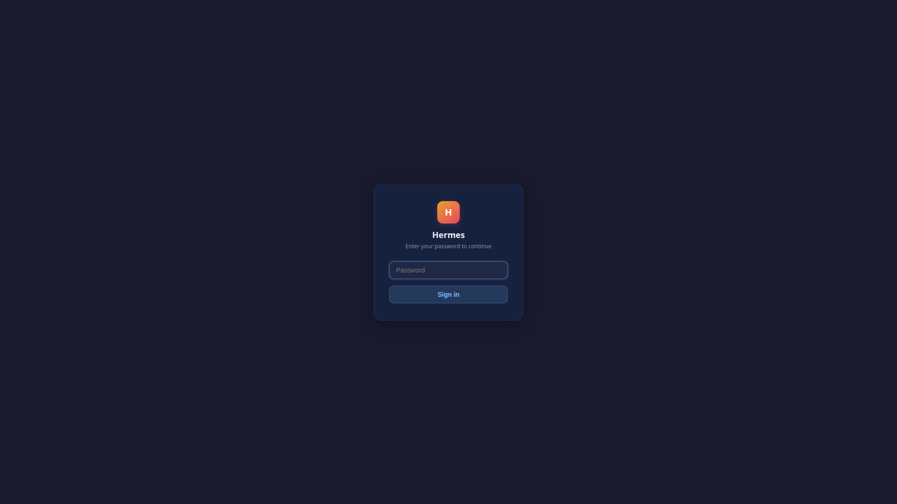

頁面中央顯示 Hermes 標誌與密碼輸入框，以及「Sign in」按鈕。

### 步驟 2：輸入密碼

在密碼欄位輸入 `woowtech`，然後點擊「Sign in」或按 Enter 鍵。

> **提示**：Hermes 採用純密碼登入（無帳號），適合團隊快速共享存取。

### 步驟 3：首次設定精靈 — 系統檢查

首次登入時，系統會顯示「Welcome to Hermes Web UI」設定精靈。第一步為系統檢查，驗證 Hermes Agent 是否已安裝且可用。

精靈包含 5 個步驟：
1. **System check** — 驗證 Hermes Agent 安裝狀態
2. **Provider setup** — 設定 AI 模型 Provider
3. **Workspace + model** — 選擇工作區與預設模型
4. **Optional password** — 設定密碼保護
5. **Finish** — 完成設定

### 步驟 4：首次設定精靈 — Provider 設定

點擊「Continue」進入 Provider 設定頁面。可選擇 Anthropic、OpenAI、OpenRouter、DeepSeek、Google Gemini 等多種 Provider。

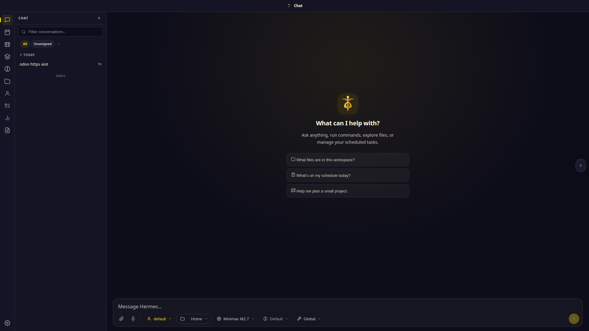

> **提示**：如果系統已透過 K8s Secret 預設好 Minimax API Key，可直接點擊「Skip setup」跳過設定。

### 步驟 5：進入主畫面

完成或跳過設定後，進入 Hermes 主畫面。左側為導航列，中央為 Chat 對話區。

導航列包含以下功能入口：

| 圖示 | 功能 | 說明 |
|------|------|------|
| 💬 | Chat | AI 對話介面 |
| 📅 | Tasks | 排程任務管理 |
| 📊 | Kanban | 看板管理 |
| 🔧 | Skills | 技能中心 |
| 🧠 | Memory | 記憶管理 |
| 📁 | Spaces | 工作區 |
| 👤 | Profiles | 設定檔管理 |
| ✅ | Todos | 待辦事項 |
| 📈 | Insights | 數據分析 |
| 📋 | Logs | 日誌查看 |
| ⚙️ | Settings | 系統設定 |

---

## 3. Chat 對話介面 — 基本操作

Chat 是 Hermes Agent 的核心功能，透過自然語言與 AI 對話，執行各種任務。

### 步驟 1：空白對話頁面

登入後的預設畫面為空白 Chat 頁面，顯示「What can I help with?」提示，以及三個快速操作按鈕。

快速操作按鈕：
- **What files are in this workspace?** — 查看工作區檔案
- **What's on my schedule today?** — 查看今日排程
- **Help me plan a small project.** — 協助規劃專案

### 步驟 2：輸入訊息

在底部輸入框輸入想問的問題或要執行的任務。支援中英文輸入。

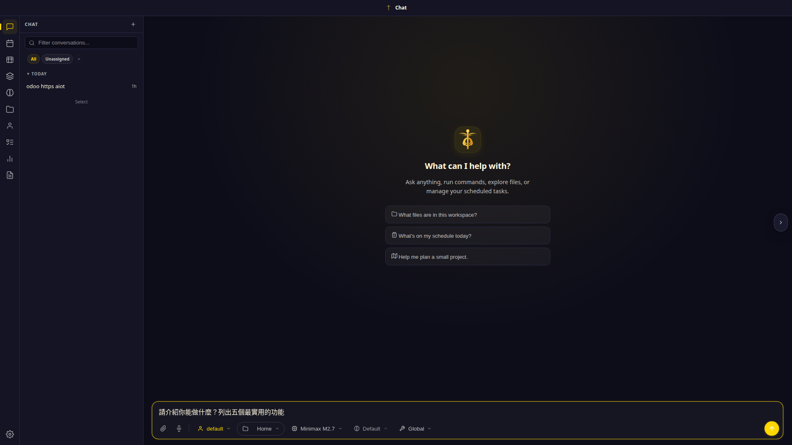

### 步驟 3：AI 回應

點擊發送按鈕（或按 Enter），Hermes 會開始處理並回應。回應完成後顯示「Activity Done in Xs」表示耗時。

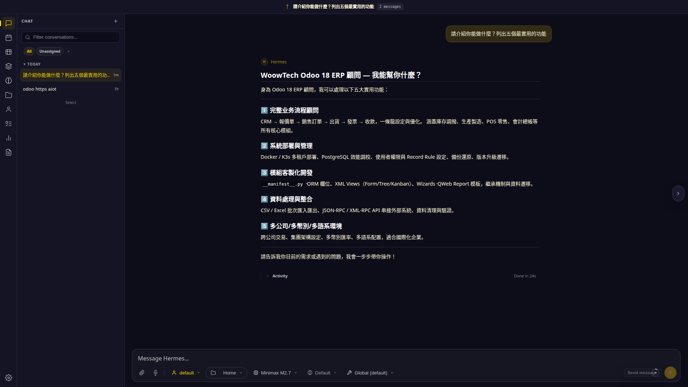

> **提示**：回應速度取決於 LLM 模型和問題複雜度。簡單問題約 3-5 秒，複雜任務可能需要 10-30 秒。

### 步驟 4：程式碼回應

Hermes 能生成並執行程式碼。詢問程式相關問題時，回應會包含格式化的程式碼區塊。

程式碼區塊支援語法高亮，可直接點擊複製。

### 步驟 5：模型選擇器

底部工具列顯示目前使用的 LLM 模型。點擊模型名稱可切換不同模型。

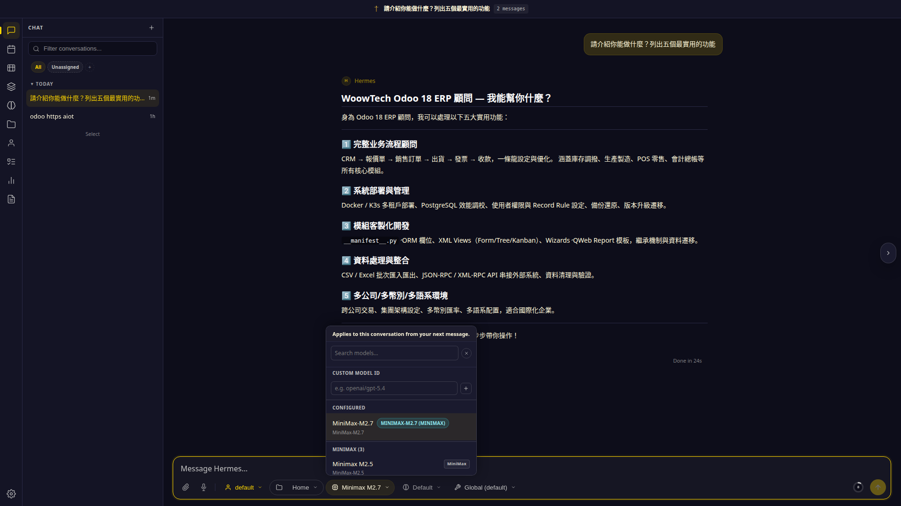

| 元素 | 說明 |
|------|------|
| 模型名稱 | 目前為 Minimax M2.7 |
| Profile 選擇器 | 目前為 default |
| Workspace | 目前工作區路徑 |

### 步驟 6：底部工具列

Chat 輸入框下方的工具列提供多種輔助功能：

| 按鈕 | 功能 | 說明 |
|------|------|------|
| 📎 Attach files | 附件上傳 | 上傳檔案供 AI 分析 |
| 🎙️ Dictate | 語音輸入 | 語音轉文字輸入 |
| 👤 Profile | 設定檔切換 | 切換 Agent Profile |
| 📁 Workspace | 工作區 | 切換工作目錄 |
| 🤖 Model | 模型切換 | 選擇 LLM 模型 |

---

## 4. Chat 對話介面 — 進階功能

### 步驟 1：訊息操作按鈕

每則 AI 回應右下角提供操作按鈕：

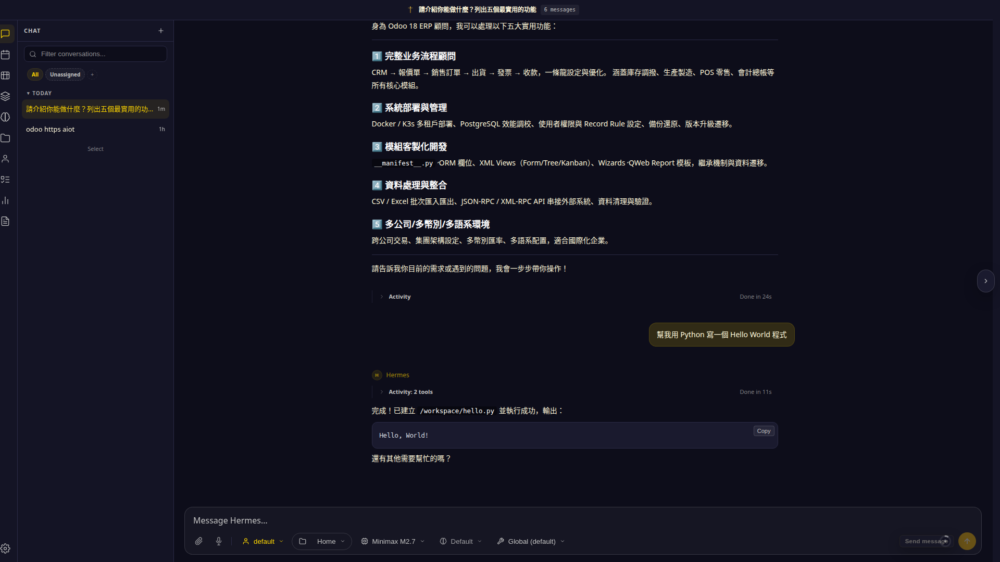

| 按鈕 | 功能 | 說明 |
|------|------|------|
| 🔀 Fork from here | 分叉對話 | 從此訊息建立新分支對話 |
| 📋 Copy | 複製 | 複製回應內容到剪貼簿 |
| 🔄 Regenerate | 重新生成 | 讓 AI 重新回答此問題 |
| ✏️ Edit | 編輯 | 編輯已發送的使用者訊息 |
| ↑ Jump to question | 跳至問題 | 快速跳回對應的問題 |

### 步驟 2：對話記錄管理

左側面板顯示所有對話記錄，按日期分組。可搜尋、篩選或建立新對話。

| 操作 | 說明 |
|------|------|
| + 新對話 | 建立全新對話 |
| 搜尋 | 按關鍵字搜尋對話 |
| 日期分組 | 按 TODAY、YESTERDAY 等分組 |
| 點擊對話 | 切換到該對話 |

### 步驟 3：Approval 審核機制

當 Hermes 需要執行敏感操作（如修改檔案、執行指令）時，會彈出審核對話框：

| 選項 | 說明 |
|------|------|
| Allow once ↵ | 本次允許 |
| Allow session | 本次會話期間允許 |
| Always allow | 永遠允許 |
| Deny | 拒絕 |
| ⚡ Skip all this session | 本次會話跳過所有審核 |

> **安全提示**：建議首次使用時逐一審核，熟悉後可選擇「Allow session」提高效率。

---

## 5. Skills 技能中心

Skills 是 Hermes Agent 的專業知識模組，每個 Skill 定義了特定領域的行為規範和操作指引。

### 步驟 1：瀏覽技能列表

點擊左側導航的「Skills」，顯示所有可用技能。

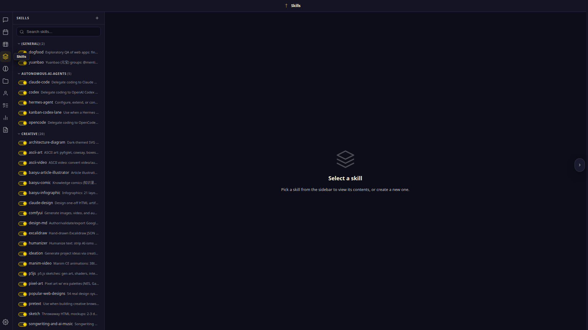

### 步驟 2：搜尋技能

使用頂部搜尋框按名稱搜尋技能。輸入關鍵字即時過濾。

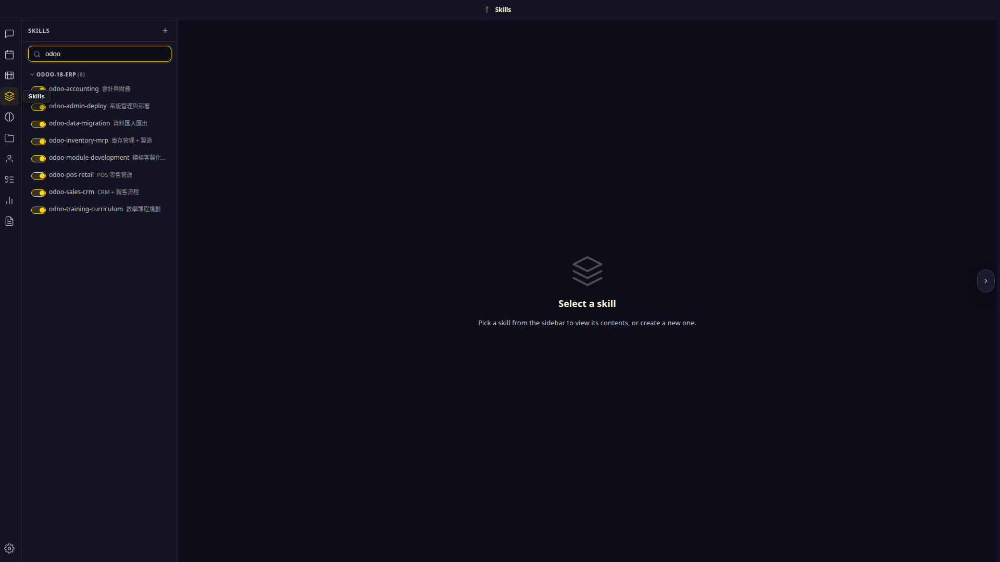

### 步驟 3：瀏覽分類

技能按類別組織，目前共 19 個類別：

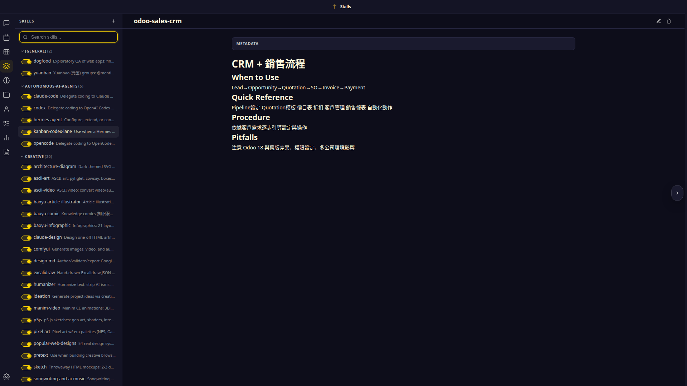

| 類別 | 技能數 | 用途 |
|------|-------|------|
| creative | 20 | 創意設計、影片製作、音樂創作 |
| software-development | 12 | TDD、除錯、Code Review |
| mlops | 9 | 機器學習、模型部署、評估 |
| productivity | 9 | Notion、Google Workspace、Airtable |
| odoo-18-erp | 8 | Odoo ERP 全模組操作 |
| github | 6 | PR 管理、Code Review、Issue |
| research | 5 | 論文搜尋、市場研究 |
| media | 5 | Spotify、YouTube、GIF |
| autonomous-ai-agents | 5 | Claude Code、Codex、Hermes |
| gaming | 2 | Minecraft、Pokemon |
| 其他 | 10 | 智慧家居、Email、MCP 等 |

### 步驟 4：搜尋 Creative 技能

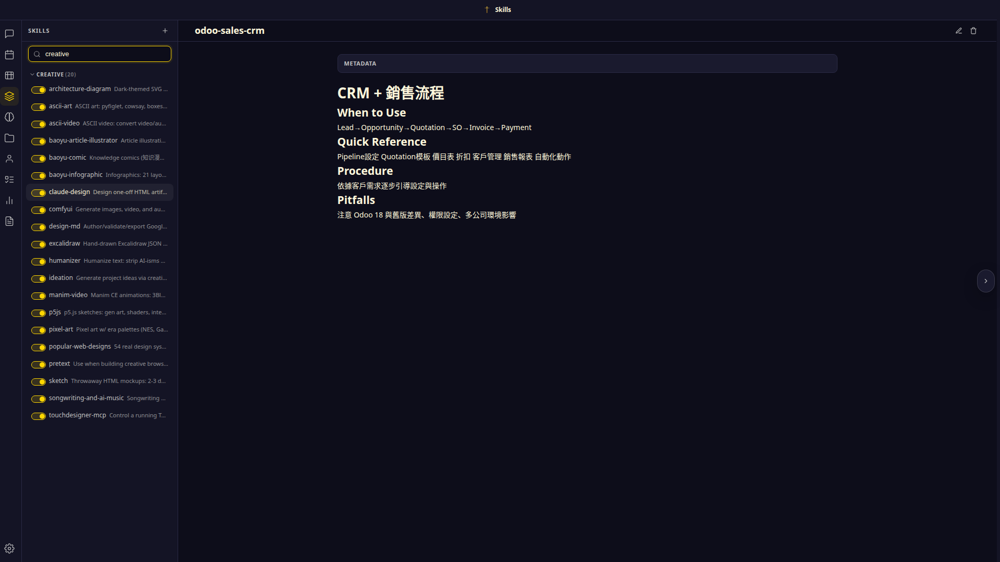

### 步驟 5：搜尋 GitHub 技能

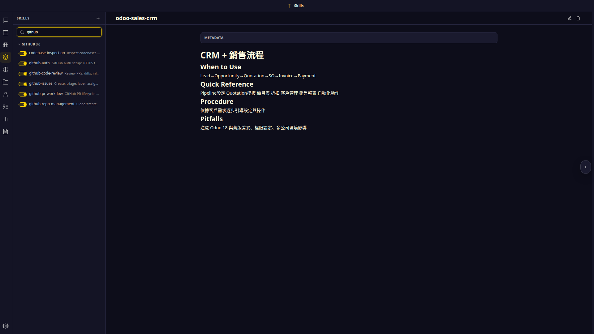

---

## 6. Skills — Odoo 18 ERP 專屬技能

WoowTech Hermes 預裝了 8 個 Odoo 18 ERP 專業技能：

### 步驟 1：查看技能詳情

點擊任一技能可查看完整的 SKILL.md 內容。

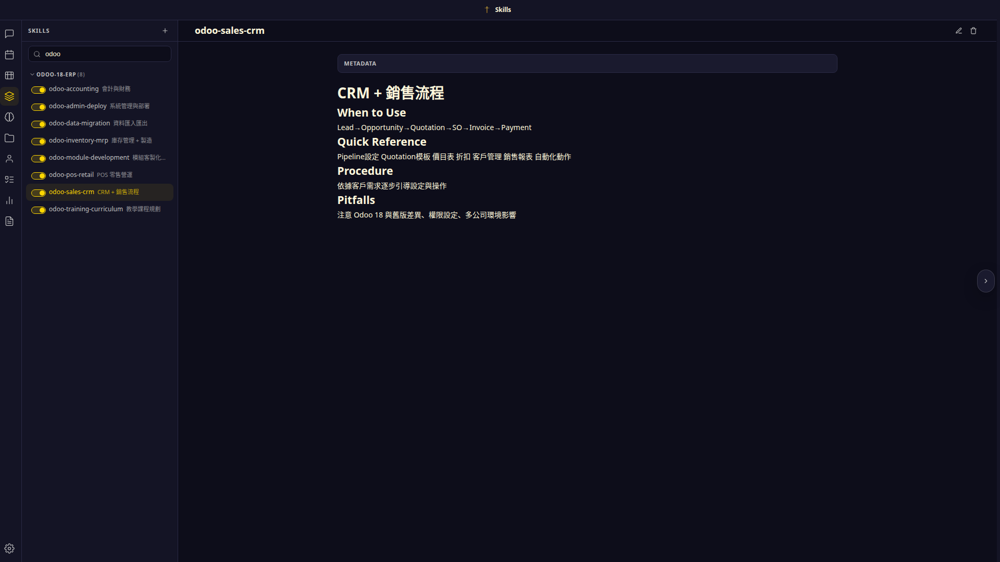

### 步驟 2：8 個 Odoo 技能一覽

| 技能名稱 | 說明 | 涵蓋模組 |
|---------|------|---------|
| odoo-sales-crm | CRM 與銷售流程 | Lead → Opportunity → 報價單 → 銷售訂單 |
| odoo-accounting | 會計與財務管理 | 會計科目表、銀行對帳、稅務、發票 |
| odoo-inventory-mrp | 庫存與製造管理 | 多倉庫、BOM、生產排程、品質控管 |
| odoo-pos-retail | POS 零售銷售 | 多門市、忠誠計畫、日結 |
| odoo-admin-deploy | 系統管理與部署 | Docker/K3s 部署、PostgreSQL、權限 |
| odoo-module-development | 模組客製化開發 | ORM、Views、Actions、QWeb |
| odoo-data-migration | 資料遷移與匯入 | CSV/Excel 匯入、External ID、版本升級 |
| odoo-training-curriculum | 教育訓練課程 | 各角色培訓大綱、實作練習 |

> **使用方式**：在 Chat 中直接詢問 Odoo 相關問題，Hermes 會自動引用對應的 Skill 知識回答。例如：「如何設定 Odoo 18 的多倉庫補貨策略？」

---

## 7. Tasks 任務管理

Tasks 用於管理排程任務和 Cron Job，讓 Hermes 在指定時間自動執行工作。

### 步驟 1：瀏覽任務列表

點擊導航列的「Tasks」查看所有排程任務。

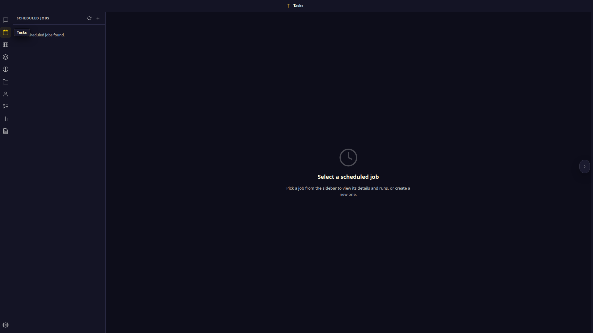

### 步驟 2：建立新任務

| 欄位 | 說明 |
|------|------|
| 任務名稱 | 描述任務用途 |
| 排程時間 | Cron 表達式（如 `0 9 * * *` 每天 9 點） |
| 執行內容 | 要 Hermes 執行的指令或對話 |

### 步驟 3：任務狀態

| 狀態 | 說明 |
|------|------|
| Pending | 等待執行 |
| Running | 執行中 |
| Completed | 已完成 |
| Paused | 已暫停 |

> **應用場景**：設定每日自動檢查伺服器狀態、每週生成報告、定時資料備份等。

---

## 8. Kanban 看板

Kanban 提供視覺化的專案管理工具，以看板方式追蹤任務進度。

### 步驟 1：瀏覽看板

點擊導航列的「Kanban」查看看板。

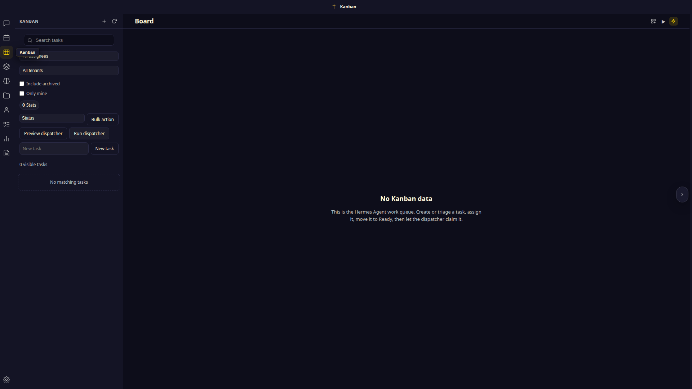

### 步驟 2：看板操作

| 操作 | 說明 |
|------|------|
| New board | 建立新看板 |
| 拖拉卡片 | 將任務卡片拖到不同欄位 |
| Preview dispatcher | 預覽任務分派 |
| Run dispatcher | 執行任務分派 |

> **應用場景**：搭配 `kanban-orchestrator` 和 `kanban-worker` Skill，可以讓 Hermes 自動管理開發任務流程。

---

## 9. Memory 記憶管理

Memory 是 Hermes 的長期記憶系統，包含三個核心檔案，讓 AI 持續學習和記住用戶偏好。

### 步驟 1：瀏覽記憶頁面

點擊導航列的「Memory」查看記憶管理頁面。

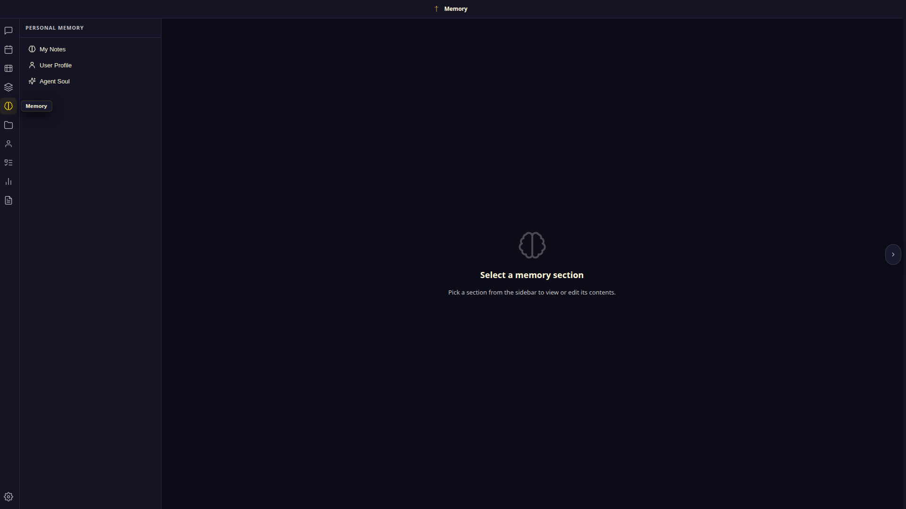

### 步驟 2：三個記憶檔案

| 檔案 | 路徑 | 說明 |
|------|------|------|
| **SOUL.md** | `~/.hermes/SOUL.md` | AI 的人格設定與專業領域定義 |
| **USER.md** | `~/.hermes/memories/USER.md` | 用戶偏好與個人資訊 |
| **MEMORY.md** | `~/.hermes/memories/MEMORY.md` | 跨對話的持久記憶筆記 |

### 步驟 3：SOUL.md 人格設定

SOUL.md 定義 Hermes 的身份、專業領域和溝通風格。WoowTech Hermes 的 SOUL.md 設定為「**WoowTech Odoo 18 ERP 顧問**」，涵蓋：

- Odoo 18 全模組操作（CRM、Sales、Inventory、MRP、Accounting、POS）
- 系統管理與部署（Docker/K3s）
- 模組客製化開發
- 資料管理與遷移

> **提示**：修改 SOUL.md 可以改變 Hermes 的專業定位。例如改為「前端開發工程師」或「資料分析師」。

---

## 10. Agent Profiles 設定檔管理

Profiles 允許管理多個 Agent 設定檔，每個 Profile 可以有不同的模型、Provider 和工作區配置。

### 步驟 1：瀏覽設定檔

點擊導航列的「Profiles」查看所有設定檔。

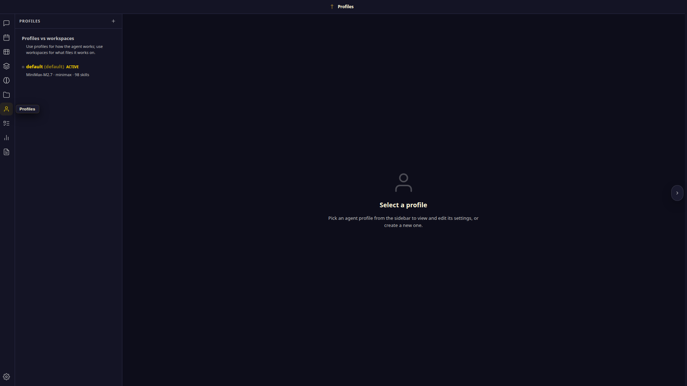

### 步驟 2：Profile 資訊

| 欄位 | 說明 |
|------|------|
| Name | 設定檔名稱（如 default） |
| Path | 設定檔路徑 |
| Model | 使用的 LLM 模型 |
| Provider | API Provider |
| Skills | 可用技能數量 |
| Gateway | 閘道狀態 |

### 步驟 3：操作

| 操作 | 說明 |
|------|------|
| Switch to this profile | 切換到此設定檔 |
| Delete this profile | 刪除設定檔 |
| New profile | 建立新設定檔 |

---

## 11. Spaces 工作區

Spaces 讓你管理 Hermes 可以存取的工作目錄。

### 步驟 1：瀏覽工作區

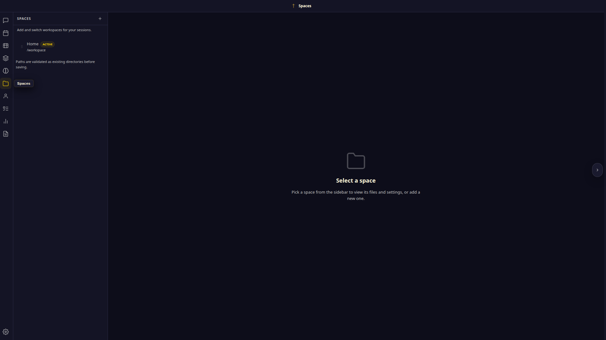

### 步驟 2：工作區設定

| 操作 | 說明 |
|------|------|
| Add space | 新增工作區目錄 |
| Home | 切回預設目錄 |
| 切換目錄 | 改變 Hermes 的工作目錄 |

> **提示**：工作區決定了 Hermes 的檔案存取範圍。切換到專案目錄可以讓 AI 直接讀取和修改專案檔案。

---

## 12. Todos 待辦事項

Todos 提供簡單的待辦事項管理，追蹤需要完成的工作。

### 步驟 1：瀏覽待辦

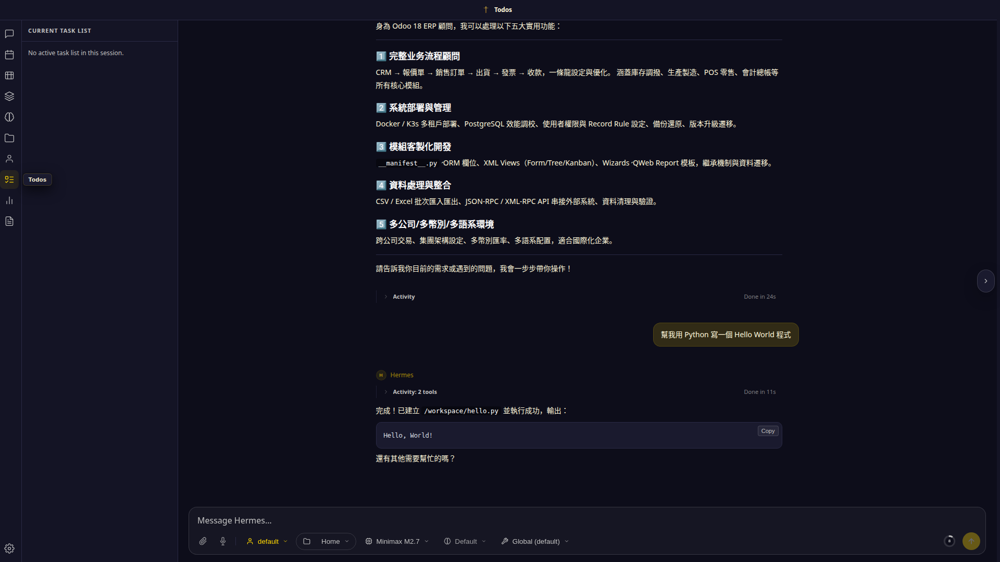

### 步驟 2：操作

| 操作 | 說明 |
|------|------|
| 新增待辦 | 輸入待辦事項描述 |
| 勾選完成 | 標記已完成 |
| 刪除 | 移除待辦事項 |

---

## 13. Insights 數據分析

Insights 提供使用統計數據，包括 Token 用量、模型分布、費用統計。

### 步驟 1：瀏覽 Insights 儀表板

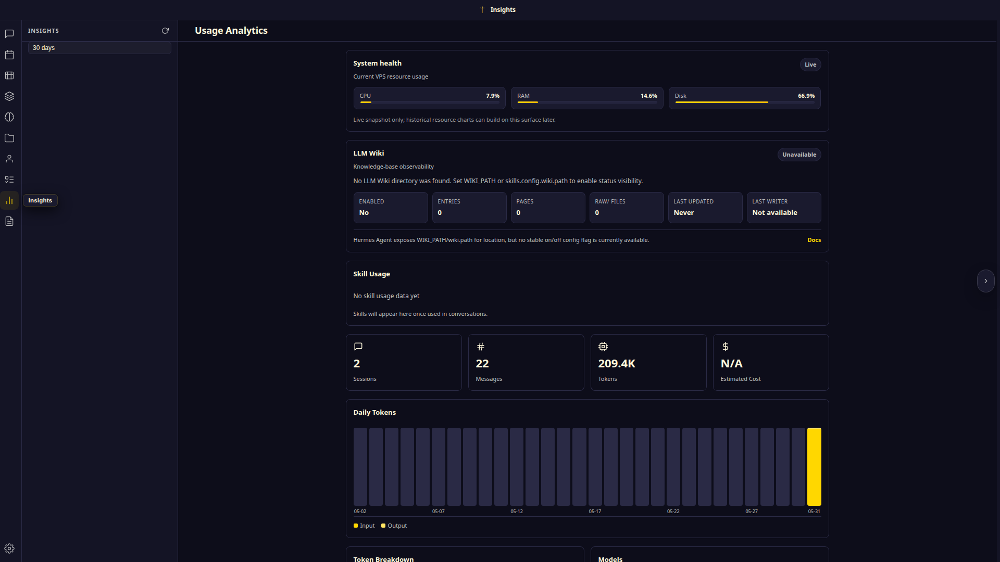

### 步驟 2：統計指標

| 指標 | 說明 |
|------|------|
| Total Sessions | 30 天內總對話數 |
| Total Messages | 總訊息數 |
| Total Tokens | Token 消耗量 |
| Total Cost | 費用估算 |

### 步驟 3：模型使用分布

| 欄位 | 說明 |
|------|------|
| Model | 模型名稱 |
| Sessions | 使用該模型的對話數 |
| Input/Output Tokens | 輸入/輸出 Token 數 |
| Cost | 費用 |
| Session Share | 對話占比 |

### 步驟 4：每日 Token 趨勢

Insights 提供每日 Token 使用量圖表，方便追蹤用量趨勢。

---

## 14. Logs 日誌查看

Logs 提供 Agent 運行日誌的即時查看功能，方便排查問題。

### 步驟 1：瀏覽日誌

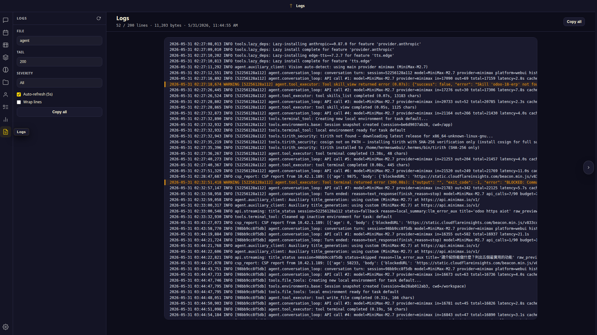

### 步驟 2：日誌類型

| 日誌 | 說明 |
|------|------|
| agent.log | Agent 主要運行日誌 |
| errors.log | 錯誤日誌 |

> **提示**：當 AI 回應異常或工具執行失敗時，可以在 Logs 中查看詳細錯誤訊息。

---

## 15. Settings 設定

Settings 提供對話管理功能，包括匯出、匯入和清除對話記錄。

### 步驟 1：Settings 頁面

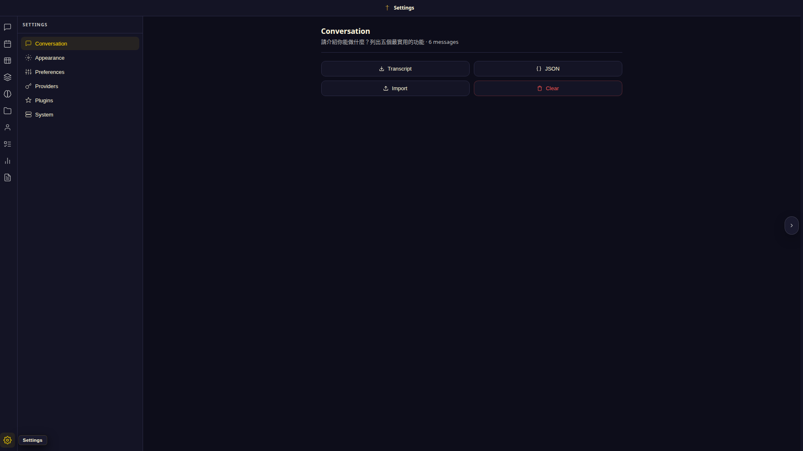

### 步驟 2：可用操作

| 操作 | 說明 |
|------|------|
| Transcript | 匯出對話為純文字 |
| JSON | 匯出對話為 JSON 格式 |
| Import | 匯入之前匯出的對話 |
| Clear | 清除當前對話記錄 |

---

## 16. 模型與 Provider 設定

Hermes 支援多種 LLM Provider 和模型，可根據需求切換。

### 步驟 1：目前配置

| 項目 | 設定值 |
|------|--------|
| 預設模型 | minimax/MiniMax-M2.7 |
| Provider | minimax |
| API Key | 透過 K8s Secret 注入 |

### 步驟 2：支援的 Provider

| Provider | 說明 |
|---------|------|
| Anthropic | Claude 系列模型 |
| OpenAI | GPT 系列模型 |
| OpenRouter | 多模型路由 |
| Minimax | MiniMax-M2.7（目前使用） |
| DeepSeek | DeepSeek 系列 |
| Google Gemini | Gemini 系列 |
| Mistral | Mistral 系列 |
| Ollama | 本地模型 |
| LM Studio | 本地模型 |

### 步驟 3：切換模型

在 Chat 底部工具列點擊模型名稱，從下拉選單中選擇其他模型。

> **注意**：切換模型需要對應的 API Key。不同 Provider 的費率和回應品質不同。

---

## 17. Gateway 閘道管理

Gateway 是 Hermes Agent 與 WebUI 之間的通訊橋梁。

### 步驟 1：Gateway 狀態

| 指標 | 說明 |
|------|------|
| running | 閘道是否正在運行 |
| configured | 閘道是否已配置 |
| platforms | 連接的平台列表 |
| session_count | 活躍會話數 |

### 步驟 2：正常狀態

正常運行時，Gateway 狀態應顯示：
- `running: true`
- `configured: true`

> **故障排除**：如果 Gateway 顯示 `running: false`，通常是 `gateway_state.json` 過期。系統已設定自動刷新機制（每 25 秒更新一次）。

---

## 18. Workspace Files 檔案面板

Workspace Files 面板顯示當前工作區的檔案結構。

### 步驟 1：開啟檔案面板

點擊右側的「Show workspace panel」按鈕展開檔案面板。

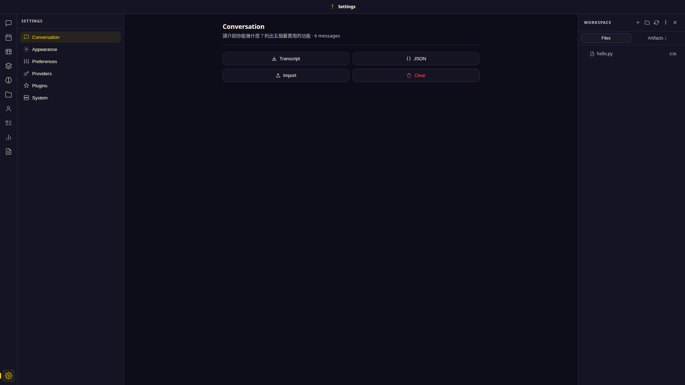

### 步驟 2：面板功能

| Tab | 說明 |
|-----|------|
| Files | 檔案瀏覽器，顯示目錄結構 |
| Artifacts | AI 生成的產出物（程式碼、文件等） |

---

## 19. CLI 工具 — 網路與連線

Hermes Agent 內建 15 個網路工具，可在對話中直接呼叫。

### 步驟 1：curl — HTTP 請求

在 Chat 中要求 Hermes 使用 curl：

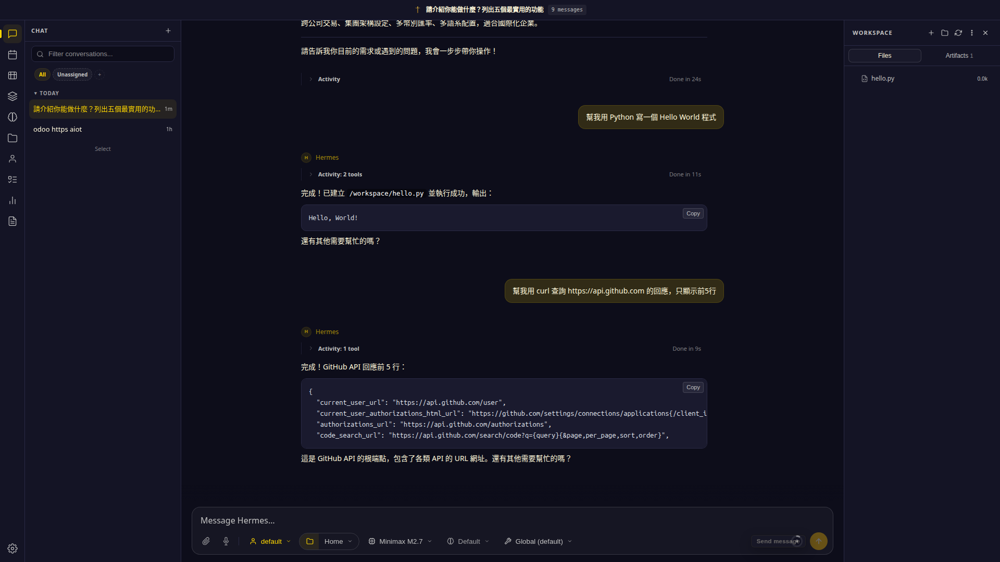

**使用範例：**

| 指令 | 說明 |
|------|------|
| `curl -s https://api.github.com` | 查詢 GitHub API |
| `curl -X POST -d '{"key":"value"}' URL` | 發送 POST 請求 |
| `curl -o file.zip URL` | 下載檔案 |

### 步驟 2：網路工具一覽

| 工具 | 版本 | 用途 | 使用場景 |
|------|------|------|---------|
| curl | 8.x | HTTP 請求 | API 呼叫、檔案下載 |
| http (HTTPie) | 3.2 | 友善 HTTP 客戶端 | JSON API 除錯 |
| lynx | — | 文字瀏覽器 | 爬取網頁文字內容 |
| ssh / scp / sftp | — | 遠端連線 | 伺服器管理 |
| ssh-keygen | — | SSH 金鑰 | 生成部署金鑰 |
| rsync | — | 檔案同步 | 備份、跨機器同步 |
| mosh | — | 行動 SSH | 不穩定網路遠端連線 |
| dig / nslookup | — | DNS 查詢 | 域名解析排查 |
| ping | — | 連通測試 | 確認主機在線 |
| traceroute | — | 路由追蹤 | 網路延遲診斷 |
| nmap | 7.95 | 網路掃描 | 端口掃描、安全檢查 |
| nc (netcat) | — | TCP/UDP | 端口測試、資料傳輸 |

> **使用方式**：直接在 Chat 中告訴 Hermes 想做什麼，它會自動選擇適合的工具。例如：「幫我掃描 192.168.1.1 的開放端口」→ Hermes 會使用 nmap。

---

## 20. CLI 工具 — 開發與搜尋

13 個開發工具，涵蓋版本控制、資料處理和程式語言執行。

### 步驟 1：Python 執行

在 Chat 中要求 Hermes 執行 Python 程式：

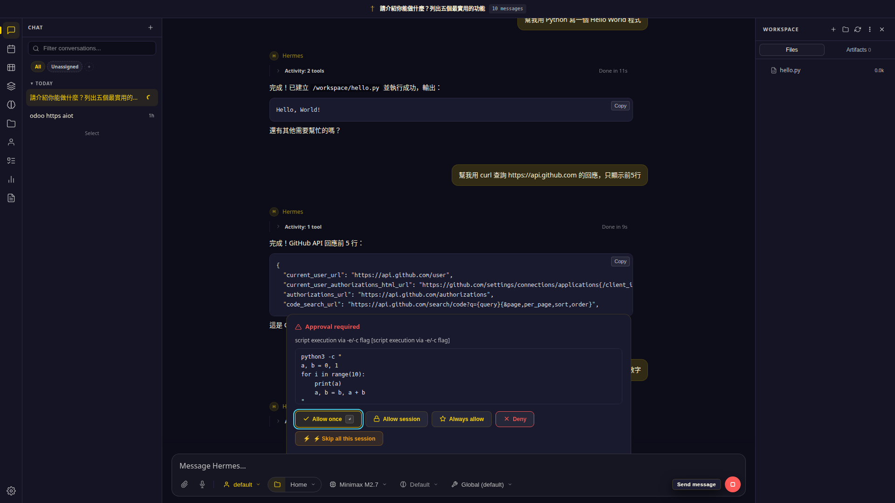

### 步驟 2：JSON 處理

使用 jq 處理 JSON 資料：

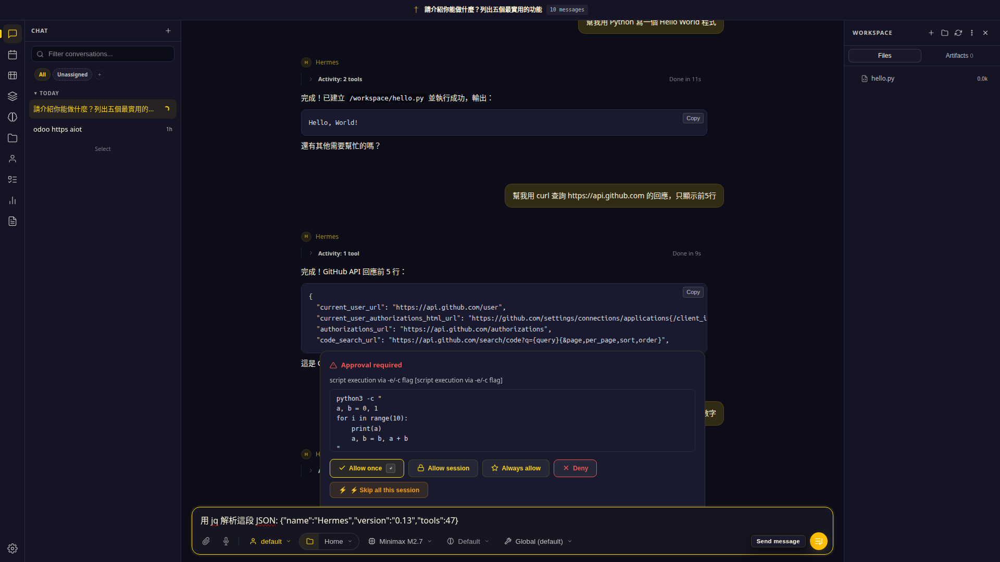

### 步驟 3：開發工具一覽

| 工具 | 版本 | 用途 | 使用場景 |
|------|------|------|---------|
| git | 2.47 | 版本控制 | Clone、commit、push、PR |
| git-lfs | — | 大檔案支援 | 影音、模型檔案管理 |
| jq | 1.7 | JSON 處理 | API 回應解析、資料轉換 |
| yq | 4.44 | YAML 處理 | K8s manifest、設定檔修改 |
| rg (ripgrep) | 14.1 | 超快搜尋 | 大型程式碼庫關鍵字搜尋 |
| fd | 10.2 | 檔案搜尋 | 按名稱、類型、大小找檔案 |
| python3 | 3.13 | Python | 腳本、資料分析、AI/ML |
| pip | — | Python 套件 | 安裝 Python 套件 |
| uv | 0.11 | 快速 Python 管理 | 比 pip 快 10-100 倍 |
| uvx | — | uv 執行器 | 一次性執行 Python 工具 |
| node | 20.19 | JavaScript | 前端工具、腳本 |
| npm | 9.2 | Node 套件 | 安裝 npm 套件 |
| npx | — | Node 執行器 | 一次性執行 npm 工具 |

---

## 21. CLI 工具 — 雲端與 DevOps

7 個雲端和 DevOps 工具，管理 Kubernetes、GCP 和 GitHub。

### 步驟 1：工具一覽

| 工具 | 版本 | 用途 | 使用場景 |
|------|------|------|---------|
| helm | 3.17 | K8s 套件管理 | 安裝/升級 Helm Charts |
| argocd | 2.14 | GitOps 部署 | 管理 ArgoCD 應用 |
| gcloud | — | Google Cloud | GCE/GKE/GCS 管理 |
| gsutil | — | GCS 儲存 | 上傳/下載 Cloud Storage |
| bq | — | BigQuery | SQL 查詢分析 |
| gh | 2.73 | GitHub CLI | PR、Issue、Actions 管理 |
| cloudflared | 2026.5 | Cloudflare Tunnel | 隧道管理 |

### 步驟 2：使用範例

| 場景 | 對 Hermes 說 | Hermes 使用的工具 |
|------|-------------|-----------------|
| 部署 Helm Chart | 「幫我用 helm 安裝 nginx-ingress」 | helm install |
| 查看 GitHub PR | 「列出目前的 open PRs」 | gh pr list |
| 同步 ArgoCD | 「同步 production 應用」 | argocd app sync |
| 上傳檔案到 GCS | 「把 report.pdf 上傳到 gs://bucket/」 | gsutil cp |

---

## 22. CLI 工具 — 文件與媒體

5 個文件和媒體處理工具，涵蓋文件轉換、影音處理和圖片操作。

### 步驟 1：工具一覽

| 工具 | 版本 | 用途 | 使用場景 |
|------|------|------|---------|
| pandoc | 3.1 | 文件轉換 | Markdown→PDF、DOCX→HTML |
| xelatex | — | LaTeX 排版 | 專業 PDF 報告（支援中文） |
| convert (ImageMagick) | — | 圖片處理 | 調整大小、格式轉換、加浮水印 |
| ffmpeg | 7.1 | 影音處理 | 影片剪輯、轉檔、擷取音頻 |
| yt-dlp | 2026.3 | 影音下載 | YouTube/各平台影片下載 |

### 步驟 2：使用範例

| 場景 | 對 Hermes 說 | Hermes 使用的工具 |
|------|-------------|-----------------|
| 轉換文件 | 「把 report.md 轉成 PDF」 | pandoc + xelatex |
| 壓縮圖片 | 「把這張圖片縮到 800px 寬」 | convert (ImageMagick) |
| 影片轉音頻 | 「擷取這個影片的音頻為 mp3」 | ffmpeg |
| 下載影片 | 「下載這個 YouTube 影片」 | yt-dlp |

---

## 23. Playwright + Chromium 瀏覽器自動化

Hermes 內建 Playwright 1.60 + Chromium 148，可在對話中執行瀏覽器自動化操作。

### 步驟 1：功能概覽

| 功能 | 說明 |
|------|------|
| 網頁截圖 | 截取任意網頁的畫面 |
| 表單填寫 | 自動填寫登入/註冊表單 |
| 資料擷取 | 從網頁擷取結構化資料 |
| E2E 測試 | 端到端自動化測試 |
| PDF 生成 | 將網頁轉為 PDF |

### 步驟 2：使用方式

在 Chat 中直接要求 Hermes 進行瀏覽器操作：

| 場景 | 對 Hermes 說 |
|------|-------------|
| 截圖 | 「幫我截取 example.com 的畫面」 |
| 擷取資料 | 「從這個網頁擷取所有標題」 |
| 表單自動化 | 「自動登入這個網站」 |
| 測試 | 「測試這個網頁的登入功能是否正常」 |

### 步驟 3：技術細節

| 項目 | 說明 |
|------|------|
| Python 套件 | playwright 1.60.0 |
| 瀏覽器引擎 | Chromium 148 (headless) |
| 瀏覽器路徑 | /opt/playwright-browsers/chromium-1223/ |
| 啟動參數 | --no-sandbox --disable-dev-shm-usage |

> **組合應用**：結合 Playwright + pandoc，可以截取網頁後直接轉成 PDF 報告。結合 Playwright + jq，可以擷取網頁資料後進行 JSON 結構化處理。

---

## 24. 行動裝置操作指南

Hermes WebUI 支援響應式設計，可在手機和平板上正常操作。

### 步驟 1：手機版登入

在手機瀏覽器開啟 Hermes 網址，顯示適配行動裝置的登入頁面。

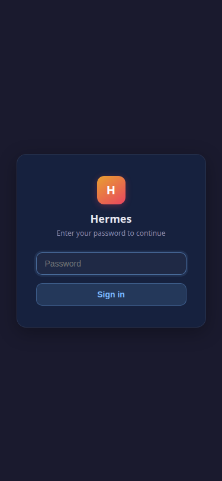

### 步驟 2：手機版 Chat

登入後進入 Chat 介面，佈局自動適配手機螢幕。

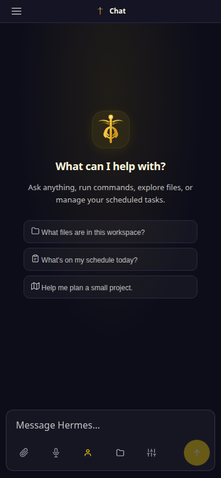

### 步驟 3：手機版操作要點

| 操作 | 說明 |
|------|------|
| 導航選單 | 點擊左上角 ☰ 展開 |
| 輸入訊息 | 底部輸入框 |
| 工具列 | 自動摺疊為圖示 |
| 截圖/長按 | 長按訊息可複製 |

---

## 25. 常見問題（FAQ）

### Q1：登入後看到「Welcome to Hermes Web UI」設定精靈怎麼辦？

直接點擊「Skip setup」跳過即可。系統已透過 K8s Secret 預設好 API Key。

### Q2：Chat 回應很慢或超時？

| 原因 | 解決方式 |
|------|---------|
| 模型回應慢 | 簡短問題通常 3-5 秒，複雜任務 10-30 秒屬正常 |
| Gateway 斷線 | 檢查 Gateway 狀態是否為 running: true |
| API Key 過期 | 聯繫管理員更新 Minimax API Key |

### Q3：Skills 頁面顯示空白？

確認 WebUI 的 `~/.hermes/skills` 目錄已正確 symlink 到 hermes-agent 的 skills 目錄。管理員可透過 kubectl 檢查。

### Q4：對話記錄會不會消失？

不會。系統已配置 Longhorn PersistentVolumeClaim (5Gi)，對話記錄、記憶、Cron Job 等資料在 Pod 重啟後仍然保留。

### Q5：可以更換 LLM 模型嗎？

可以。在 Chat 底部點擊模型名稱，從下拉選單中選擇其他模型。需要對應的 API Key。

### Q6：CLI 工具是怎麼安裝的？

47 個 CLI 工具已預裝在 Hermes Agent 的 Docker Image 中（`hermes-agent-custom:latest`），無需額外安裝。

### Q7：Playwright 可以截取需要登入的網站嗎？

可以。Hermes 可以使用 Playwright 先自動登入（填寫表單、點擊按鈕），然後再截圖或擷取資料。

### Q8：如何新增自訂 Skill？

在 Skills 頁面點擊「+ New skill」，輸入技能名稱和 SKILL.md 內容即可。或透過在 Agent 容器的 `skills/` 目錄下建立 `category/skill-name/SKILL.md` 結構。

### Q9：Memory 的 SOUL.md 可以修改嗎？

可以。在 Memory 頁面直接編輯 SOUL.md 內容，修改 Hermes 的人格定位和專業領域。修改後立即生效。

### Q10：系統架構是什麼？

每個 Hermes 實例包含 5 個 Pod：
- **hermes-agent** — AI 引擎（含 47 個 CLI 工具 + Chromium）
- **hermes-webui-simple** — Web 介面（含 93 個 Skills）
- **hermes-postgresql** — 資料庫
- **hermes-redis** — 快取
- **cloudflared** — Cloudflare Tunnel

部署在 K3s Kubernetes 叢集上，使用 Longhorn 分散式儲存確保資料持久化。

---

> **技術支援**：如有問題請聯繫 WOOW Tech 沃科技團隊
> **平台**：Hermes Agent by Nous Research + WoowTech Custom Image
