# 禪香不二 Inzense — Odoo 18 香品零售平台使用手冊

> **版本**：Odoo 18 Community
> **適用對象**：門市 POS 收銀人員、Portal 會員、後台管理人員
> **最後更新**：2026-05-27
> **維護團隊**：WOOW Tech 沃科技

---

## 目錄

| 編號 | 章節名稱 | 說明 |
|------|---------|------|
| [1](#1-平台總覽與帳號說明) | 平台總覽與帳號說明 | 系統網址、帳號、門市、架構說明 |
| [2](#2-會員登入與註冊) | 會員登入與註冊 | 登入畫面、註冊流程、忘記密碼 |
| [3](#3-會員中心portal-儀表板) | 會員中心（Portal 儀表板） | 儀表板、功能卡片、快速導覽 |
| [4](#4-會員中心--集點卡) | 會員中心 — 集點卡 | 集點卡列表、詳情、歷史紀錄 |
| [5](#5-會員中心--優惠券) | 會員中心 — 優惠券 | 優惠券列表、使用方式 |
| [6](#6-會員中心--禮品卡) | 會員中心 — 禮品卡 | 禮品卡列表、餘額、歷史 |
| [7](#7-會員中心--電子錢包) | 會員中心 — 電子錢包 | 電子錢包餘額、儲值與消費紀錄 |
| [8](#8-我的訂單) | 我的訂單 | 訂單列表、訂單詳情、狀態追蹤 |
| [9](#9-我的發票) | 我的發票 | 發票列表、發票詳情、PDF 下載、線上付款 |
| [10](#10-pos-銷售點--開店與基本操作) | POS 銷售點 — 開店與基本操作 | 開啟收銀機、商品選擇、購物車 |
| [11](#11-pos-銷售點--結帳與付款) | POS 銷售點 — 結帳與付款 | 現金付款、信用卡付款、客戶帳戶付款 |
| [12](#12-pos-銷售點--會員優惠折扣) | POS 銷售點 — 會員優惠折扣 | 集點折抵、優惠券、禮品卡、電子錢包在 POS 使用 |
| [13](#13-pos-銷售點--商品分類與完整商品列表) | POS 銷售點 — 商品分類與完整商品列表 | 5 大分類、10 項商品 |
| [14](#14-pos-銷售點--多門市管理與倉庫隔離) | POS 銷售點 — 多門市管理與倉庫隔離 | 3 間門市、倉庫對應、庫存獨立 |
| [15](#15-pos-銷售點--關店與日結) | POS 銷售點 — 關店與日結 | 關閉收銀機、日結報表 |
| [16](#16-pos-訂單批量匯入) | POS 訂單批量匯入 | 外部平台訂單 CSV/Excel 匯入、客戶帳戶付款 |
| [17](#17-銷售訂單批量匯入) | 銷售訂單批量匯入 | 後台銷售訂單 CSV/Excel 匯入 |
| [18](#18-銷售訂單完整流程) | 銷售訂單完整流程 | 建立→確認→出貨→開票→收款 |
| [19](#19-發票管理與銷帳) | 發票管理與銷帳 | 發票過帳、登記付款、銷帳、POS 發票 |
| [20](#20-後台管理--登入與儀表板) | 後台管理 — 登入與儀表板 | 管理員登入、後台導航 |
| [21](#21-後台管理--產品目錄管理) | 後台管理 — 產品目錄管理 | 商品新增、編輯、分類 |
| [22](#22-後台管理--庫存與倉庫管理) | 後台管理 — 庫存與倉庫管理 | 4 倉庫、內部調撥、補貨 |
| [23](#23-後台管理--忠誠計畫管理) | 後台管理 — 忠誠計畫管理 | 4 大忠誠計畫設定 |
| [24](#24-後台管理--客戶與權限管理) | 後台管理 — 客戶與權限管理 | 聯絡人、Portal 權限 |
| [25](#25-後台管理--條碼掃描功能) | 後台管理 — 條碼掃描功能 | 條碼查詢、GS1 解析、標籤列印 |
| [26](#26-行動裝置操作指南) | 行動裝置操作指南 | 手機版 Portal、POS、後台 |
| [27](#27-常見問題faq) | 常見問題（FAQ） | 常見問題與解答 |

---

## 1. 平台總覽與帳號說明

本章說明禪香不二 Inzense Odoo 18 香品零售平台的整體架構，包含系統網址、預設帳號、門市配置，以及平台角色與權限劃分。

### 步驟 1：系統網址一覽

禪香不二平台採用 Odoo 18 架構，整合 POS 門市銷售、Portal 會員中心與後台管理系統。

| 系統 | 網址 | 說明 |
|------|------|------|
| 後台管理介面 | https://inzense-odoo.woowtech.io/odoo | Odoo 18 後台管理系統入口 |
| 會員中心（Portal） | https://inzense-odoo.woowtech.io/my/member-center | 會員自助查詢入口 |
| 會員登入 | https://inzense-odoo.woowtech.io/web/login | 登入頁面 |

### 步驟 2：預設帳號與角色

| 帳號 | 密碼 | 姓名 | 角色 | 說明 |
|------|------|------|------|------|
| `admin` | `admin` | 管理員 | 全系統管理 | 後台管理、POS 設定、商品管理 |
| `portal@inzense.com.tw` | `portal` | 禪香不二 展示客戶 | Portal 會員 | 會員中心、訂單查詢、忠誠計畫 |

### 步驟 3：門市與倉庫配置

禪香不二設有 3 間門市與 1 個中央倉庫，採用多倉庫隔離架構：

| 門市/倉庫 | 代碼 | 倉庫名稱 | 庫存量（每品項） | 說明 |
|---------|------|---------|--------------|------|
| 禪香不二 中央倉庫 | 中央 | 禪香不二 中央倉庫 | 1,000 | 主要配貨中心 |
| 禪香不二 信義旗艦店 | 信義 | 信義旗艦店倉庫 | 100 | 台北信義區旗艦門市 |
| 禪香不二 板橋店 | 板橋 | 板橋店倉庫 | 100 | 新北板橋門市 |
| 禪香不二 台中店 | 台中 | 台中店倉庫 | 100 | 台中門市 |

> **補貨機制**：每間門市倉庫均設有從中央倉庫自動供應的路線。當門市庫存不足時，可透過內部調撥從中央倉庫補貨。

### 步驟 4：公司資訊

| 項目 | 內容 |
|------|------|
| 公司名稱 | 禪香不二 Inzense |
| 地址 | 台北市北投區光明路240號2樓之8 |
| 電話 | 0926-926-851 |
| 幣別 | 新台幣（TWD） |
| 語言 | 繁體中文（zh_TW） |

### 步驟 5：平台架構說明

| 功能模組 | 說明 |
|---------|------|
| 銷售點（POS） | 3 間門市的零售銷售系統，支援現金與信用卡 |
| 銷售管理（Sales） | 後台銷售訂單管理、報價單 |
| 發票管理（Invoicing） | 發票開立、收款、銷帳 |
| 庫存管理（Inventory） | 4 倉庫庫存追蹤、內部調撥 |
| 忠誠計畫（Loyalty） | 電子錢包、集點卡、禮品卡、優惠券 |
| 會員中心（Portal） | 會員自助入口，查看訂單、發票、忠誠計畫 |
| 條碼掃描（Barcode） | 商品條碼查詢、GS1 解析、標籤列印 |
| POS 訂單匯入 | 外部平台訂單批量匯入至 POS |
| 銷售訂單匯入 | 批量銷售訂單 CSV/Excel 匯入 |

---

## 2. 會員登入與註冊

### 步驟 1：登入頁面

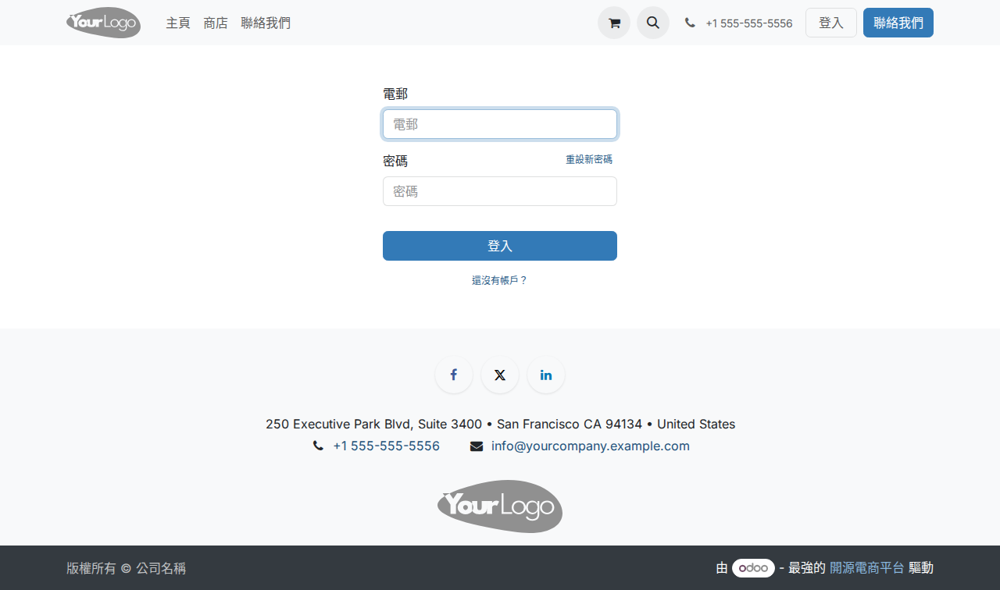

1. 開啟瀏覽器，前往 `https://inzense-odoo.woowtech.io/web/login`。
2. 頁面顯示登入表單，包含電郵與密碼欄位。

| 功能 | 說明 |
|------|------|
| 電郵欄位 | 輸入登入帳號（Email 或使用者名稱） |
| 密碼欄位 | 輸入對應密碼 |
| 登入按鈕 | 點擊後驗證帳號密碼 |
| 忘記密碼 | 點擊後前往密碼重設頁面 |
| 註冊連結 | 點擊後前往新會員註冊頁面 |

### 步驟 2：會員登入

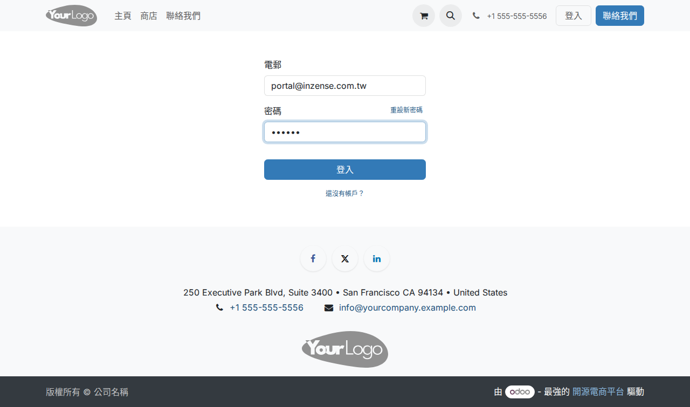

1. 在「電郵」欄位輸入 `portal@inzense.com.tw`。
2. 在「密碼」欄位輸入 `portal`。
3. 點擊「登入」按鈕。
4. 登入成功後，自動跳轉至 Portal 首頁（`/my/home`）。


### 步驟 3：管理員登入

1. 在「電郵」欄位輸入 `admin`。
2. 在「密碼」欄位輸入 `admin`。
3. 登入成功後，進入後台管理介面。

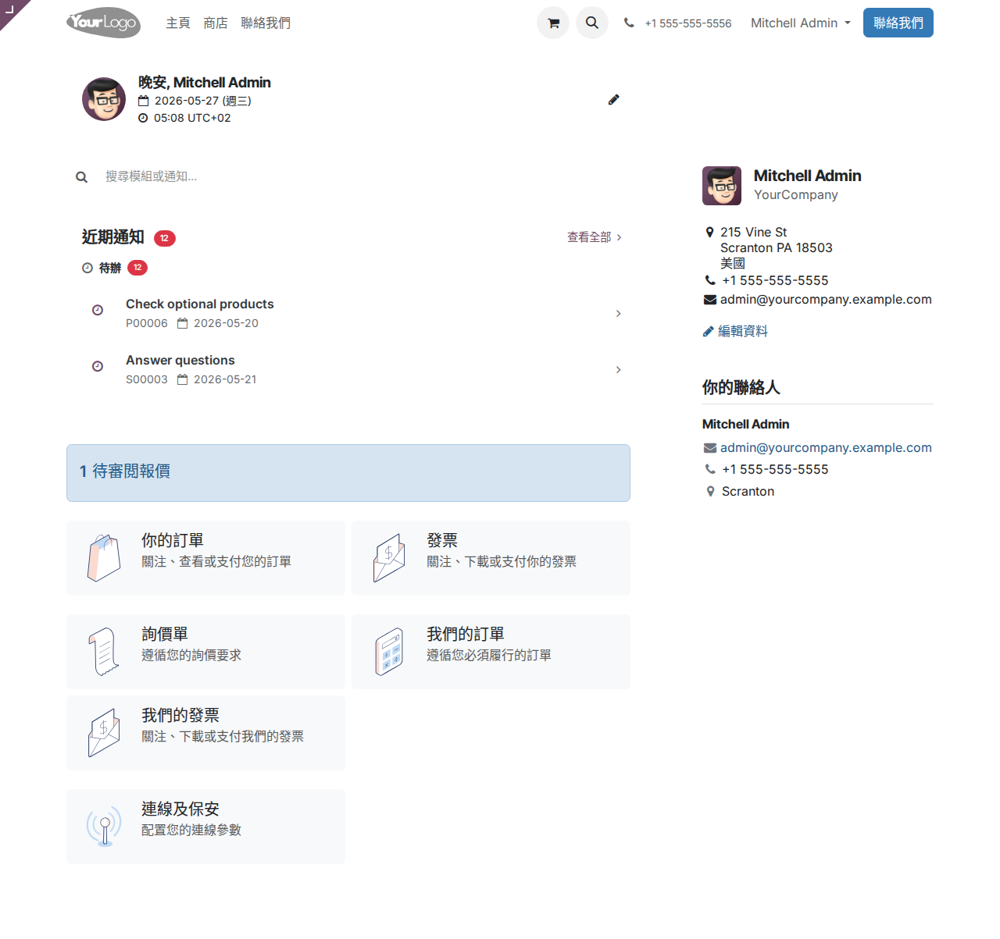

### 登入錯誤處理

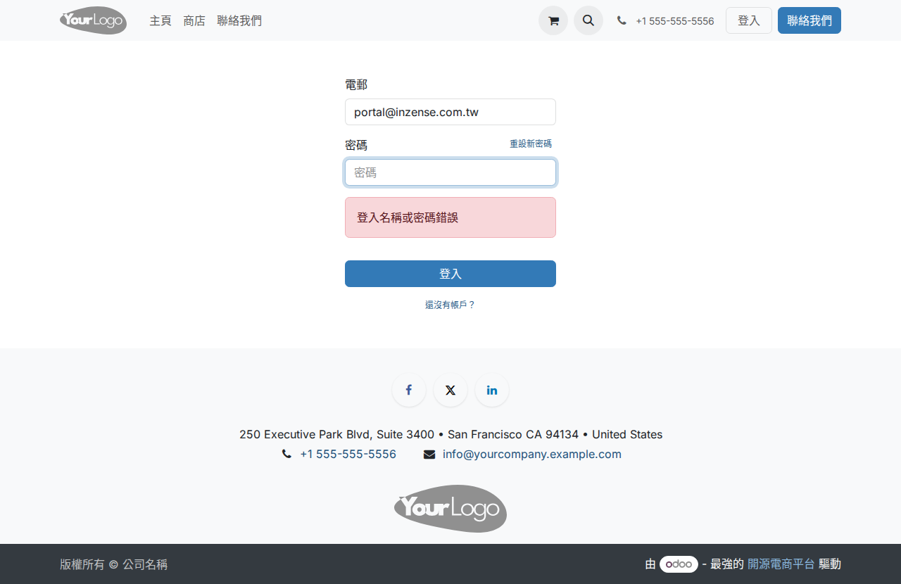

當輸入的帳號或密碼不正確時，系統會在登入表單上方顯示錯誤提示訊息。請確認帳號與密碼是否正確後重新嘗試。

### 步驟 4：忘記密碼

1. 在登入頁面點擊「重設新密碼」連結。
2. 輸入註冊時使用的電子郵件地址。
3. 點擊「送出」按鈕。
4. 系統發送密碼重設郵件至您的信箱。
5. 開啟郵件，點擊重設連結，設定新密碼。

### 步驟 5：新會員註冊

1. 在登入頁面點擊「還沒有帳戶？」連結。
2. 填寫姓名、電子郵件、密碼等資訊。
3. 點擊「註冊」按鈕完成註冊。

> **安全提醒**：預設的 `admin` / `admin` 帳號密碼僅供展示與測試使用，正式上線前務必修改為強密碼。

---

## 3. 會員中心（Portal 儀表板）

登入後，會員將進入 Portal 儀表板頁面。此頁面為會員的個人中心，提供快速導覽至各項功能的入口。

### 步驟 1：儀表板總覽

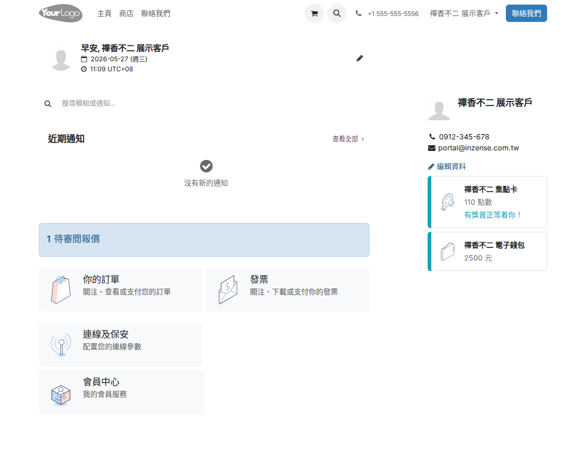

Portal 儀表板顯示會員的各項服務統計與快速入口：

| 功能 | 說明 |
|------|------|
| 歡迎訊息 | 顯示個人化問候語與日期 |
| 你的訂單 | 顯示訂單數量，點擊前往訂單列表 |
| 發票 | 顯示發票數量，點擊前往發票列表 |
| 會員中心 | 點擊前往忠誠計畫總覽（集點卡、優惠券、禮品卡、電子錢包） |

### 步驟 2：功能卡片與路徑

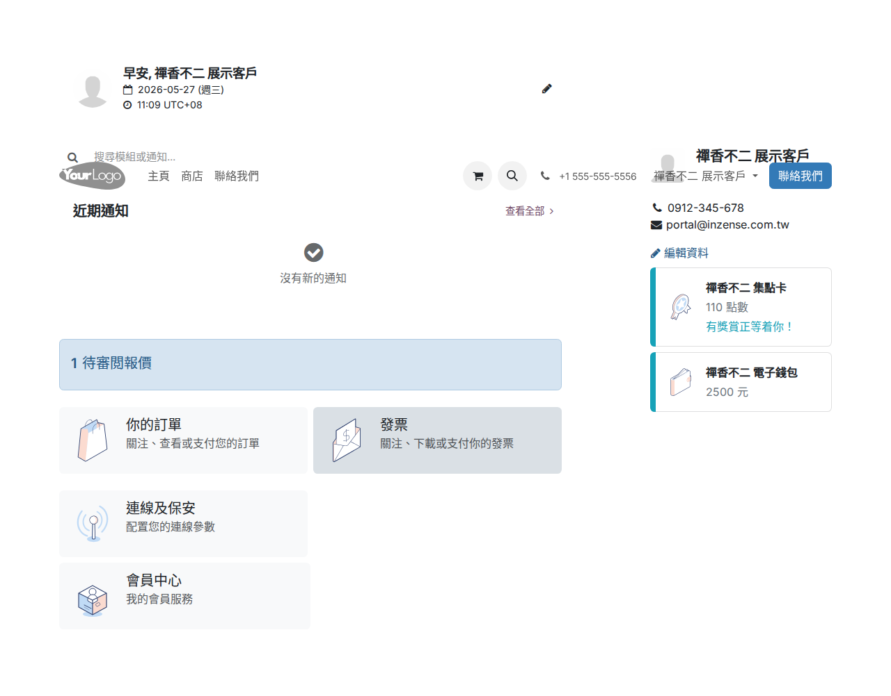

| 功能卡片 | 路徑 | 說明 |
|---------|------|------|
| 你的訂單 | `/my/orders` | 查看所有銷售訂單 |
| 發票 | `/my/invoices` | 查看所有發票與付款紀錄 |
| 會員中心 | `/my/member-center` | 查看忠誠計畫（集點、優惠、禮品、錢包） |
| 個人資料 | `/my/account` | 編輯個人資料與聯絡資訊 |
| 連線及保安 | `/my/security` | 修改密碼與安全設定 |

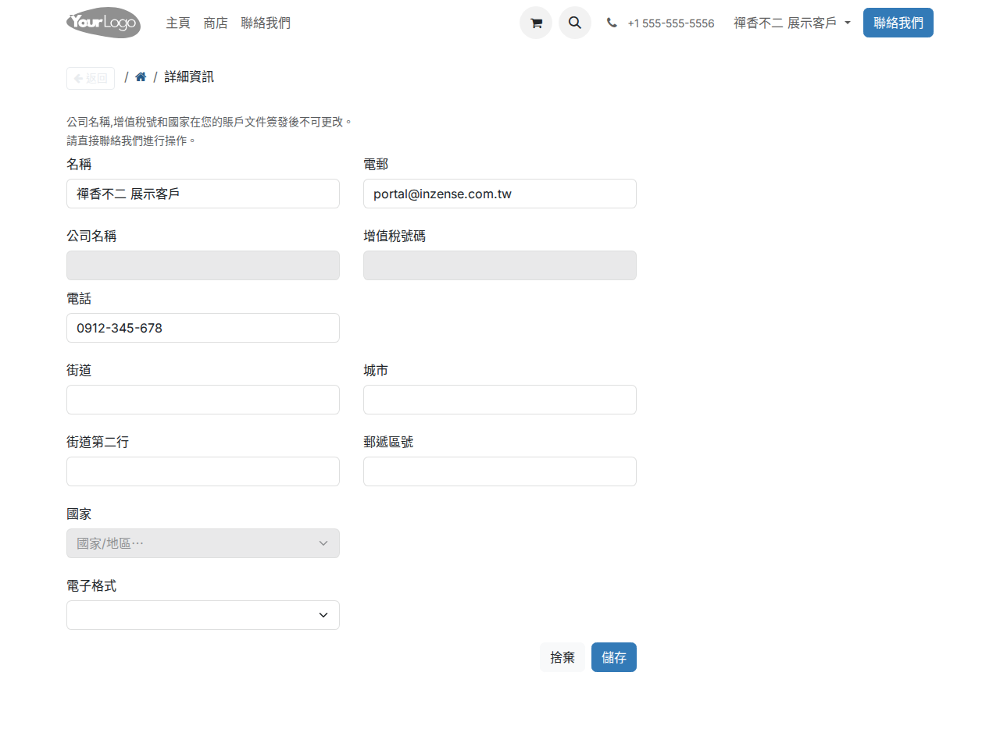

> **提示**：展示客戶帳號已預設有 10+ 筆訂單、4 種忠誠計畫卡片，可完整體驗所有 Portal 功能。

---

## 4. 會員中心 — 集點卡

### 步驟 1：進入集點卡頁面

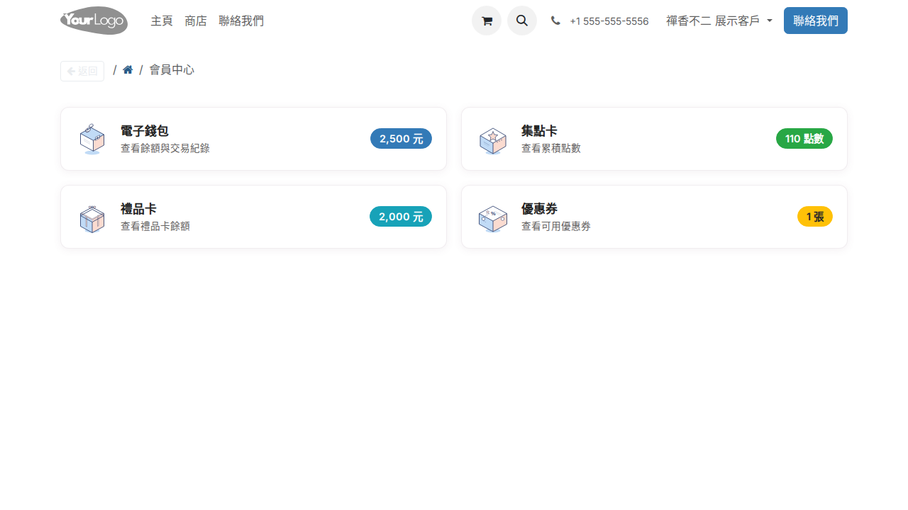

1. 從會員中心 Hub 頁面，點擊「集點卡」區塊。
2. 或直接前往 `/my/member-center/loyalty`。

### 步驟 2：集點卡列表

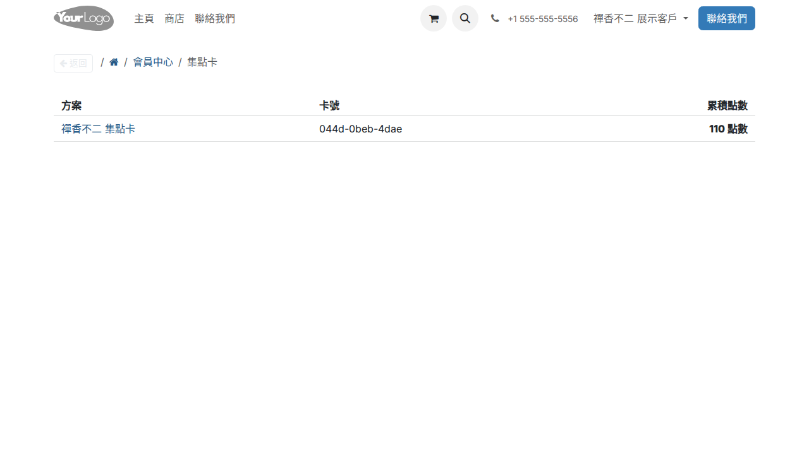

| 功能 | 說明 |
|------|------|
| 卡片代碼 | 集點卡的唯一識別碼 |
| 目前點數 | 目前持有的集點數（單位：點數） |
| 計畫名稱 | 禪香不二 集點卡 |
| 查看詳情 | 點擊進入詳情頁面 |

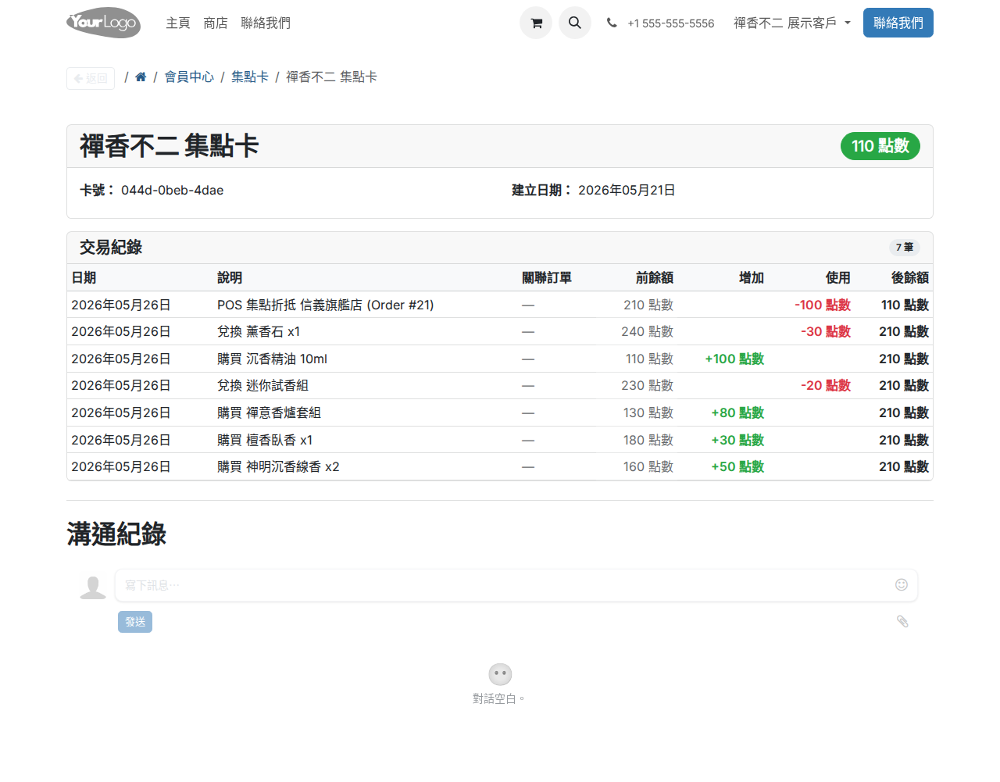

**展示客戶資料：**

| 項目 | 內容 |
|------|------|
| 計畫名稱 | 禪香不二 集點卡 |
| 目前點數 | 210 點數 |
| 累積規則 | 每消費 NT$100 獲得 1 點 |
| 兌換規則 | 1 點 = NT$1 折扣 |

### 步驟 3：集點卡歷史

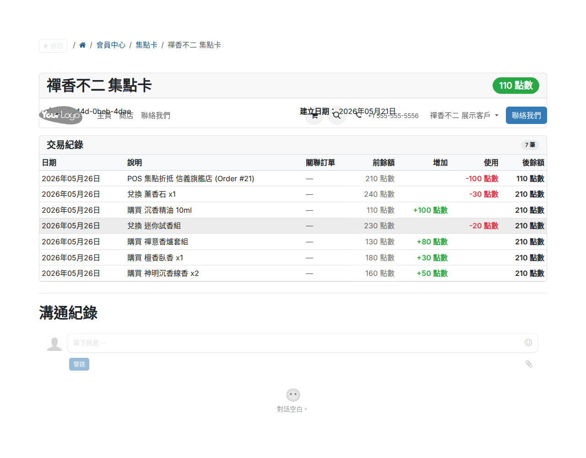

點擊集點卡進入詳情頁後，可查看完整的異動紀錄：

| 日期 | 說明 | 獲得 | 使用 |
|------|------|------|------|
| — | 購買 神明沉香線香 x2 | +50 | — |
| — | 購買 檀香臥香 x1 | +30 | — |
| — | 購買 禪意香爐套組 | +80 | — |
| — | 兌換 迷你試香組 | — | -20 |
| — | 購買 沉香精油 10ml | +100 | — |
| — | 兌換 薰香石 x1 | — | -30 |

---

## 5. 會員中心 — 優惠券

### 步驟 1：進入優惠券頁面

1. 從會員中心 Hub 頁面，點擊「優惠券」區塊。
2. 或直接前往 `/my/member-center/coupons`。

### 步驟 2：優惠券列表

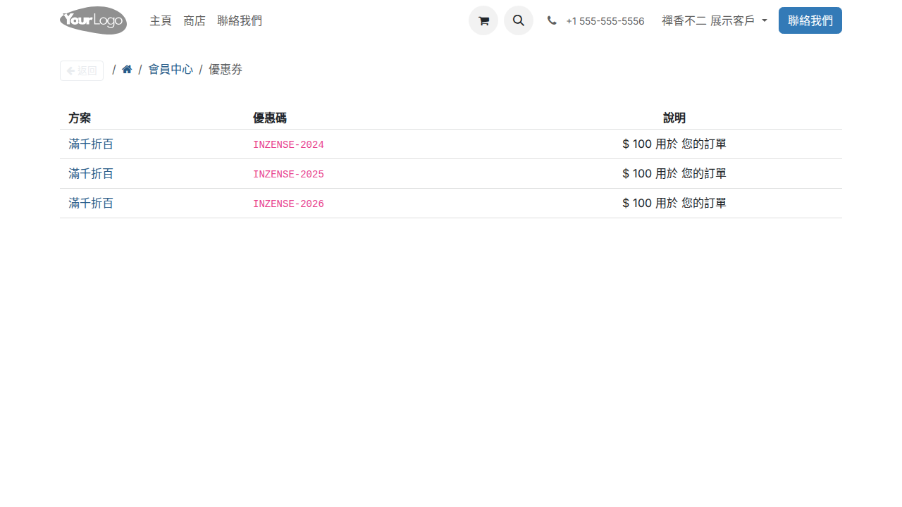

| 功能 | 說明 |
|------|------|
| 優惠券代碼 | 優惠券的唯一代碼 |
| 狀態 | 可用（1 張）/ 已使用（0 張） |
| 計畫名稱 | 滿千折百 |
| 使用條件 | 訂單金額滿 NT$1,000 即可使用，折抵 NT$100 |

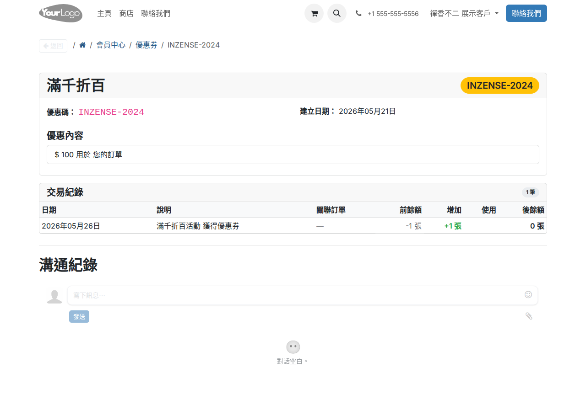

**展示客戶優惠券：**

| 代碼 | 狀態 | 說明 |
|------|------|------|
| INZENSE-2024 | 已使用 | 已用於訂單 |
| INZENSE-2025 | 可用 | 尚未使用 |
| INZENSE-2026 | 可用 | 尚未使用 |

### 步驟 3：使用優惠券

1. 優惠券可在 POS 結帳時由收銀人員輸入代碼套用。
2. 訂單金額需滿 NT$1,000 才符合使用條件。
3. 每張優惠券限用一次，使用後狀態變為「已使用」。

---

## 6. 會員中心 — 禮品卡

### 步驟 1：進入禮品卡頁面

1. 從會員中心 Hub 頁面，點擊「禮品卡」區塊。
2. 或直接前往 `/my/member-center/gift-cards`。

### 步驟 2：禮品卡列表

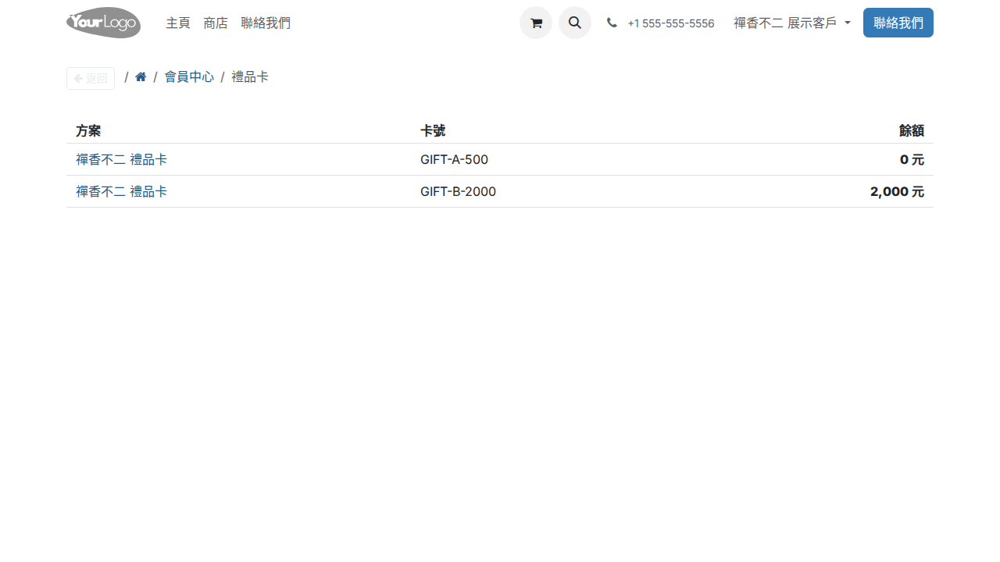

**展示客戶禮品卡：**

| 卡號 | 餘額 | 計畫名稱 |
|------|------|---------|
| GIFT-A-500 | NT$500 | 禪香不二 禮品卡 |
| GIFT-B-2000 | NT$2,000 | 禪香不二 禮品卡 |

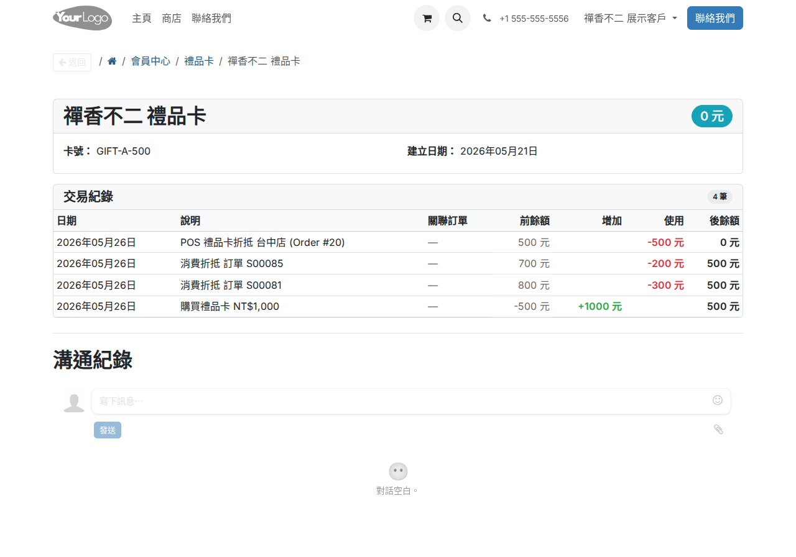

### 步驟 3：禮品卡歷史

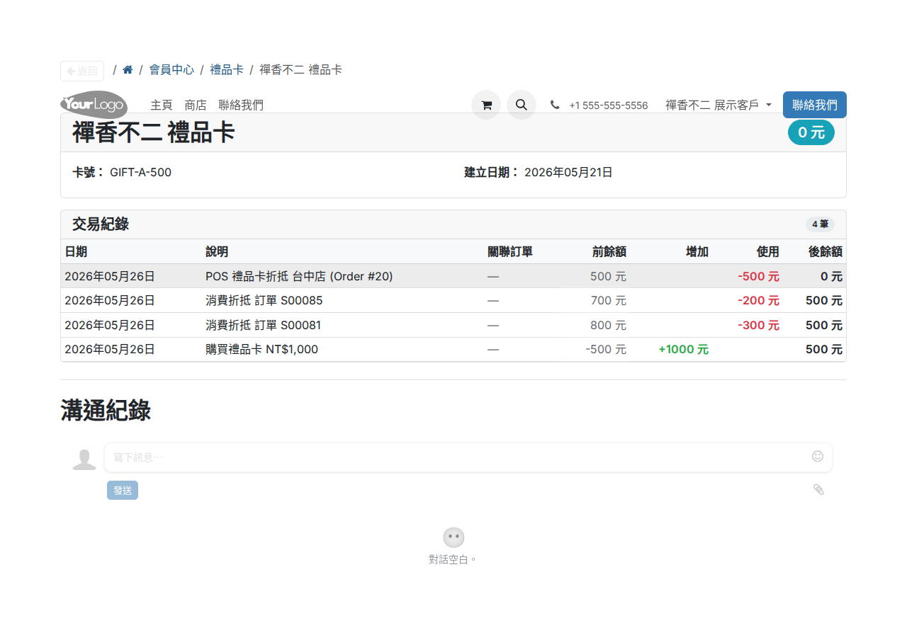

| 日期 | 說明 | 儲值 | 消費 |
|------|------|------|------|
| — | 購買禮品卡 NT$1,000 | +1,000 | — |
| — | 消費折抵 訂單 S00081 | — | -300 |
| — | 消費折抵 訂單 S00085 | — | -200 |

### 步驟 4：使用禮品卡

1. 禮品卡餘額可在 POS 結帳時自動折抵。
2. 折抵規則：1 點 = NT$1，直接從卡片餘額扣除。
3. 禮品卡可購買贈送親友，或自用儲值。

---

## 7. 會員中心 — 電子錢包

### 步驟 1：進入電子錢包頁面

1. 從會員中心 Hub 頁面，點擊「電子錢包」區塊。
2. 或直接前往 `/my/member-center/ewallet`。

### 步驟 2：電子錢包總覽

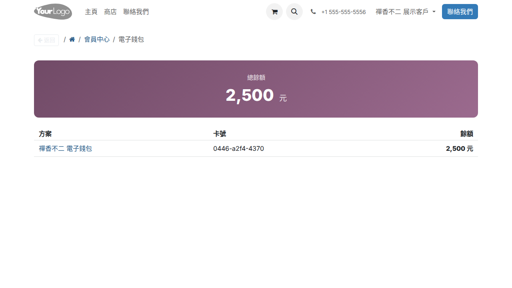

| 項目 | 內容 |
|------|------|
| 計畫名稱 | 禪香不二 電子錢包 |
| 目前餘額 | NT$3,000（初始）|
| 單位 | 元 |
| 折抵規則 | 1 點 = NT$1，結帳時直接折抵 |

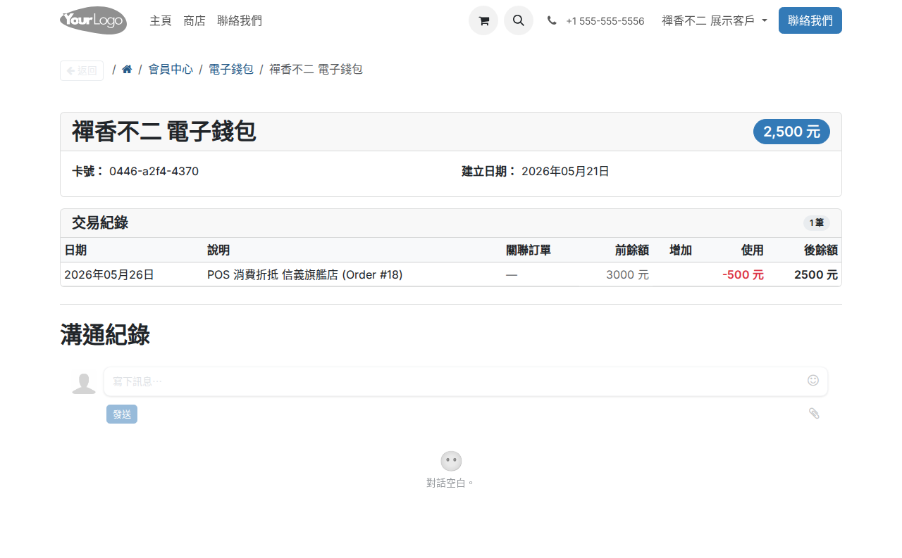

### 步驟 3：電子錢包歷史

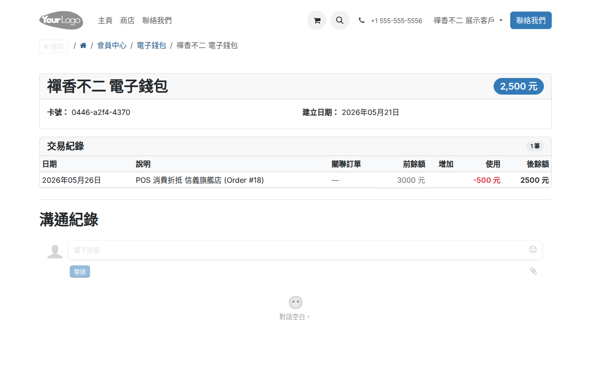

| 日期 | 說明 | 儲值 | 消費 |
|------|------|------|------|
| — | 儲值 NT$5,000 | +5,000 | — |
| — | 消費折抵 訂單 S00076 | — | -800 |
| — | 消費折抵 訂單 S00079 | — | -650 |
| — | 消費折抵 訂單 S00083 | — | -550 |
| — | 儲值回饋 NT$500 | +500 | — |
| — | 消費折抵 訂單 S00088 | — | -500 |

---

## 8. 我的訂單

### 步驟 1：訂單列表

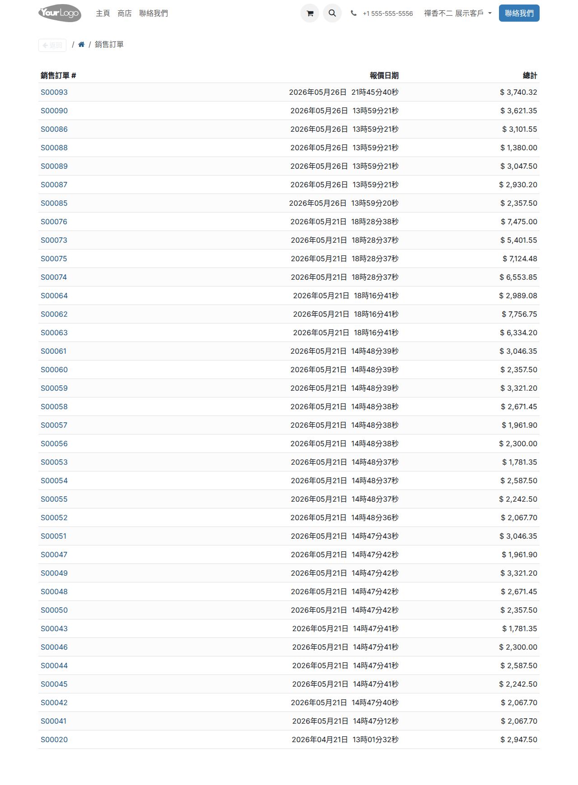

1. 從 Portal 儀表板點擊「你的訂單」，或前往 `/my/orders`。

| 功能 | 說明 |
|------|------|
| 訂單編號 | 每筆訂單的唯一識別編號 |
| 訂單日期 | 訂單建立的日期 |
| 訂單金額 | 訂單的總金額（含稅） |
| 訂單狀態 | 報價中 / 銷售訂單 / 已完成 |

**展示客戶訂單範例（部分）：**

| 天數前 | 商品組合 | 數量 |
|--------|---------|------|
| 30 天 | 善緣香 | x2 |
| 27 天 | 財神香 + 三清檀香 | x1+1 |
| 24 天 | 心輪香 | x3 |
| 21 天 | 木神香 + 柬埔寨沉香 | x1+1 |
| 18 天 | 巴拉圭綠檀 | x2 |

### 步驟 2：訂單詳情

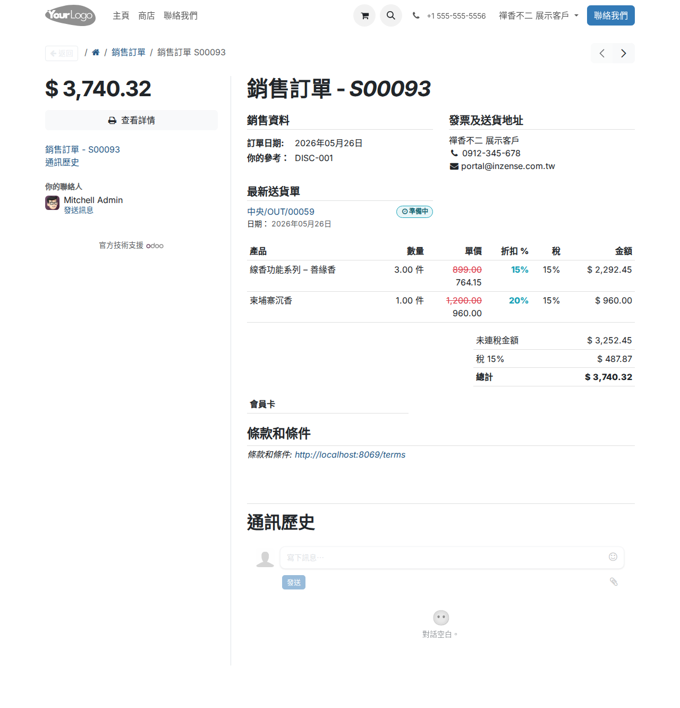

點擊訂單編號，進入訂單詳情頁面：

| 功能 | 說明 |
|------|------|
| 訂單編號 | 訂單的完整編號 |
| 訂單明細 | 購買的商品、數量、單價、小計 |
| 稅額 | 各項目的稅額計算 |
| 合計金額 | 訂單的總計金額（含稅） |
| 發票連結 | 若已開立發票，可直接跳轉 |

---

## 9. 我的發票

### 步驟 1：發票列表

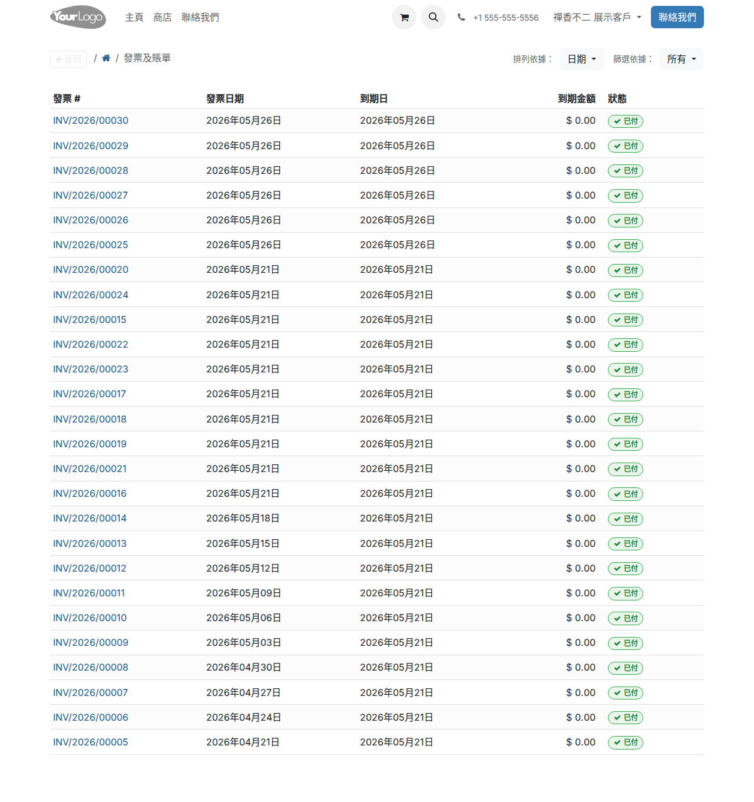

1. 從 Portal 儀表板點擊「發票」，或前往 `/my/invoices`。

| 功能 | 說明 |
|------|------|
| 發票編號 | 發票的唯一編號（如 INV/2026/XXXXX） |
| 發票日期 | 開立日期 |
| 發票金額 | 應付總金額 |
| 付款狀態 | 已付款 / 未付款 / 部分付款 |
| 下載 PDF | 點擊可下載發票 PDF 檔案 |

### 步驟 2：發票詳情與 PDF 下載

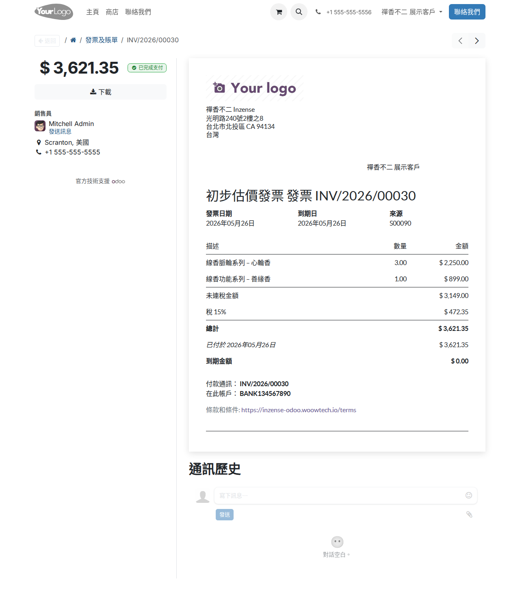

1. 點擊發票編號進入詳情頁面。
2. 查看發票明細：項目名稱、數量、單價、稅額、合計。
3. 點擊「下載 PDF」按鈕下載發票檔案。

### 步驟 3：線上付款

若發票尚未付款，Portal 會員可透過線上付款功能完成付款：

1. 在發票詳情頁面，找到「付款」或「線上付款」按鈕。
2. 選擇付款方式（依系統設定，可能包含信用卡、銀行轉帳等）。
3. 依指示完成付款流程。
4. 付款成功後，發票狀態自動更新為「已付款」。

> **提示**：目前系統已啟用 Demo 付款供應商作為測試用途。正式上線時應替換為實際的付款閘道。

---

## 10. POS 銷售點 — 開店與基本操作

POS（銷售點）是門市日常營運的核心系統。本章說明如何開啟 POS、選擇商品、管理購物車。

### 步驟 1：選擇門市並開啟收銀機

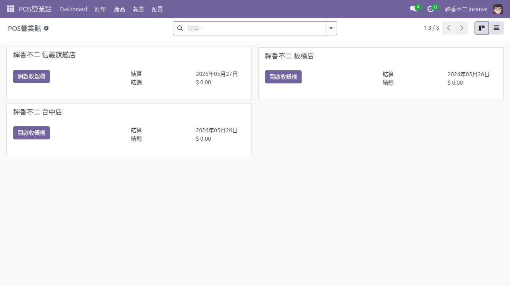

1. 以管理員帳號登入後台。
2. 點擊左上角選單，進入「銷售點」（Point of Sale）模組。
3. 系統顯示 3 間門市的 POS 設定卡片。
4. 點擊要開啟的門市卡片上的「開啟收銀機」按鈕。

| 門市 | 倉庫 | 付款方式 |
|------|------|---------|
| 禪香不二 信義旗艦店 | 信義旗艦店倉庫 | 現金-信義、禪香不二 信用卡 |
| 禪香不二 板橋店 | 板橋店倉庫 | 現金-板橋、禪香不二 信用卡 |
| 禪香不二 台中店 | 台中店倉庫 | 現金-台中、禪香不二 信用卡 |

5. POS 前端載入完成後，顯示商品選擇畫面。

### 步驟 2：選擇商品

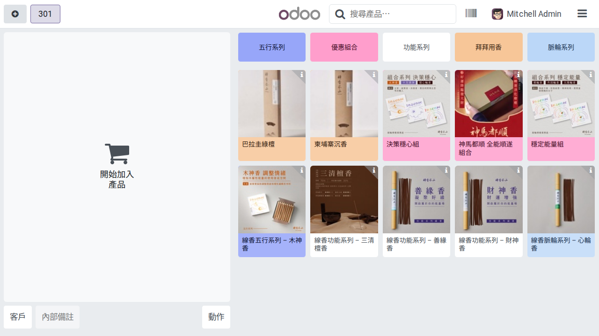

1. POS 商品區以網格方式顯示所有可銷售商品。
2. 上方或左側有分類標籤，可切換不同商品分類。
3. 點擊商品圖片即可將商品加入購物車。
4. 重複點擊同一商品，數量自動增加。

### 步驟 3：管理購物車

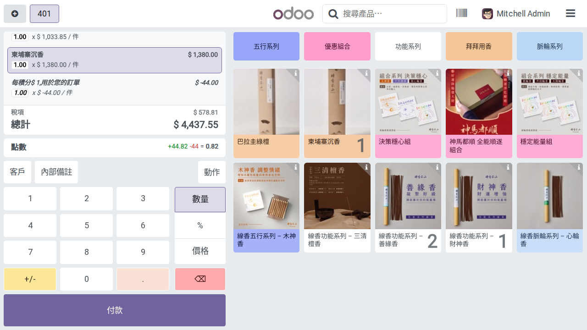

| 操作 | 說明 |
|------|------|
| 增加數量 | 點擊商品圖片或使用數字鍵盤輸入數量 |
| 修改數量 | 點選購物車中的訂單行，使用數字鍵盤更改 |
| 刪除商品 | 點選訂單行後按「刪除」或將數量設為 0 |
| 指定客戶 | 點擊「客戶」按鈕，搜尋並選擇客戶（啟用忠誠計畫折扣） |

### 步驟 4：指定客戶（重要）

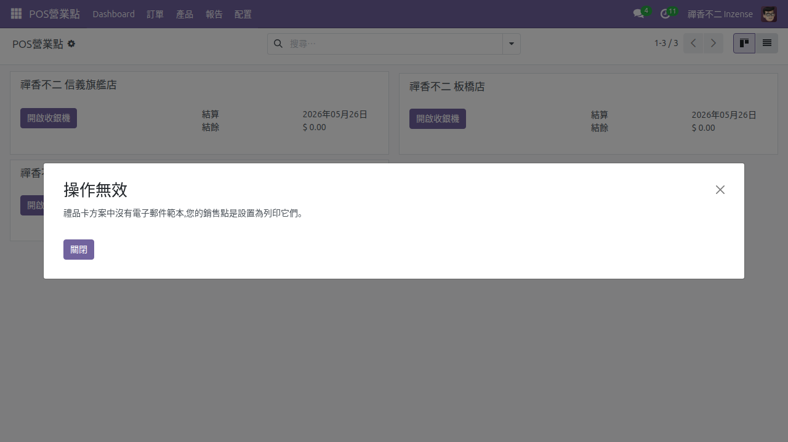

指定客戶後，系統可自動查詢該客戶的忠誠計畫卡片：

1. 點擊 POS 畫面上的「客戶」按鈕。
2. 在搜尋欄輸入客戶姓名（如「禪香不二 展示客戶」）。
3. 選擇客戶後，購物車上方會顯示客戶名稱。
4. 此時可使用該客戶的集點卡、優惠券、禮品卡、電子錢包。

---

## 11. POS 銷售點 — 結帳與付款

### 步驟 1：進入付款畫面

1. 確認購物車中的商品正確後，點擊「付款」按鈕。
2. 系統進入付款畫面，顯示應付金額與可用的付款方式。

### 步驟 2：現金付款

1. 在付款畫面點擊「現金」付款方式（如「現金-信義」）。
2. 系統自動帶入應付金額。
3. 如客戶支付金額大於應付金額，輸入實收金額，系統自動計算找零。
4. 點擊「確認」按鈕完成交易。
5. 列印收據或發送電子收據。

### 步驟 3：信用卡付款

1. 在付款畫面點擊「禪香不二 信用卡」付款方式。
2. 系統帶入應付金額。
3. 使用實體刷卡機完成刷卡（Odoo 不處理實際刷卡，僅記錄金額）。
4. 點擊「確認」按鈕完成交易。

### 步驟 4：客戶帳戶付款（先出貨後收款）

此付款方式用於外部平台訂單或需要延遲收款的場景：

1. 在付款畫面點擊「客戶帳戶」付款方式。
2. 必須先指定客戶（客戶帳戶需要記錄應收帳款對象）。
3. 系統將訂單記錄為「應收帳款」，不立即產生現金/銀行分錄。
4. 等外部平台撥款或客戶付款後，在後台進行銷帳。

| 付款方式 | 類型 | 即時入帳 | 適用場景 |
|---------|------|---------|---------|
| 現金 | cash | 是 | 門市現場現金交易 |
| 信用卡 | bank | 是 | 門市現場刷卡交易 |
| 客戶帳戶 | pay_later | 否（應收） | 外部平台訂單、延遲收款 |

### 步驟 5：混合付款

POS 支援單筆訂單使用多種付款方式：

1. 先點擊第一種付款方式（如現金），輸入部分金額。
2. 再點擊第二種付款方式（如信用卡），系統自動帶入剩餘金額。
3. 確認總付款金額等於應付金額後，點擊「確認」完成交易。

---

## 12. POS 銷售點 — 會員優惠折扣

POS 整合了 4 種忠誠計畫，會員在 POS 結帳時可使用各種優惠折扣。

### 步驟 1：集點卡折抵

1. 先指定客戶（必須）。
2. 系統自動查詢該客戶的集點卡餘額。
3. 結帳時，系統會顯示可用的集點折扣選項。
4. 選擇使用集點折抵，輸入要折抵的點數。
5. 折抵規則：1 點 = NT$1。

**範例**：客戶有 210 點，購買巴拉圭綠檀 NT$1,000，使用 100 點折抵，實付 NT$900。

### 步驟 2：優惠券使用

1. 先指定客戶。
2. 在 POS 中輸入優惠券代碼。
3. 系統驗證代碼是否有效：
   - 訂單金額是否滿足最低消費（NT$1,000）。
   - 優惠券是否已使用。
4. 驗證通過後，自動折抵 NT$100。

### 步驟 3：禮品卡折抵

1. 先指定客戶。
2. 系統查詢該客戶持有的禮品卡及餘額。
3. 結帳時選擇禮品卡折抵。
4. 折抵金額不超過禮品卡餘額與訂單金額的較小值。

**範例**：GIFT-A-500 餘額 NT$500，購買木神香 NT$750，折抵 NT$500，實付 NT$250。

### 步驟 4：電子錢包折抵

1. 先指定客戶。
2. 系統顯示電子錢包餘額。
3. 結帳時選擇電子錢包折抵，輸入折抵金額。
4. 折抵規則：1 點 = NT$1。

**範例**：電子錢包餘額 NT$3,000，購買善緣香 NT$899，折抵 NT$500，實付 NT$399。

---

## 13. POS 銷售點 — 商品分類與完整商品列表

### 步驟 1：POS 商品分類

POS 商品區設有 5 大分類標籤，點擊可篩選顯示該分類的商品：

| 分類 | 說明 |
|------|------|
| 功能系列 | 具特定功能效果的線香 |
| 脈輪系列 | 對應人體脈輪能量的線香 |
| 五行系列 | 對應五行元素的線香 |
| 拜拜用香 | 傳統祭祀用的高級香品 |
| 優惠組合 | 多品項套裝組合與禮盒 |

### 步驟 2：完整商品列表（10 項）

**功能系列（3 項）：**

| 商品名稱 | 價格（TWD） | 條碼 | 說明 |
|---------|-----------|------|------|
| 線香功能系列 – 善緣香 | $899 | 4710001000011 | 增進善緣，人際和諧 |
| 線香功能系列 – 財神香 | $899 | 4710001000028 | 招財進寶，財運亨通 |
| 線香功能系列 – 三清檀香 | $650 | — | 純正檀香，清心靜氣 |

**脈輪系列（1 項）：**

| 商品名稱 | 價格（TWD） | 說明 |
|---------|-----------|------|
| 線香脈輪系列 – 心輪香 | $750 | 對應心輪能量，平衡情緒 |

**五行系列（1 項）：**

| 商品名稱 | 價格（TWD） | 條碼 | 說明 |
|---------|-----------|------|------|
| 線香五行系列 – 木神香 | $750 | 4710001000035 | 木元素能量，生機盎然 |

**拜拜用香（2 項）：**

| 商品名稱 | 價格（TWD） | 條碼 | 說明 |
|---------|-----------|------|------|
| 柬埔寨沉香 | $1,200 | 4710001000042 | 頂級柬埔寨天然沉香 |
| 巴拉圭綠檀 | $1,000 | — | 南美洲珍貴綠檀木 |

**優惠組合（3 項）：**

| 商品名稱 | 價格（TWD） | 說明 |
|---------|-----------|------|
| 決策穩心組 | $807 | 安定心神的多品項套裝 |
| 穩定能量組 | $712 | 穩定能量場的組合包 |
| 神馬都順 全能順遂組合 | $2,888 | 年節禮盒，全方位祈福 |

---

## 14. POS 銷售點 — 多門市管理與倉庫隔離

### 步驟 1：門市與倉庫對應

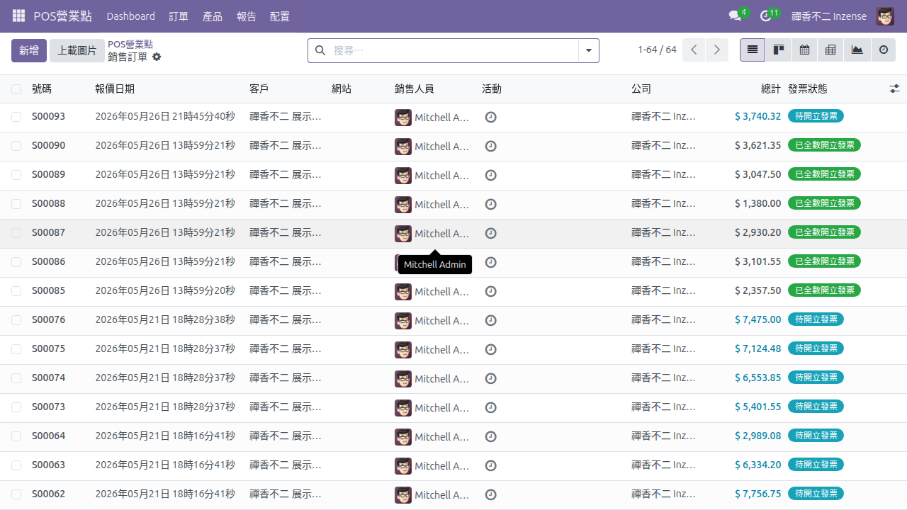

每間 POS 門市綁定專屬倉庫，銷售時只會從該門市的倉庫扣除庫存：

| POS 門市 | 對應倉庫 | 現金付款方式 | 信用卡付款方式 |
|---------|---------|------------|------------|
| 禪香不二 信義旗艦店 | 信義旗艦店倉庫 | 現金-信義 | 禪香不二 信用卡（共用） |
| 禪香不二 板橋店 | 板橋店倉庫 | 現金-板橋 | 禪香不二 信用卡（共用） |
| 禪香不二 台中店 | 台中店倉庫 | 現金-台中 | 禪香不二 信用卡（共用） |


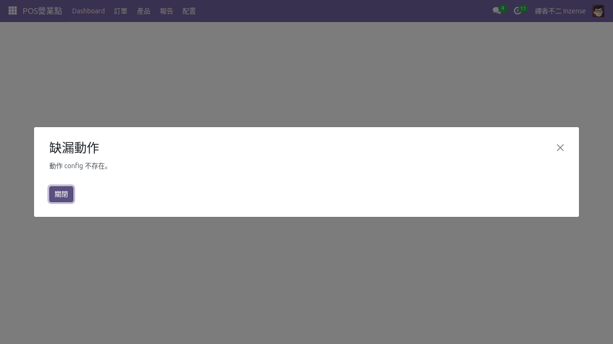

> **重要**：Odoo 18 要求每間 POS 使用各自獨立的現金付款方式（不可共用），信用卡付款方式則可跨門市共用。

### 步驟 2：倉庫隔離驗證

- 信義旗艦店銷售時，僅從信義旗艦店倉庫扣庫存。
- 板橋店和台中店的庫存不受影響。
- 中央倉庫的庫存也不受門市銷售直接影響。

### 步驟 3：中央倉庫補貨

當門市庫存不足時，可透過內部調撥從中央倉庫補貨：

1. 進入後台「庫存 > 作業 > 調撥」。
2. 建立新的內部調撥單。
3. 來源位置：中央/庫存。
4. 目的位置：門市/庫存（如信義/庫存）。
5. 選擇商品與數量。
6. 確認並驗證調撥單。

---

## 15. POS 銷售點 — 關店與日結

### 步驟 1：關閉收銀機

1. 在 POS 畫面，點擊左上角漢堡選單（三橫線）。
2. 點擊「關閉收銀機」或「Close」。
3. 系統進入關帳流程。

### 步驟 2：日結摘要

關閉收銀機時，系統顯示日結摘要：

| 項目 | 說明 |
|------|------|
| 交易筆數 | 本次 session 的總交易筆數 |
| 總營業額 | 所有交易的總金額 |
| 現金收入 | 現金付款的總金額 |
| 信用卡收入 | 信用卡付款的總金額 |
| 客戶帳戶 | 延遲收款的金額（應收帳款） |

### 步驟 3：確認關帳

1. 核對日結摘要數據是否正確。
2. 點擊「關閉」或「驗證」按鈕確認關帳。
3. 系統將 POS session 狀態設為「已關閉」。
4. 庫存扣除與會計分錄在此時生成。

> **注意**：POS session 關閉後，該 session 內的所有訂單即為最終確認，無法再修改。

---

## 16. POS 訂單批量匯入

本功能用於將外部電商平台（如蝦皮、momo）的訂單批量匯入至 POS 系統。匯入的訂單使用「客戶帳戶」（pay_later）付款方式，記錄為應收帳款。

### 步驟 1：開啟匯入精靈

1. 以管理員帳號登入後台。
2. 進入「銷售點 > 訂單 > 匯入 POS 訂單」。
3. 系統彈出匯入精靈對話框。

### 步驟 2：匯入精靈欄位說明

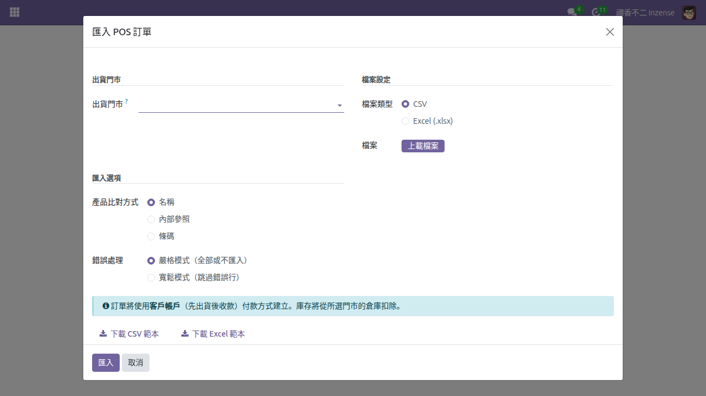

| 欄位 | 說明 |
|------|------|
| 出貨門市 | 選擇目標 POS 門市（必填，決定從哪個倉庫扣庫存） |
| 檔案類型 | CSV 或 Excel (.xlsx) |
| 檔案 | 點擊「上載檔案」上傳訂單檔案 |
| 產品比對方式 | 名稱 / 內部參照 / 條碼（用於比對商品） |
| 錯誤處理 | 嚴格模式（全部或不匯入）/ 寬鬆模式（跳過錯誤行） |

### 步驟 3：CSV 檔案格式

| 欄位名稱 | 必填 | 說明 |
|---------|------|------|
| ORDER | 是 | 訂單編號（同一編號的行合併為一筆訂單） |
| CUSTOMER | 是 | 客戶名稱（須與系統中的客戶名稱完全一致） |
| PRODUCT | 是 | 商品名稱（或內部參照/條碼，依比對方式） |
| QUANTITY | 是 | 數量 |
| PRICE | 是 | 單價 |
| DATE | 是 | 日期（YYYY-MM-DD 或 DD/MM/YYYY） |
| TAX | 否 | 稅項名稱（多個以分號隔開） |
| DISCOUNT | 否 | 折扣百分比（如 5 代表 5%） |

**CSV 範例：**

```csv
ORDER,CUSTOMER,PRODUCT,QUANTITY,PRICE,DATE,TAX,DISCOUNT
SHOPEE-001,禪香不二 展示客戶,線香功能系列 – 善緣香,2,899,2026-05-20,,
SHOPEE-001,禪香不二 展示客戶,線香功能系列 – 財神香,1,899,2026-05-20,,
SHOPEE-002,禪香不二 展示客戶,柬埔寨沉香,1,1200,2026-05-21,,5
```

### 步驟 4：下載範本


- 點擊「下載 CSV 範本」可下載預填範例的 CSV 檔案。
- 點擊「下載 Excel 範本」可下載預填範例的 Excel 檔案。
- 下載範本不需要先填寫任何欄位。

### 步驟 5：執行匯入

1. 選擇出貨門市（如「禪香不二 信義旗艦店」）。
2. 上傳 CSV 或 Excel 檔案。
3. 點擊「匯入」按鈕。
4. 系統自動：
   - 為該門市開啟一個批量匯入 session。
   - 逐筆建立 POS 訂單，付款方式為「客戶帳戶」。
   - 關閉 session，觸發庫存扣除。
5. 匯入完成後，顯示匯入結果與建立的訂單列表。

### 步驟 6：錯誤處理

| 模式 | 行為 |
|------|------|
| 嚴格模式 | 先驗證所有行，任何一行有錯誤則全部不匯入 |
| 寬鬆模式 | 匯入有效的行，跳過錯誤行，並在結果中列出被跳過的行 |

常見錯誤：
- 找不到客戶名稱
- 找不到商品名稱
- 數量或價格不是有效數字
- 缺少必填欄位

---

## 17. 銷售訂單批量匯入

本功能用於將銷售訂單批量匯入至 Odoo 後台。與 POS 匯入不同，此功能建立的是標準 `sale.order`。

### 步驟 1：開啟匯入精靈

1. 以管理員帳號登入後台。
2. 進入「銷售 > 訂單 > 匯入銷售訂單」。
3. 系統彈出匯入精靈對話框。

### 步驟 2：匯入精靈欄位說明

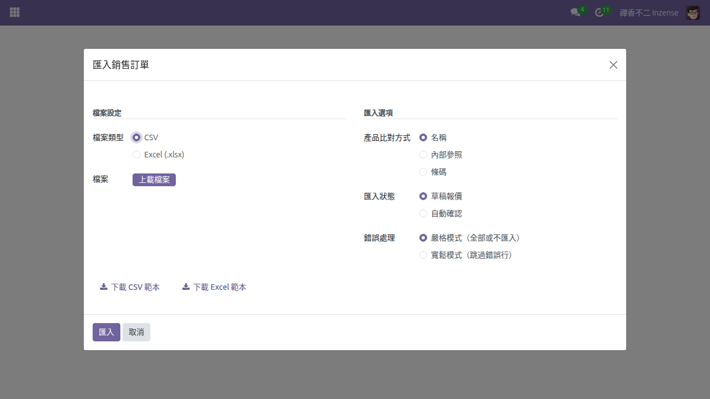

| 欄位 | 說明 |
|------|------|
| 檔案類型 | CSV 或 Excel (.xlsx) |
| 檔案 | 點擊「上載檔案」上傳訂單檔案 |
| 產品比對方式 | 名稱 / 內部參照 / 條碼 |
| 匯入狀態 | 草稿報價（僅建立）/ 自動確認（建立並確認） |
| 錯誤處理 | 嚴格模式 / 寬鬆模式 |

### 步驟 3：CSV 格式

CSV 格式與 POS 匯入相同（ORDER, CUSTOMER, PRODUCT, QUANTITY, PRICE, DATE, TAX, DISCOUNT）。

### 步驟 4：匯入狀態選項

| 選項 | 說明 |
|------|------|
| 草稿報價 | 匯入後建立為「報價單」（draft），需手動確認 |
| 自動確認 | 匯入後自動確認為「銷售訂單」（sale） |

### 步驟 5：執行匯入

1. 選擇檔案類型並上傳檔案。
2. 選擇產品比對方式與匯入狀態。
3. 點擊「匯入」按鈕。
4. 匯入完成後，顯示建立的銷售訂單列表。

---

## 18. 銷售訂單完整流程

本章說明銷售訂單從建立到完成收款的完整生命週期。

### 步驟 1：建立銷售訂單

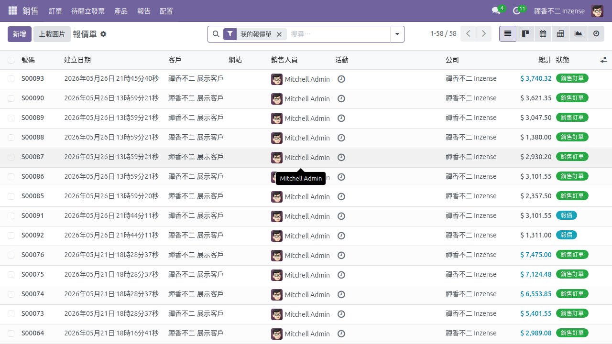


1. 進入「銷售 > 訂單」。
2. 點擊「新增」建立新的銷售訂單。
3. 選擇客戶。
4. 在訂單明細中新增商品行：選擇商品、設定數量。
5. 系統自動計算小計、稅額、合計。
6. 點擊「儲存」保存草稿。

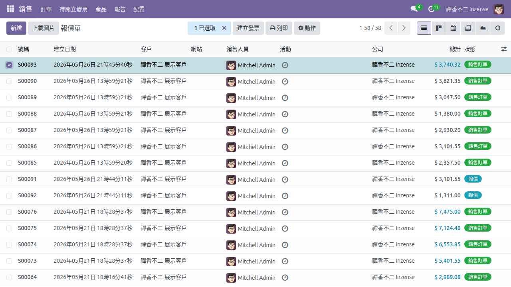

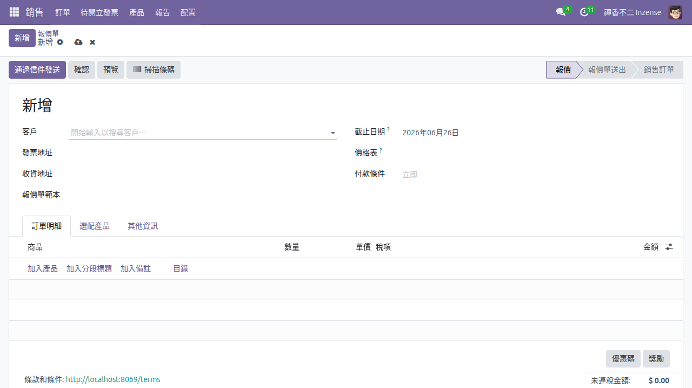

### 步驟 2：確認訂單

1. 在銷售訂單頁面，點擊「確認」按鈕。
2. 訂單狀態從「報價單」變為「銷售訂單」。
3. 系統自動建立出貨單（stock.picking）。

### 步驟 3：處理出貨

1. 在已確認的訂單頁面，點擊「出貨」按鈕或進入出貨單。
2. 確認各商品的實際出貨數量。
3. 點擊「驗證」完成出貨。
4. 庫存從對應倉庫扣除。

### 步驟 4：建立發票

1. 在已出貨的訂單頁面，點擊「建立發票」按鈕。
2. 選擇發票類型（一般發票）。
3. 系統自動產生發票草稿。
4. 確認發票明細無誤。

### 步驟 5：過帳發票

1. 在發票頁面，點擊「確認」按鈕。
2. 發票狀態從「草稿」變為「已過帳」。
3. 系統產生會計分錄（journal entry）。
4. 發票編號正式生成（如 INV/2026/XXXXX）。

### 步驟 6：登記收款

1. 在已過帳的發票頁面，點擊「登記付款」按鈕。
2. 選擇付款方式（銀行/現金）。
3. 輸入收款金額（可全額或部分收款）。
4. 輸入付款日期。
5. 點擊「確認」完成收款。
6. 發票狀態變為「已付款」。

### 流程總結

```
報價單（Draft） → 銷售訂單（Sale） → 出貨（Done） → 發票草稿（Draft）
→ 已過帳（Posted） → 已付款（Paid）
```

---

## 19. 發票管理與銷帳

### 步驟 1：發票管理概覽

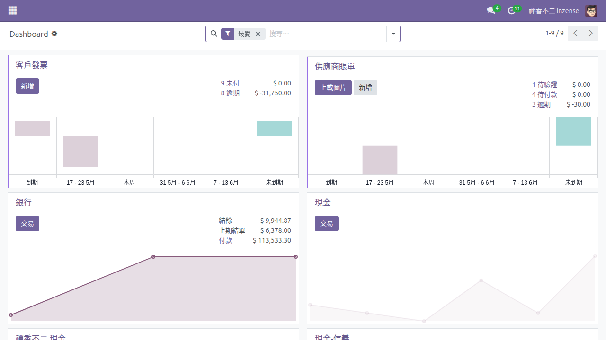

進入「會計 > 發票」模組，可管理所有發票：

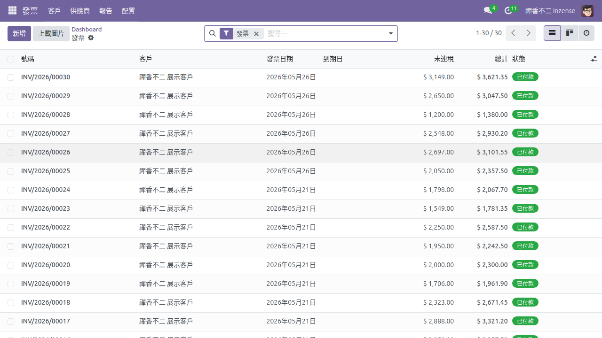

| 功能 | 說明 |
|------|------|
| 客戶發票 | 向客戶收款的發票 |
| 供應商帳單 | 應付供應商的帳單 |
| 信用票 | 退款或折讓的信用票 |

### 步驟 2：發票過帳


1. 在發票列表中，選擇狀態為「草稿」的發票。
2. 點擊進入發票詳情。
3. 確認明細無誤後，點擊「確認」按鈕。
4. 發票過帳後會產生會計分錄。

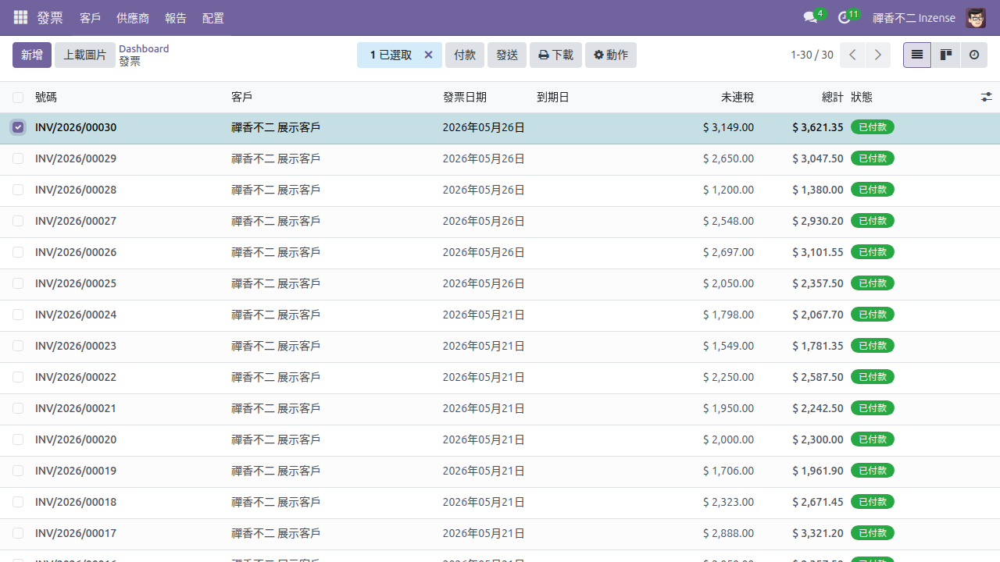

### 步驟 3：登記付款（銷帳）

1. 在已過帳的發票中，點擊「登記付款」。
2. 系統彈出付款精靈：

| 欄位 | 說明 |
|------|------|
| 付款方式 | 選擇銀行帳戶或現金帳戶 |
| 金額 | 預設帶入發票應付金額，可修改為部分付款 |
| 日期 | 付款日期 |
| 備註 | 付款備註（如匯款帳號後五碼） |

3. 點擊「確認」完成銷帳。
4. 發票的付款狀態變為「已付款」。

### 步驟 4：POS 訂單與發票

POS 訂單的會計處理方式取決於付款類型：

| POS 付款方式 | 會計處理 | 發票 |
|------------|---------|------|
| 現金 | 即時入帳至現金日記帳 | 不自動開立發票 |
| 信用卡 | 即時入帳至銀行日記帳 | 不自動開立發票 |
| 客戶帳戶 | 記錄應收帳款，payment_state=not_paid | 不自動開立發票 |

> **POS 發票**：POS 訂單預設不開立發票。如需開立發票，可在 POS 訂單上勾選「To Invoice」，或在後台的 POS 訂單列表中手動建立。

### 步驟 5：POS 客戶帳戶銷帳流程

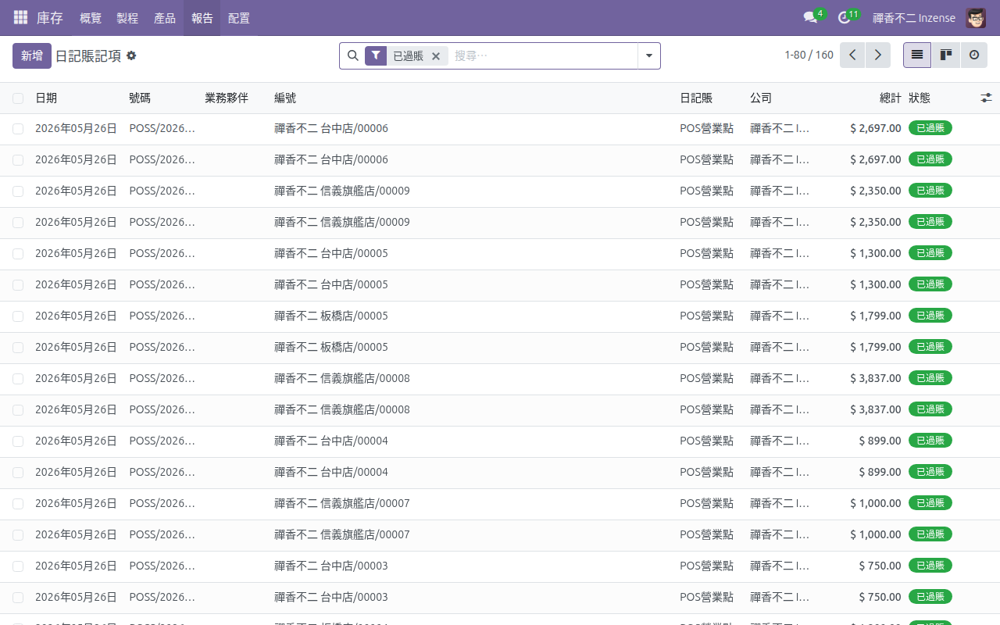

當使用「客戶帳戶」付款的 POS 訂單（如外部平台匯入的訂單），需在收到款項後進行銷帳：

1. 進入後台「銷售點 > 訂單」。
2. 找到使用「客戶帳戶」付款的訂單。
3. 確認收到外部平台撥款後，在會計模組中記錄收款。
4. 或透過批次銷帳功能一次處理多筆應收帳款。

---

## 20. 後台管理 — 登入與儀表板

### 步驟 1：管理員登入

1. 前往 `https://inzense-odoo.woowtech.io/odoo`。
2. 輸入帳號 `admin`、密碼 `admin`。
3. 登入後進入 Odoo 後台管理介面。

### 步驟 2：後台儀表板

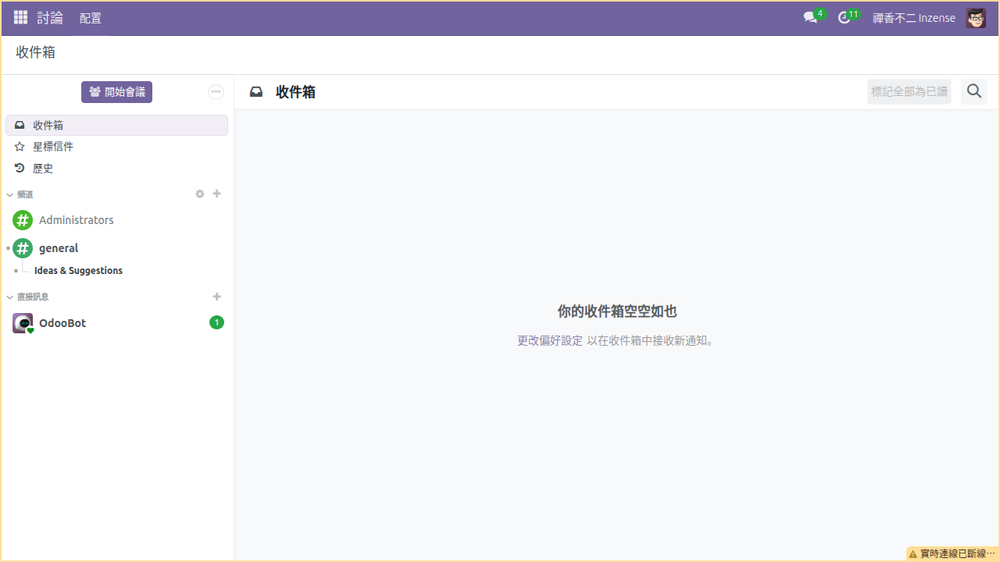

| 模組 | 功能 | 說明 |
|------|------|------|
| 銷售（Sales） | 銷售訂單管理 | 管理報價單與銷售訂單 |
| 銷售點（POS） | POS 管理 | 管理門市設定、POS 訂單、日結報表 |
| 庫存（Inventory） | 庫存管理 | 管理倉庫、庫存、調撥 |
| 會計（Invoicing） | 發票帳務 | 管理發票、收款、會計分錄 |
| 聯絡人（Contacts） | 客戶管理 | 管理客戶與夥伴資料 |
| 設定（Settings） | 系統設定 | 系統參數、使用者權限 |

---

## 21. 後台管理 — 產品目錄管理

### 步驟 1：產品列表

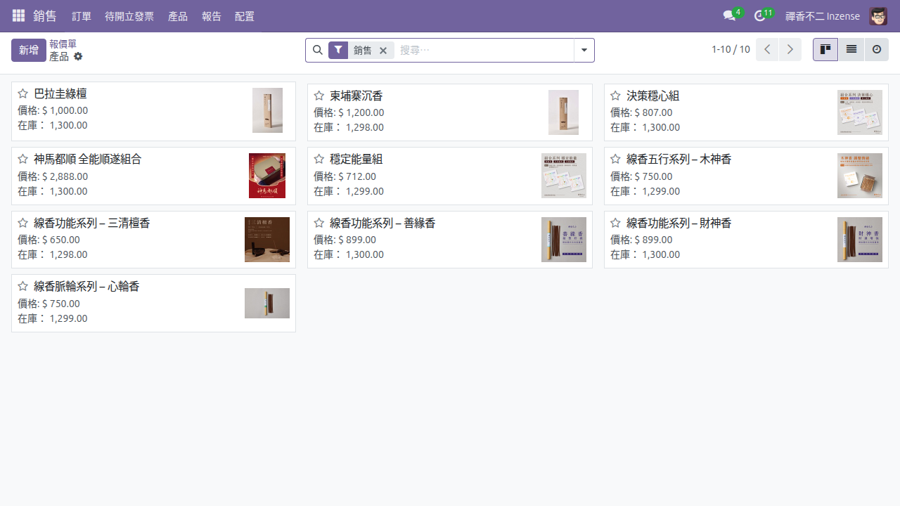

1. 進入「銷售 > 產品 > 產品」。
2. 系統顯示所有 10 項商品。

### 步驟 2：新增或編輯產品


| 欄位 | 說明 |
|------|------|
| 產品名稱 | 商品的完整名稱 |
| 產品類型 | 消耗品 / 可儲存產品 / 服務 |
| 銷售價格 | 商品定價（NT$） |
| 成本價格 | 進貨成本（內部使用） |
| 條碼 | EAN-13 條碼（如 4710001000011） |
| 內部參照 | 內部管理用的商品編號 |
| POS 分類 | POS 商品分類（功能系列、脈輪系列等） |
| POS 可用 | 是否在 POS 中顯示 |
| 產品圖片 | 商品照片 |
| 是否可儲存 | 勾選後啟用庫存追蹤 |

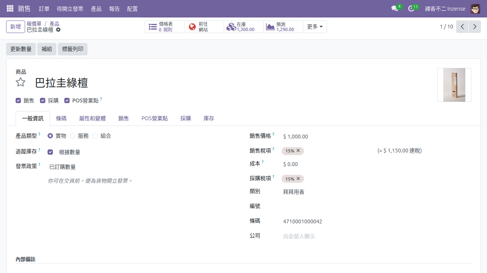

### 步驟 3：POS 分類管理

在 POS 設定中管理分類：

| POS 分類 | 包含商品數 |
|---------|---------|
| 功能系列 | 3 項 |
| 脈輪系列 | 1 項 |
| 五行系列 | 1 項 |
| 拜拜用香 | 2 項 |
| 優惠組合 | 3 項 |

---

## 22. 後台管理 — 庫存與倉庫管理

### 步驟 1：倉庫列表

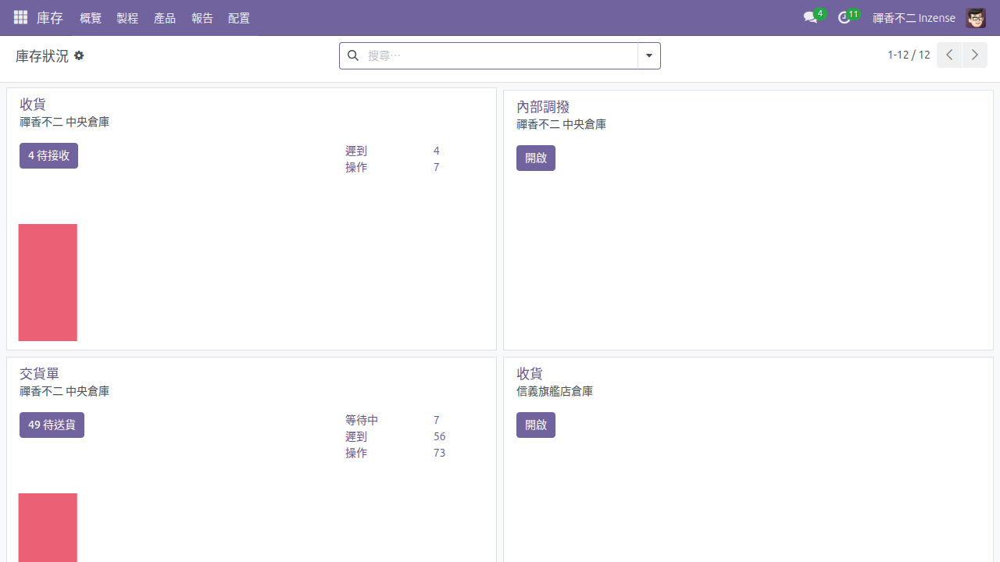

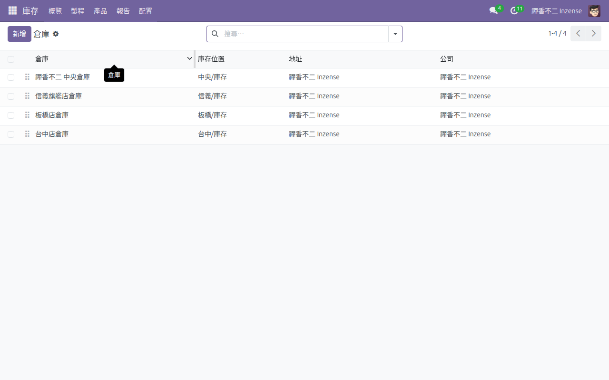

進入「庫存 > 設定 > 倉庫」，查看 4 個倉庫：

| 倉庫 | 代碼 | 補貨來源 | 用途 |
|------|------|---------|------|
| 禪香不二 中央倉庫 | 中央 | — | 主要配貨中心 |
| 信義旗艦店倉庫 | 信義 | 中央倉庫 | 信義門市專用 |
| 板橋店倉庫 | 板橋 | 中央倉庫 | 板橋門市專用 |
| 台中店倉庫 | 台中 | 中央倉庫 | 台中門市專用 |

### 步驟 2：內部調撥（補貨）

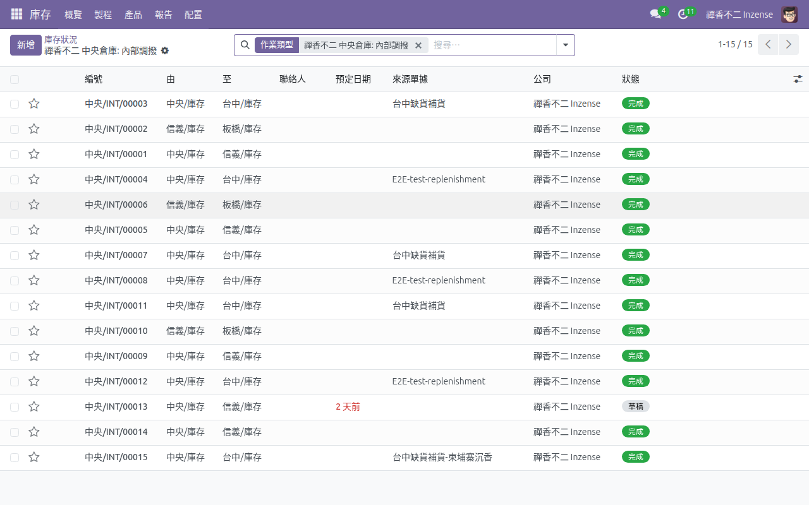

1. 進入「庫存 > 作業 > 調撥」。
2. 點擊「新增」建立內部調撥。
3. 選擇作業類型：「內部調撥」。
4. 來源位置：中央/庫存。
5. 目的位置：門市/庫存。
6. 新增調撥行：選擇商品與數量。
7. 點擊「確認」→「指派」→ 設定實際調撥數量 →「驗證」。

### 步驟 3：庫存查詢


1. 進入「庫存 > 產品」。
2. 點擊商品進入產品頁面。
3. 查看「庫存」頁籤，顯示各倉庫的即時庫存量。

---

## 23. 後台管理 — 忠誠計畫管理

### 步驟 1：忠誠計畫列表

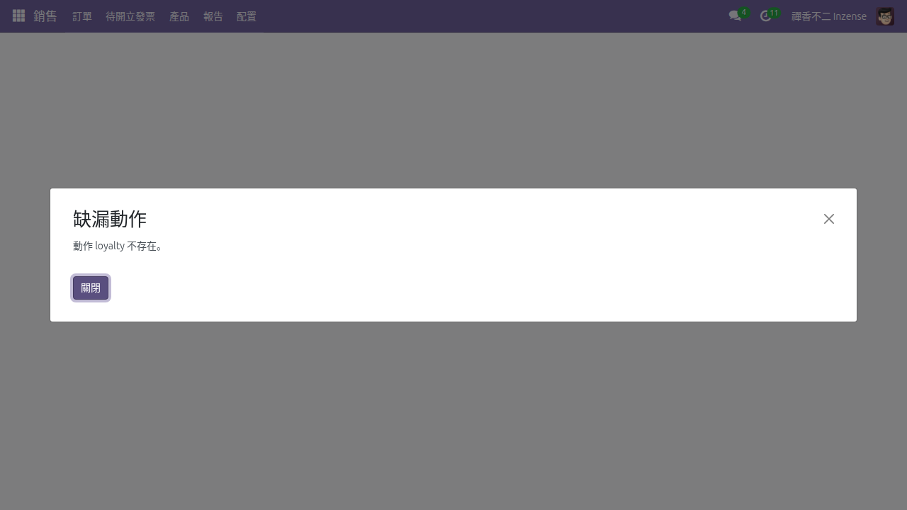

進入「銷售 > 產品 > 折扣與忠誠度」，查看 4 個忠誠計畫：

| 計畫名稱 | 類型 | 觸發方式 | 說明 |
|---------|------|---------|------|
| 禪香不二 集點卡 | 忠誠點數 | 自動 | 消費累積，1 點 = NT$1 折扣 |
| 滿千折百 | 優惠券 | 代碼 | 滿 NT$1,000 折 NT$100 |
| 禪香不二 禮品卡 | 禮品卡 | 自動 | 預儲值卡片，1 點 = NT$1 |
| 禪香不二 電子錢包 | 電子錢包 | 自動 | 儲值錢包，1 點 = NT$1 |

### 步驟 2：管理會員卡

1. 點擊忠誠計畫進入設定頁面。
2. 切換至「會員卡」頁籤。
3. 可查看持有該計畫卡片的所有會員。
4. 管理員可手動調整餘額或發放新卡。

---

## 24. 後台管理 — 客戶與權限管理

### 步驟 1：聯絡人列表

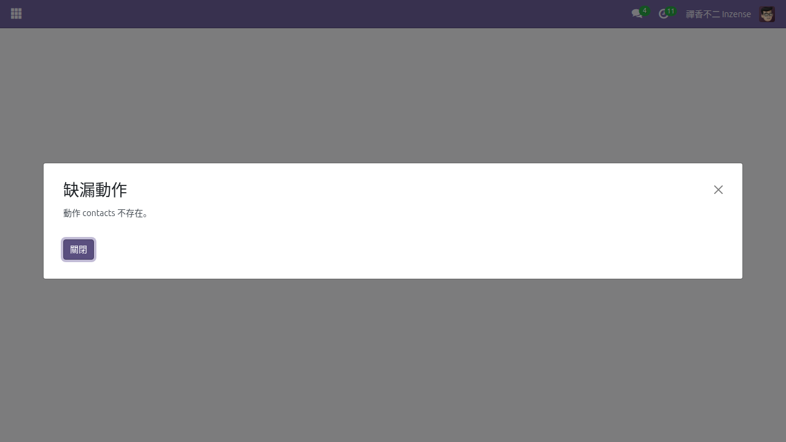

進入「聯絡人」模組，管理所有客戶資料：

| 姓名 | 類型 | Email | 角色 |
|------|------|-------|------|
| 禪香不二 展示客戶 | 個人 | portal@inzense.com.tw | Portal 會員 |

### 步驟 2：授予 Portal 存取權限

1. 選擇聯絡人。
2. 點擊「動作 > 授予 Portal 存取」。
3. 系統發送邀請郵件至該客戶的 Email。
4. 客戶完成驗證後即可登入 Portal。

### 步驟 3：使用者權限

| 使用者類型 | 權限範圍 | 說明 |
|-----------|---------|------|
| 內部使用者 | 後台管理 | 可存取 Odoo 後台，權限依群組設定 |
| Portal 使用者 | Portal 前台 | 僅可存取訂單、發票、會員中心 |

---

## 25. 後台管理 — 條碼掃描功能

禪香不二整合了 WOOW Tech 條碼掃描套件，支援銷售、庫存、採購等模組的條碼操作。

### 步驟 1：商品條碼


系統已為部分商品設定 EAN-13 條碼：

| 商品 | 條碼 |
|------|------|
| 線香功能系列 – 善緣香 | 4710001000011 |
| 線香功能系列 – 財神香 | 4710001000028 |
| 線香五行系列 – 木神香 | 4710001000035 |
| 柬埔寨沉香 | 4710001000042 |

### 步驟 2：條碼掃描功能

| 功能 | 說明 |
|------|------|
| 商品查詢 | 掃描條碼快速查詢商品資訊 |
| 銷售訂單 | 掃描條碼自動新增商品至訂單行 |
| 庫存揀貨 | 掃描條碼確認揀貨商品 |
| GS1-128 解析 | 支援 GS1 格式，可擷取 GTIN、批號、有效日期 |
| 標籤列印 | 生成商品條碼標籤圖片 |

---

## 26. 行動裝置操作指南

禪香不二平台支援響應式設計（RWD），可在手機與平板上正常操作。

### 步驟 1：手機版 Portal

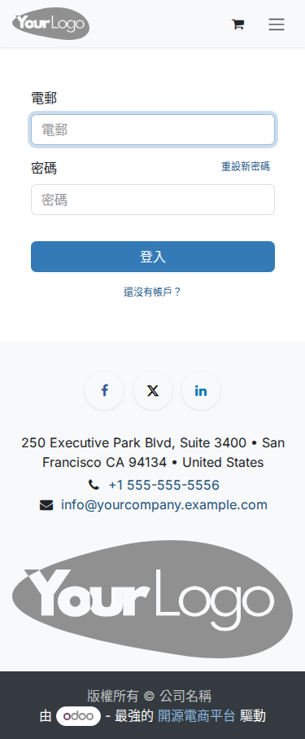

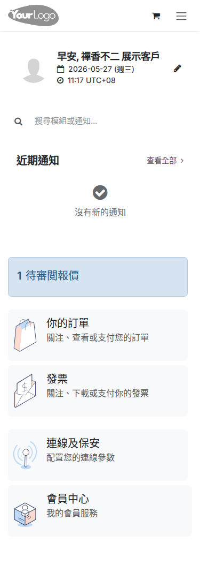

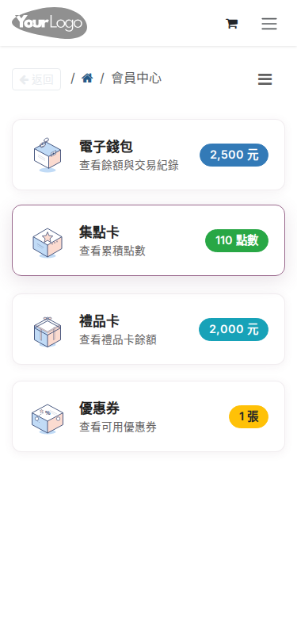

| 功能 | 說明 |
|------|------|
| 登入 | 輸入欄位全寬顯示，按鈕適配觸控 |
| 儀表板 | 功能卡片單欄堆疊排列 |
| 會員中心 | 4 種卡片類型均可正常瀏覽 |
| 訂單/發票 | 列表可上下滾動，詳情頁適配手機 |

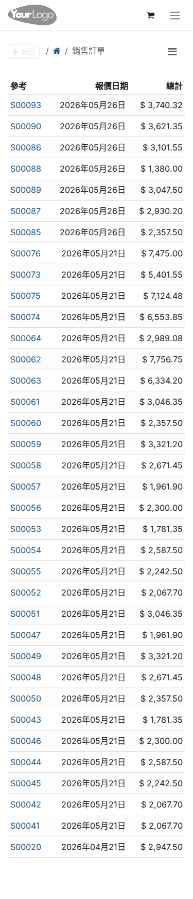

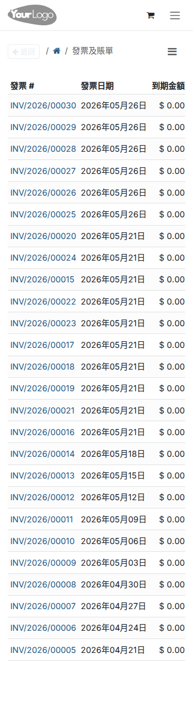

### 步驟 2：手機版後台

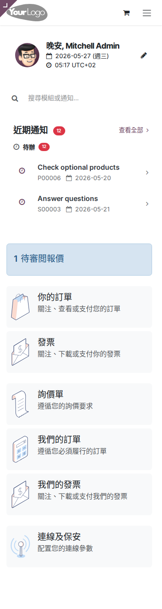

| 功能 | 說明 |
|------|------|
| 導覽選單 | 收合為漢堡選單 |
| 列表視圖 | 自動調整欄位寬度 |
| 表單視圖 | 單欄式排版 |

> **建議**：建議使用 Chrome、Safari 或 Firefox 等主流瀏覽器，並保持更新至最新版本。

---

## 27. 常見問題（FAQ）

### Q1：如何登入會員中心？

**A**：前往 `https://inzense-odoo.woowtech.io/web/login`，輸入帳號 `portal@inzense.com.tw`、密碼 `portal`，登入後從首頁點擊「會員中心」即可。

### Q2：如何查看集點卡餘額？

**A**：登入後前往 `/my/member-center`，在會員中心 Hub 頁面即可看到集點卡的目前點數。點擊可進入詳情查看歷史紀錄。

### Q3：如何使用優惠券？

**A**：優惠券可在 POS 結帳時使用。收銀人員在 POS 畫面輸入優惠券代碼即可套用折扣。使用條件：訂單金額需滿 NT$1,000。

### Q4：如何在 POS 使用電子錢包折抵？

**A**：在 POS 先指定客戶，系統自動查詢電子錢包餘額。在付款畫面選擇使用電子錢包折抵，輸入折抵金額後完成付款。

### Q5：如何開啟 POS 收銀機？

**A**：以管理員身份登入後台，進入「銷售點」模組，選擇門市後點擊「開啟收銀機」。

### Q6：三間門市的庫存是獨立的嗎？

**A**：是的。每間門市有專屬倉庫，POS 銷售僅從該門市倉庫扣庫存，不影響其他門市。

### Q7：門市庫存不足怎麼辦？

**A**：在後台「庫存 > 作業 > 調撥」中建立內部調撥，從中央倉庫調貨至門市倉庫。

### Q8：如何批量匯入外部平台訂單？

**A**：進入「銷售點 > 訂單 > 匯入 POS 訂單」，選擇門市、上傳 CSV/Excel 檔案，點擊「匯入」。系統自動建立 POS 訂單並從該門市倉庫扣庫存。

### Q9：POS 匯入的訂單使用什麼付款方式？

**A**：統一使用「客戶帳戶」（pay_later）付款方式。訂單記錄為應收帳款，等外部平台撥款後再在後台進行銷帳。

### Q10：如何銷帳 POS 的應收帳款？

**A**：在後台「會計」模組中找到對應的應收帳款分錄，使用「登記付款」功能記錄收款即可完成銷帳。

### Q11：如何批量匯入銷售訂單？

**A**：進入「銷售 > 訂單 > 匯入銷售訂單」，上傳 CSV/Excel 檔案，選擇匯入狀態（草稿或自動確認），點擊「匯入」。

### Q12：銷售訂單的完整流程是什麼？

**A**：建立報價單 → 確認為銷售訂單 → 處理出貨 → 建立發票 → 過帳發票 → 登記收款。

### Q13：如何開立發票？

**A**：在已確認的銷售訂單中點擊「建立發票」，選擇發票類型後確認。發票建立後需另外點擊「確認」進行過帳。

### Q14：如何處理退款？

**A**：在已過帳的發票中點擊「建立折讓單」（Credit Note），輸入退款原因與金額，確認後系統自動產生退款分錄。

### Q15：POS 可以開發票嗎？

**A**：POS 訂單預設不開發票。如需開立，可在後台「銷售點 > 訂單」中找到該筆 POS 訂單，手動建立發票。

### Q16：有哪些商品可以在 POS 銷售？

**A**：系統共有 10 項商品，分為功能系列（3 項）、脈輪系列（1 項）、五行系列（1 項）、拜拜用香（2 項）、優惠組合（3 項），全部可在 POS 中銷售。

### Q17：如何修改個人資料？

**A**：登入 Portal 後前往 `/my/account`，可修改姓名、電話、地址等資訊。

### Q18：如何修改密碼？

**A**：登入 Portal 後前往 `/my/security`，輸入目前密碼與新密碼即可修改。

### Q19：手機可以正常使用嗎？

**A**：是的。系統採用響應式設計，Portal 會員中心、後台管理均可在手機上正常操作。

### Q20：如何聯繫禪香不二？

**A**：電話：0926-926-851，地址：台北市北投區光明路240號2樓之8。

---

## 附錄 A：系統快速參考卡

### 系統網址

| 系統 | 網址 |
|------|------|
| 後台管理 | https://inzense-odoo.woowtech.io/odoo |
| 會員登入 | https://inzense-odoo.woowtech.io/web/login |
| 會員中心 | https://inzense-odoo.woowtech.io/my/member-center |

### 帳號速查

| 帳號 | 密碼 | 角色 |
|------|------|------|
| `admin` | `admin` | 管理員 |
| `portal@inzense.com.tw` | `portal` | Portal 會員（禪香不二 展示客戶） |

### 常用路徑

| 功能 | 路徑 |
|------|------|
| Portal 首頁 | `/my/home` |
| 會員中心 Hub | `/my/member-center` |
| 集點卡 | `/my/member-center/loyalty` |
| 優惠券 | `/my/member-center/coupons` |
| 禮品卡 | `/my/member-center/gift-cards` |
| 電子錢包 | `/my/member-center/ewallet` |
| 我的訂單 | `/my/orders` |
| 我的發票 | `/my/invoices` |
| 個人資料 | `/my/account` |
| 安全性 | `/my/security` |
| 後台管理 | `/odoo` |

### 商品價格速查

| 商品 | 價格 |
|------|------|
| 三清檀香 | $650 |
| 穩定能量組 | $712 |
| 心輪香 | $750 |
| 木神香 | $750 |
| 決策穩心組 | $807 |
| 善緣香 | $899 |
| 財神香 | $899 |
| 巴拉圭綠檀 | $1,000 |
| 柬埔寨沉香 | $1,200 |
| 全能順遂組合 | $2,888 |

### 展示客戶資料摘要

| 項目 | 數量/內容 |
|------|----------|
| 銷售訂單 | 10+ 筆（已確認、已開票、已付款） |
| 發票 | 10+ 張（已過帳、已付款） |
| 集點卡 | 210 點數 |
| 優惠券 | 3 張（1 已用、2 可用） |
| 禮品卡 | 2 張（NT$500 + NT$2,000） |
| 電子錢包 | NT$3,000 |

---

> **本手冊由 WOOW Tech 沃科技維護**
> 如有任何問題或建議，請聯繫技術支援團隊。
> 版權所有 &copy; 2026 WOOW Tech 沃科技。保留所有權利。
