# 沐淨醫美 Mujimed — Odoo 18 醫美平台使用手冊

> **版本**：Odoo 18 Community / Enterprise  
> **適用對象**：B2C 消費者會員、B2B 企業夥伴、後台管理人員  
> **最後更新**：2026-05-20  
> **維護團隊**：WOOW Tech 沃科技

---

## 目錄

| 編號 | 章節名稱 | 說明 |
|------|---------|------|
| [1](#1-平台總覽與帳號說明) | 平台總覽與帳號說明 | 系統網址、帳號、醫護人員、架構說明 |
| [2](#2-b2c-首頁與品牌形象) | B2C 首頁與品牌形象 | 品牌主視覺、療程區塊、信任指標、行動呼籲 |
| [3](#3-b2b-首頁與企業入口) | B2B 首頁與企業入口 | B2B 主視覺、商品分類、企業優勢、行動呼籲 |
| [4](#4-會員登入與註冊) | 會員登入與註冊 | 登入畫面、註冊流程、忘記密碼 |
| [5](#5-b2c-會員中心portal-儀表板) | B2C 會員中心（Portal 儀表板） | 儀表板、統計數據、快速導覽 |
| [6](#6-b2c-療程商城--瀏覽與搜尋) | B2C 療程商城 — 瀏覽與搜尋 | 療程列表、分類篩選、詳情頁、加入購物車 |
| [7](#7-b2c-購物流程--購物車到結帳) | B2C 購物流程 — 購物車到結帳 | 購物車、優惠券、結帳、付款、確認 |
| [8](#8-b2c-預約掛號--瀏覽療程與選擇醫師) | B2C 預約掛號 — 瀏覽療程與選擇醫師 | 20 種療程類型、醫護人員選擇 |
| [9](#9-b2c-預約掛號--日曆選時與確認) | B2C 預約掛號 — 日曆選時與確認 | 日曆、時段、預約表單、確認通知 |
| [10](#10-b2c-我的訂單) | B2C 我的訂單 | 訂單列表、訂單詳情、狀態追蹤 |
| [11](#11-b2c-我的發票) | B2C 我的發票 | 發票列表、發票詳情、PDF 下載 |
| [12](#12-b2c-我的預約) | B2C 我的預約 | 預約列表、預約詳情、狀態管理 |
| [13](#13-b2c-會員卡與忠誠計畫) | B2C 會員卡與忠誠計畫 | 7 大忠誠計畫、餘額查詢 |
| [14](#14-b2c-聯絡我們) | B2C 聯絡我們 | 聯絡表單、地圖、聯絡資訊 |
| [15](#15-b2b-企業採購--商品目錄) | B2B 企業採購 — 商品目錄 | 31 項商品、6 大分類 |
| [16](#16-b2b-企業採購--購物車與結帳) | B2B 企業採購 — 購物車與結帳 | B2B 購物車、結帳流程 |
| [17](#17-b2b-企業入口--訂單與發票管理) | B2B 企業入口 — 訂單與發票管理 | B2B Portal、訂單管理、發票管理 |
| [18](#18-後台管理--登入與儀表板) | 後台管理 — 登入與儀表板 | 管理員登入、後台儀表板 |
| [19](#19-後台管理--多網站管理) | 後台管理 — 多網站管理 | 網站列表、設定、編輯器 |
| [20](#20-後台管理--產品目錄管理) | 後台管理 — 產品目錄管理 | 商品管理、分類、上架發佈 |
| [21](#21-後台管理--銷售訂單管理) | 後台管理 — 銷售訂單管理 | 銷售訂單、確認、開立發票 |
| [22](#22-後台管理--客戶與合作夥伴管理) | 後台管理 — 客戶與合作夥伴管理 | 聯絡人、Portal 存取權限 |
| [23](#23-後台管理--預約與排班管理) | 後台管理 — 預約與排班管理 | 預約類型、預約記錄管理 |
| [24](#24-後台管理--忠誠計畫與會員卡管理) | 後台管理 — 忠誠計畫與會員卡管理 | 忠誠計畫、會員卡設定 |
| [25](#25-後台管理--發票與帳務管理) | 後台管理 — 發票與帳務管理 | 發票管理、收款作業 |
| [26](#26-後台管理--網站存取權限與使用者管理) | 後台管理 — 網站存取權限與使用者管理 | 使用者帳號、權限規則 |
| [27](#27-行動裝置操作指南) | 行動裝置操作指南 | 手機版首頁、登入、Portal、商城、預約、購物車 |
| [28](#28-常見問題faq) | 常見問題（FAQ） | 常見問題與解答 |

---

## 1. 平台總覽與帳號說明

本章說明沐淨醫美 Mujimed Odoo 18 醫美平台的整體架構，包含系統網址、預設帳號、醫護人員編制，以及平台角色與權限劃分。閱讀本章後，您將了解如何進入各系統前台與後台，以及各帳號的適用範圍。

### 步驟 1：系統網址一覽

沐淨醫美平台採用 Odoo 18 多網站（Multi-Website）架構，同時營運 B2C 消費者網站與 B2B 企業批發網站，並共用同一個後台管理介面。

| 系統 | 網址 | 說明 |
|------|------|------|
| B2C 消費者網站 | https://b2cmujimed-odoo.woowtech.io | 面向一般消費者的醫美療程預約與購物平台 |
| B2B 企業網站 | https://b2bmujimed-odoo.woowtech.io | 面向診所、醫美業者的企業批發採購平台 |
| 後台管理介面 | https://b2cmujimed-odoo.woowtech.io/odoo | Odoo 18 後台管理系統入口 |

> **提示**：B2C 與 B2B 網站共用同一個 Odoo 資料庫，後台管理員可以在同一介面中管理兩個網站的內容、商品與訂單。

### 步驟 2：預設帳號與角色

系統預設提供三種角色帳號，分別對應不同的使用情境：

| 帳號 | 密碼 | 姓名 | 角色 | 適用網站 |
|------|------|------|------|---------|
| `admin` | `admin` | 管理員 | 全系統管理 | 後台管理（`/odoo`） |
| `portal` | `portal` | 王小美 | B2C 會員 | B2C 消費者網站 |
| `partner` | `partner` | 美麗佳人診所 | B2B 企業夥伴 | B2B 企業網站 |

**角色說明：**

- **管理員（admin）**：擁有 Odoo 全系統最高權限，可管理網站內容、商品目錄、銷售訂單、預約排班、忠誠計畫、使用者權限等所有模組。
- **B2C 會員（portal）**：一般消費者帳號，可在 B2C 網站上瀏覽療程、線上預約、購買療程、查看訂單與發票、管理會員卡。
- **B2B 企業夥伴（partner）**：企業採購帳號，可在 B2B 網站上瀏覽批發商品、下單採購、管理企業訂單與發票。

### 步驟 3：醫護人員編制

沐淨醫美配置專業醫師與護理師團隊，以下為系統內建的醫護人員資料：

| 醫師/護理師 | 系統帳號 | 專科 | 職責說明 |
|------------|---------|------|---------|
| 陳志明醫師 | `dr.chen` | 微整形注射 | 負責玻尿酸、肉毒桿菌、膠原蛋白增生劑等注射類療程 |
| 林雅婷醫師 | `dr.lin` | 雷射光電 | 負責皮秒雷射、飛梭雷射、淨膚雷射、脈衝光等光電療程 |
| 王建國醫師 | `dr.wang` | 體雕抗老 | 負責冷凍溶脂、電波拉皮、音波拉提等體雕抗老療程 |
| 張美玲護理師 | `nurse.zhang` | 注射助理 | 協助微整形注射療程之術前準備與術後照護 |
| 李佳蓉護理師 | `nurse.li` | 雷射操作 | 協助雷射光電療程之儀器操作與術後衛教 |
| 黃心怡護理師 | `nurse.huang` | 保養療程 | 負責水光注射、導入保養、煥膚等臉部保養療程 |

### 步驟 4：平台架構說明

沐淨醫美平台基於 Odoo 18 建置，整合以下核心模組：

| 功能模組 | 說明 |
|---------|------|
| 網站（Website） | 多網站架構，同時營運 B2C 與 B2B 前台 |
| 電子商務（eCommerce） | 線上療程商城與企業批發商城 |
| 預約系統（Appointment） | 線上預約掛號，含醫師選擇與日曆排班 |
| 銷售（Sales） | 銷售訂單管理、報價單 |
| 發票（Invoicing） | 發票開立、收款管理 |
| 忠誠計畫（Loyalty） | 電子錢包、忠誠點數、禮品卡、優惠券、寄品卡 |
| 聯絡人（Contacts） | 客戶與合作夥伴資料管理 |
| Portal | 會員自助入口，查看訂單、發票、預約、會員卡 |

---

## 2. B2C 首頁與品牌形象

B2C 消費者網站首頁是沐淨醫美面對一般消費者的第一印象。首頁採用現代化醫美品牌設計，由上而下依序呈現品牌主視覺、療程服務區塊、信任指標、行動呼籲橫幅，以及聯絡資訊與頁尾。本章將逐一介紹各區塊的內容與功能。

### 步驟 1：品牌主視覺（Hero Section）

首頁最上方為全寬品牌主視覺區塊，包含以下元素：

| 功能 | 說明 |
|------|------|
| 品牌標題 | 顯示「沐淨醫美」品牌名稱與品牌標語 |
| 主視覺圖片 | 高品質醫美形象照片，傳遞專業與美感 |
| 行動呼籲按鈕 | 引導訪客進入療程商城或線上預約 |
| 導覽列（Navbar） | 頂部固定導覽列，包含首頁、療程商城、預約掛號、聯絡我們等連結 |
| 會員登入 | 導覽列右上角提供登入 / 註冊入口 |

1. 開啟瀏覽器，前往 `https://b2cmujimed-odoo.woowtech.io`。
2. 頁面載入後，首先映入眼簾的即為品牌主視覺區塊。
3. 點擊導覽列中的各連結，可前往對應功能頁面。
4. 點擊右上角「登入」按鈕，可進入會員登入頁面。

### 步驟 2：療程服務區塊（Services Section）

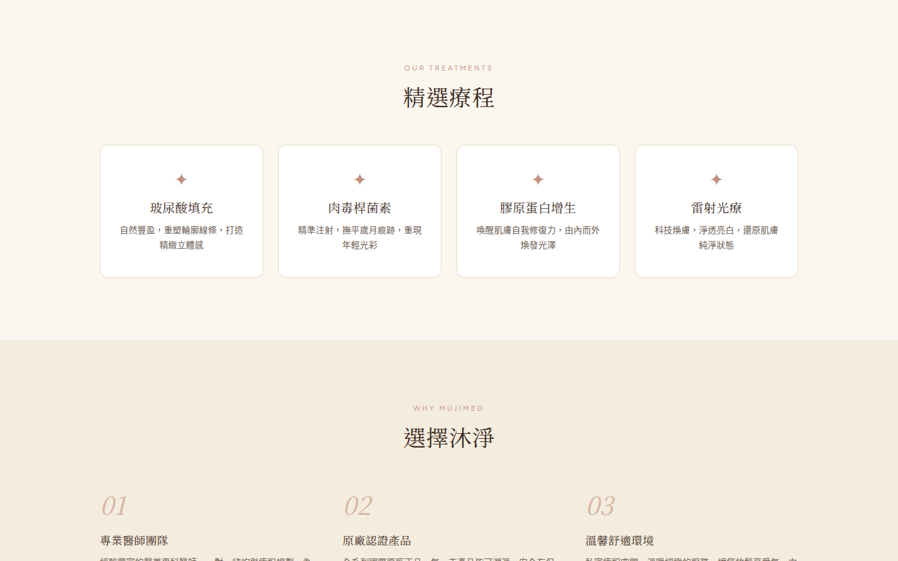

品牌主視覺下方為療程服務區塊，以卡片式排列展示沐淨醫美提供的核心療程分類：

| 功能 | 說明 |
|------|------|
| 療程分類卡片 | 每張卡片代表一個療程分類，搭配圖示與簡介 |
| 分類名稱 | 如微整形注射、光電雷射、體雕療程、臉部保養、特殊療程 |
| 分類圖示 | 專屬圖示設計，幫助訪客快速辨識療程類型 |
| 查看更多連結 | 點擊卡片或連結可前往該分類的療程列表頁面 |

1. 向下捲動首頁，即可看到療程服務區塊。
2. 瀏覽各療程分類卡片，了解沐淨醫美提供的服務項目。
3. 點擊有興趣的分類卡片，將跳轉至對應的療程商城頁面。

### 步驟 3：信任指標區塊（Trust Section）

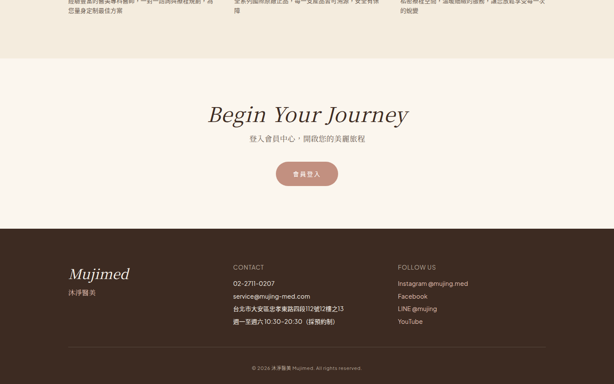

信任指標區塊透過數據與認證資訊，建立訪客對品牌的信心：

| 功能 | 說明 |
|------|------|
| 服務人數 | 顯示累計服務人數或療程次數 |
| 專業認證 | 展示診所相關醫療認證與合格證書 |
| 顧客滿意度 | 顧客好評率或滿意度數據 |
| 醫師團隊 | 專業醫師人數或團隊介紹 |

1. 繼續向下捲動頁面，即可看到信任指標區塊。
2. 此區塊以視覺化方式呈現關鍵信任數據。
3. 訪客可藉此評估品牌的專業度與可信度。

### 步驟 4：行動呼籲橫幅（CTA Banner）

行動呼籲橫幅以醒目的設計鼓勵訪客立即採取行動：

| 功能 | 說明 |
|------|------|
| CTA 標題 | 引導性標題文案，如「立即預約諮詢」 |
| CTA 按鈕 | 醒目按鈕，點擊後可前往預約頁面或療程商城 |
| 背景設計 | 使用品牌色系或形象照片作為背景 |

1. 此橫幅通常位於頁面中段或下段。
2. 點擊 CTA 按鈕，將直接跳轉至指定功能頁面。

### 步驟 5：聯絡資訊與頁尾（Contact & Footer）

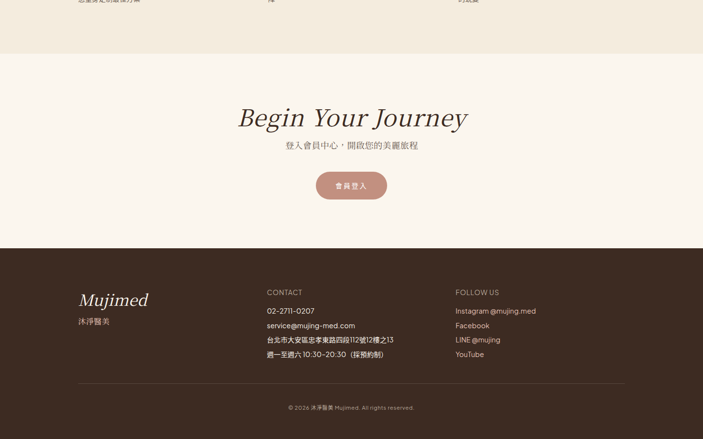

頁面最下方為聯絡資訊與頁尾區塊：

| 功能 | 說明 |
|------|------|
| 診所地址 | 沐淨醫美診所實體地址 |
| 聯絡電話 | 診所聯絡電話號碼 |
| 營業時間 | 診所營業時間資訊 |
| 社群媒體連結 | Facebook、Instagram、LINE 等社群連結 |
| 頁尾導覽 | 包含隱私權政策、服務條款等連結 |
| 版權聲明 | 網站版權與技術支援資訊 |

1. 捲動至頁面最底部，即可查看完整的聯絡資訊。
2. 點擊電話號碼可直接撥打（行動裝置）。
3. 點擊社群媒體圖示可前往對應的社群平台頁面。

---

## 3. B2B 首頁與企業入口

B2B 企業網站面向醫美診所、醫療機構及企業夥伴，提供醫美耗材與設備的批發採購服務。本章介紹 B2B 首頁的各區塊設計與功能。

### 步驟 1：B2B 品牌主視覺（Hero Section）

B2B 首頁最上方為企業形象主視覺區塊：

| 功能 | 說明 |
|------|------|
| 企業標題 | 顯示沐淨醫美 B2B 批發平台名稱與標語 |
| 主視覺圖片 | 醫療設備或專業耗材形象照片 |
| 企業登入按鈕 | 引導企業夥伴登入或註冊 |
| 商品目錄按鈕 | 直接前往 B2B 批發商品目錄 |
| 導覽列 | 頂部固定導覽列，含首頁、商品目錄、聯絡我們等連結 |

1. 開啟瀏覽器，前往 `https://b2bmujimed-odoo.woowtech.io`。
2. B2B 首頁主視覺以專業企業形象為主軸，與 B2C 消費者網站風格有所區隔。
3. 點擊「企業登入」按鈕，使用企業夥伴帳號（`partner` / `partner`）登入。
4. 點擊「商品目錄」按鈕，可直接瀏覽 B2B 批發商品。

### 步驟 2：商品分類區塊（Categories Section）

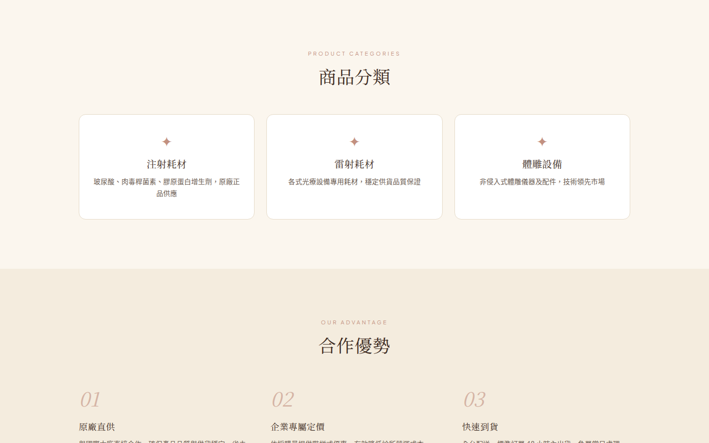

B2B 商品分類區塊以卡片或圖示方式展示六大批發商品分類：

| 功能 | 說明 |
|------|------|
| 注射耗材 | 玻尿酸、肉毒桿菌等注射類耗材 |
| 雷射耗材 | 各式雷射探頭與耗材 |
| 體雕設備耗材 | 電波、音波、冷凍溶脂等設備耗材 |
| 保養品 | 術後修護、精華液等專業保養品 |
| 儀器配件 | 導入儀、光療面罩等儀器配件 |
| 診所用品 | 手套、紗布等一般診所消耗品 |

1. 向下捲動 B2B 首頁，可看到商品分類區塊。
2. 點擊任一分類卡片，將跳轉至該分類的商品列表頁面。
3. 每個分類下方會顯示該分類的商品數量。

### 步驟 3：企業優勢區塊（Advantages Section）

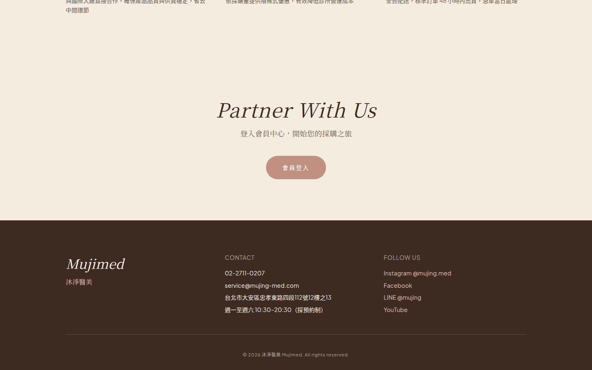

企業優勢區塊說明選擇沐淨醫美 B2B 平台的優勢：

| 功能 | 說明 |
|------|------|
| 批發優惠價格 | 企業夥伴享有專屬批發價格 |
| 原廠認證 | 所有商品均為原廠正品認證 |
| 快速出貨 | 專業倉儲管理，確保快速出貨 |
| 專屬客服 | 企業夥伴享有專屬客服支援 |
| 帳務管理 | 完善的企業帳務與發票管理 |

1. 繼續向下捲動，即可看到企業優勢區塊。
2. 此區塊以圖文並茂的方式呈現各項優勢。

### 步驟 4：B2B 行動呼籲（CTA Section）

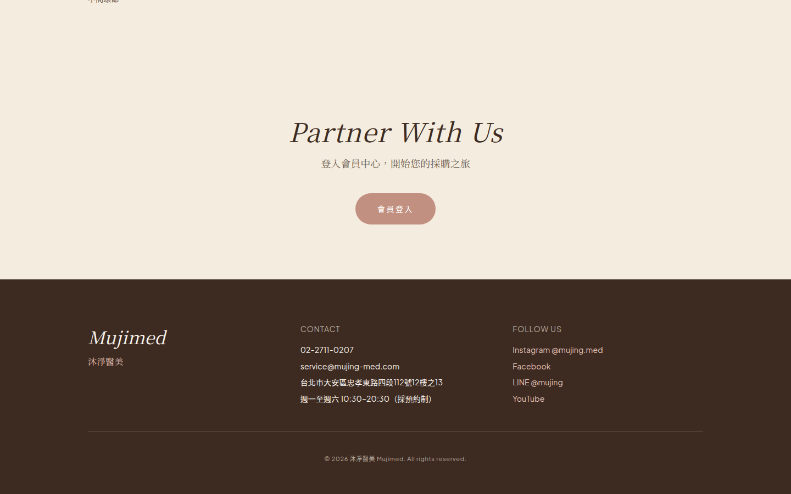

B2B 行動呼籲區塊引導企業夥伴註冊或聯繫業務團隊：

| 功能 | 說明 |
|------|------|
| CTA 標題 | 如「立即成為沐淨醫美企業夥伴」 |
| 註冊按鈕 | 引導前往企業夥伴註冊頁面 |
| 聯絡業務按鈕 | 引導前往聯絡表單或顯示業務聯絡方式 |

1. 此區塊通常位於 B2B 首頁下段。
2. 點擊按鈕可進行企業夥伴註冊或聯繫業務。

---

## 4. 會員登入與註冊

無論是 B2C 消費者或 B2B 企業夥伴，均需透過會員登入功能進入個人化服務。本章說明登入、註冊、忘記密碼等操作流程。

### 步驟 1：登入頁面概覽

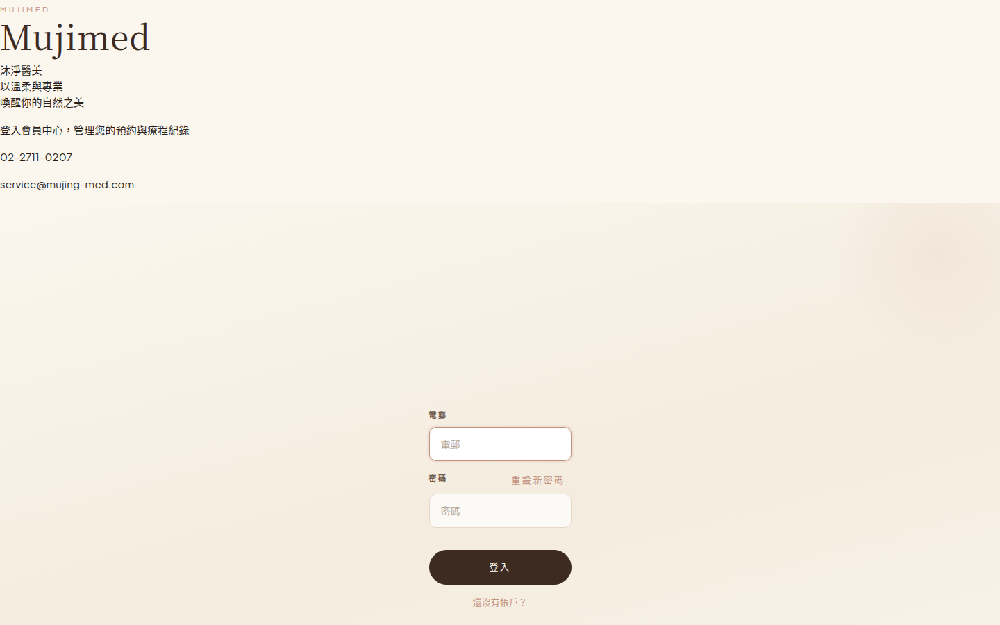

登入頁面採用分割式版面設計（Split Layout），左側為品牌形象區域，右側為登入表單：

| 功能 | 說明 |
|------|------|
| 品牌形象區域 | 左側顯示沐淨醫美品牌圖片與標語 |
| 登入表單 | 右側提供帳號（Email）與密碼輸入欄位 |
| 登入按鈕 | 點擊後驗證帳號密碼並登入系統 |
| 忘記密碼連結 | 點擊後前往密碼重設頁面 |
| 註冊連結 | 點擊後前往新會員註冊頁面 |

1. 點擊網站右上角的「登入」按鈕，或直接前往 `/web/login` 頁面。
2. 頁面載入後，您將看到分割式登入畫面。
3. 左側為品牌形象展示，右側為登入操作區域。

### 步驟 2：填寫登入資訊並登入

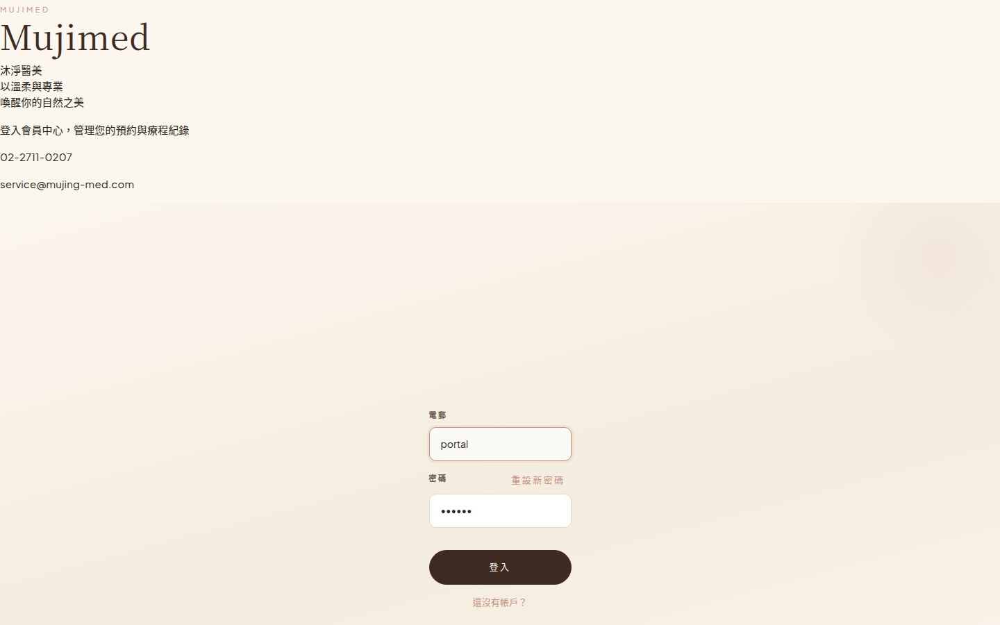

1. 在「電子郵件」（Email）欄位中輸入您的帳號。
   - B2C 消費者請輸入：`portal`
   - B2B 企業夥伴請輸入：`partner`
   - 管理員請輸入：`admin`
2. 在「密碼」（Password）欄位中輸入對應的密碼。
3. 確認輸入無誤後，點擊「登入」（Log in）按鈕。
4. 系統驗證成功後，將自動跳轉至對應的首頁或 Portal 儀表板。

| 功能 | 說明 |
|------|------|
| 帳號欄位 | 輸入註冊時使用的電子郵件或帳號名稱 |
| 密碼欄位 | 輸入對應密碼，可點擊眼睛圖示切換顯示/隱藏 |
| 登入按鈕 | 送出登入請求 |
| 記住我 | 勾選後下次造訪免重新輸入帳號 |

### 步驟 3：忘記密碼

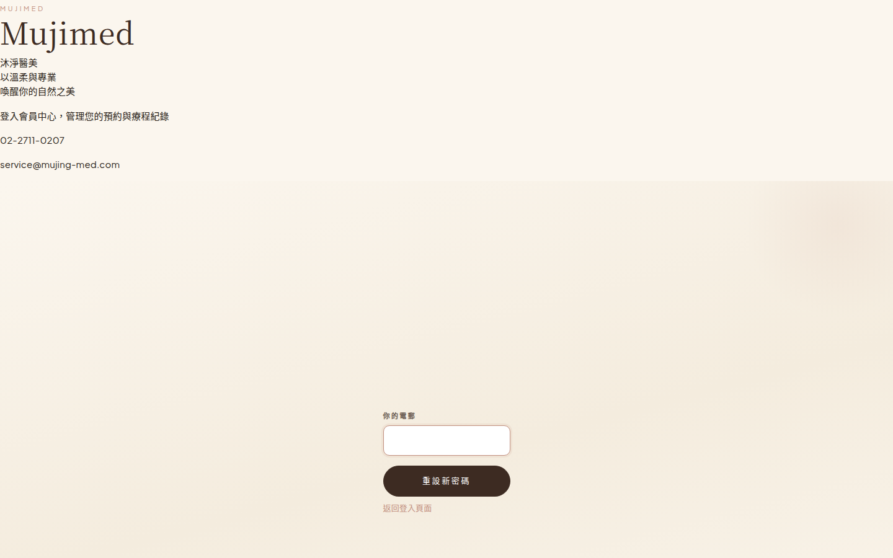

若您忘記密碼，可透過以下步驟重設：

1. 在登入頁面點擊「忘記密碼？」（Reset Password）連結。
2. 系統將跳轉至密碼重設頁面。
3. 輸入您註冊時使用的電子郵件地址。
4. 點擊「送出」按鈕。
5. 系統將發送密碼重設郵件至您的信箱。
6. 開啟郵件，點擊重設連結。
7. 設定新密碼並確認。
8. 使用新密碼重新登入。

| 功能 | 說明 |
|------|------|
| Email 輸入欄位 | 輸入註冊時的電子郵件地址 |
| 送出按鈕 | 發送密碼重設郵件 |
| 返回登入 | 點擊可返回登入頁面 |

### 步驟 4：新會員註冊

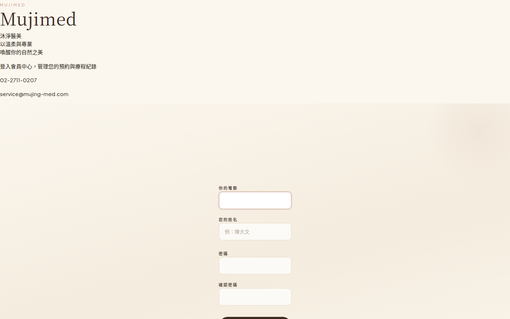

新用戶可透過註冊功能建立帳號：

1. 在登入頁面點擊「還沒有帳號？立即註冊」連結。
2. 系統將跳轉至註冊頁面。
3. 填寫以下必要資訊：
   - **姓名**：輸入您的真實姓名。
   - **電子郵件**：輸入有效的電子郵件地址（將作為登入帳號）。
   - **密碼**：設定至少 8 個字元的密碼。
   - **確認密碼**：再次輸入密碼以確認。
4. 點擊「註冊」（Sign up）按鈕。
5. 系統可能會發送驗證郵件，請前往信箱完成驗證。
6. 驗證完成後即可使用新帳號登入。

| 功能 | 說明 |
|------|------|
| 姓名欄位 | 輸入使用者真實姓名 |
| Email 欄位 | 輸入有效電子郵件，作為登入帳號 |
| 密碼欄位 | 設定登入密碼 |
| 確認密碼欄位 | 再次輸入密碼以確認一致 |
| 註冊按鈕 | 送出註冊申請 |

---

## 5. B2C 會員中心（Portal 儀表板）

登入後，B2C 會員將進入 Portal 儀表板頁面。此頁面為會員的個人中心，提供快速導覽至各項功能的入口，並顯示會員相關的統計數據。

### 步驟 1：儀表板總覽

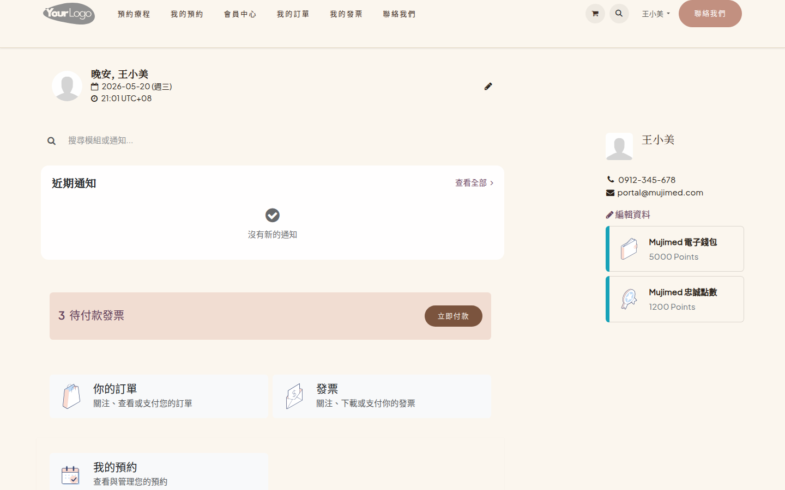

Portal 儀表板頁面顯示會員的各項服務統計與快速入口：

| 功能 | 說明 |
|------|------|
| 歡迎訊息 | 顯示「歡迎，王小美」等個人化問候語 |
| 訂單數量 | 顯示目前的訂單數量（王小美：3 筆） |
| 發票數量 | 顯示目前的發票數量（王小美：3 筆） |
| 預約數量 | 顯示目前的預約數量（王小美：5 筆） |
| 會員卡 | 顯示持有的會員卡與忠誠計畫數量 |
| 功能卡片 | 以卡片形式呈現各功能入口 |

1. 登入後系統自動跳轉至 Portal 儀表板（`/my` 或 `/my/home`）。
2. 頁面上方顯示歡迎訊息與個人資訊。
3. 下方以卡片形式排列各項功能入口。
4. 每張卡片顯示該功能的統計數據（如訂單 3 筆、發票 3 筆）。

### 步驟 2：功能卡片與快速導覽

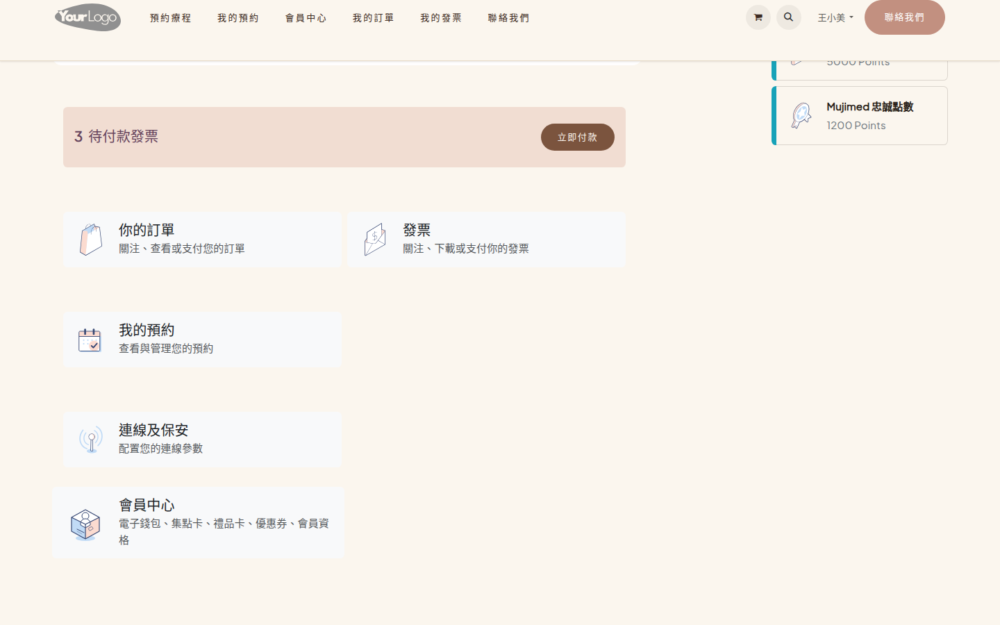

Portal 儀表板提供以下功能卡片，點擊即可前往對應頁面：

| 功能卡片 | 路徑 | 說明 |
|---------|------|------|
| 我的訂單 | `/my/orders` | 查看所有銷售訂單 |
| 我的發票 | `/my/invoices` | 查看所有發票與付款紀錄 |
| 我的預約 | `/my/appointments` | 查看所有預約掛號記錄 |
| 會員卡 | `/my/loyalty_card` | 查看會員卡、電子錢包、忠誠點數等 |
| 個人資料 | `/my/account` | 編輯個人資料與聯絡資訊 |
| 安全性 | `/my/security` | 修改密碼與安全設定 |

1. 在儀表板頁面上，找到您要使用的功能卡片。
2. 點擊卡片本身或卡片上的「查看」按鈕。
3. 系統將跳轉至對應的功能頁面。
4. 各功能頁面上方均有麵包屑導覽（Breadcrumb），可快速返回儀表板。

> **提示**：王小美（portal）帳號已預設有 5 筆預約、3 筆訂單、3 筆發票，以及多張會員卡，可完整體驗所有 Portal 功能。

---

## 6. B2C 療程商城 — 瀏覽與搜尋

B2C 療程商城提供沐淨醫美的所有療程項目，消費者可在此瀏覽、搜尋、查看詳情，並將療程加入購物車進行購買。本章說明商城的完整瀏覽功能。

### 步驟 1：療程商城列表頁

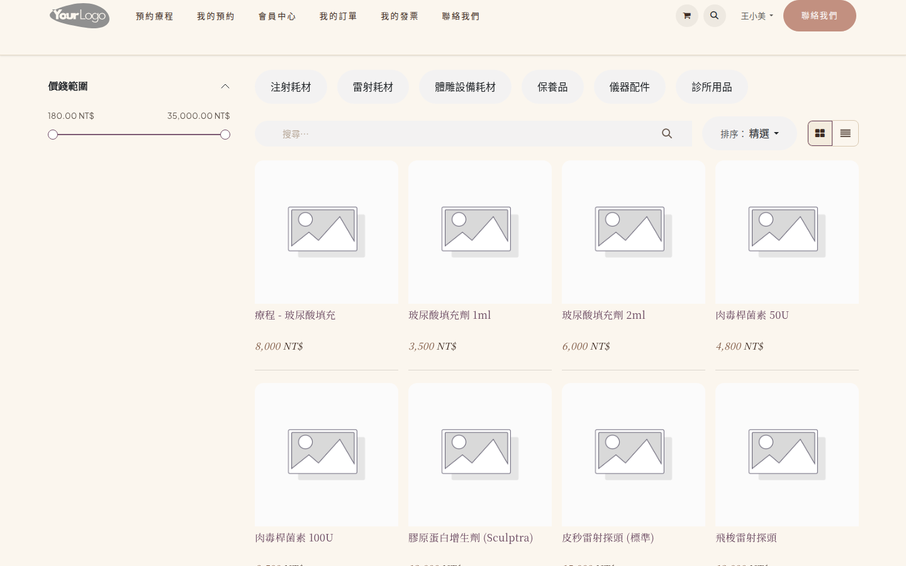

前往療程商城後，您將看到以網格（Grid）方式排列的療程商品卡片：

| 功能 | 說明 |
|------|------|
| 療程卡片 | 每張卡片顯示一個療程項目，包含圖片、名稱、價格 |
| 療程圖片 | 療程項目的代表性圖片 |
| 療程名稱 | 如「玻尿酸填充」、「皮秒雷射」等 |
| 療程價格 | 單次療程的定價 |
| 加入購物車按鈕 | 快速將療程加入購物車 |
| 分類篩選 | 左側或上方提供分類篩選選項 |
| 搜尋欄 | 可輸入關鍵字搜尋特定療程 |
| 排序選項 | 可依價格、名稱等條件排序 |

1. 點擊導覽列中的「療程商城」或前往 `/shop` 頁面。
2. 頁面以網格形式顯示所有可購買的療程項目。
3. 使用左側分類篩選，可限制顯示特定分類的療程。
4. 使用搜尋欄輸入關鍵字，可快速找到特定療程。

### 步驟 2：療程分類與完整商品列表

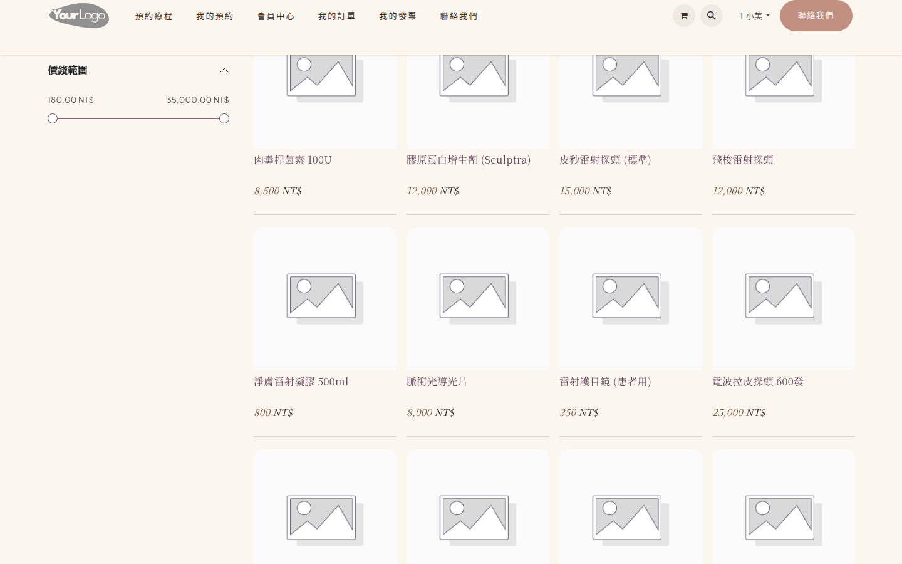

沐淨醫美 B2C 療程商城共提供 **20 種療程項目**，分為五大分類：

**微整形注射（4 項）：**

| 療程名稱 | 價格（TWD） | 說明 |
|---------|-----------|------|
| 玻尿酸填充 | $8,000 | 利用玻尿酸進行臉部填充，改善法令紋、豐唇、豐頰等 |
| 肉毒桿菌注射 | $6,000 | 注射肉毒桿菌素，改善動態紋路如抬頭紋、魚尾紋、皺眉紋 |
| 膠原蛋白增生劑 | $15,000 | 注射膠原蛋白增生劑，刺激自體膠原蛋白增生，改善膚質 |
| 消脂針 | $5,000 | 注射消脂成分，局部溶解脂肪，適用於雙下巴、嘴邊肉等 |

**光電雷射（5 項）：**

| 療程名稱 | 價格（TWD） | 說明 |
|---------|-----------|------|
| 皮秒雷射 | $5,000 | 以皮秒級脈衝雷射治療色斑、毛孔、膚色不均等問題 |
| 飛梭雷射 | $6,000 | 分段式換膚雷射，改善痘疤、毛孔、細紋 |
| 淨膚雷射 | $3,000 | 溫和淨膚雷射，改善膚色暗沉、縮小毛孔 |
| 脈衝光 IPL | $3,500 | 多波段脈衝光，改善色素、血管擴張、膚質 |
| 除毛雷射 | $2,500 | 雷射除毛，適用於腋下、手臂、腿部等部位 |

**體雕療程（3 項）：**

| 療程名稱 | 價格（TWD） | 說明 |
|---------|-----------|------|
| 冷凍溶脂 | $25,000 | 以冷凍技術破壞脂肪細胞，非侵入式體雕 |
| 電波拉皮 Thermage | $35,000 | 以射頻電波加熱深層組織，促進膠原蛋白收縮與增生 |
| 音波拉提 HIFU | $30,000 | 以聚焦超音波拉提緊緻筋膜層，改善臉部鬆弛 |

**臉部保養（4 項）：**

| 療程名稱 | 價格（TWD） | 說明 |
|---------|-----------|------|
| 水光注射 | $4,500 | 利用水光槍將玻尿酸與營養成分注入皮膚淺層 |
| 導入保養 | $2,000 | 利用超音波或電穿孔技術將精華液導入皮膚深層 |
| 化學煥膚 | $2,500 | 使用化學藥劑進行皮膚煥膚，改善膚質與色素 |
| 杏仁酸煥膚 | $1,800 | 使用杏仁酸進行溫和煥膚，適合敏感肌膚 |

**特殊療程（4 項）：**

| 療程名稱 | 價格（TWD） | 說明 |
|---------|-----------|------|
| PRP 自體血小板 | $12,000 | 抽取自體血液分離血小板，回注皮膚促進修復與再生 |
| 雷射除斑 | $6,000 | 針對性雷射治療，去除雀斑、曬斑、老人斑 |
| 痘疤治療 | $5,000 | 綜合治療方案，改善凹陷性痘疤與增生性痘疤 |
| 初次諮詢 | $500 | 首次到院諮詢，由專業醫師評估膚況並建議療程方案 |

### 步驟 3：療程詳情頁面

1. 在商城列表頁中，點擊任一療程卡片的圖片或名稱。
2. 系統將跳轉至該療程的詳情頁面。
3. 詳情頁面包含以下資訊：

| 功能 | 說明 |
|------|------|
| 療程大圖 | 療程項目的高解析度圖片 |
| 療程名稱 | 完整療程名稱 |
| 療程價格 | 單次療程定價 |
| 療程描述 | 詳細的療程說明、適應症、注意事項 |
| 數量選擇 | 可調整購買數量（通常為 1） |
| 加入購物車按鈕 | 將療程加入購物車 |
| 分類標籤 | 顯示該療程所屬分類 |

4. 閱讀完療程詳情後，設定數量並點擊「加入購物車」按鈕。
5. 系統將顯示已成功加入購物車的提示訊息。
6. 您可繼續瀏覽其他療程，或前往購物車結帳。

---

## 7. B2C 購物流程 — 購物車到結帳

將療程加入購物車後，即可進行結帳流程。本章說明從購物車檢視、套用優惠券、填寫結帳資訊到完成付款的完整流程。

### 步驟 1：購物車概覽

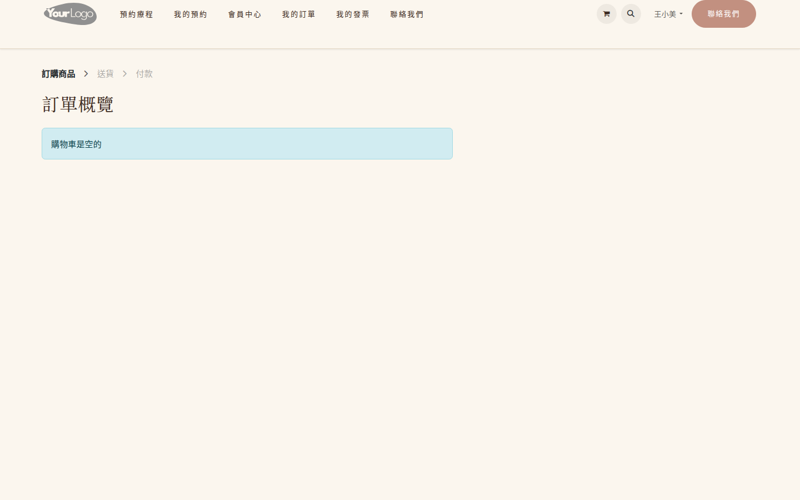

點擊導覽列右上角的購物車圖示，或前往 `/shop/cart` 頁面，即可查看購物車內容：

| 功能 | 說明 |
|------|------|
| 商品列表 | 顯示已加入購物車的所有療程項目 |
| 商品圖片 | 各療程的縮圖 |
| 商品名稱 | 療程名稱 |
| 單價 | 該療程的單次價格 |
| 數量 | 可增減數量或刪除項目 |
| 小計 | 該項目的小計金額（單價 × 數量） |
| 優惠券輸入欄 | 可輸入優惠碼以套用折扣 |
| 合計金額 | 購物車所有項目的總計金額 |
| 繼續購物按鈕 | 返回療程商城繼續瀏覽 |
| 結帳按鈕 | 前往結帳流程 |

1. 確認購物車中的療程項目與數量是否正確。
2. 如需修改數量，直接在數量欄位中調整。
3. 如需移除某項療程，點擊該項目旁的刪除按鈕（垃圾桶圖示）。
4. 確認無誤後，點擊「結帳」按鈕進入結帳流程。

### 步驟 2：套用優惠券

若您持有優惠券代碼，可在購物車頁面套用：

1. 在購物車頁面找到「優惠碼」（Promo Code）輸入欄位。
2. 輸入您的優惠券代碼。
3. 點擊「套用」（Apply）按鈕。
4. 系統將驗證優惠碼是否有效。
5. 若有效，合計金額將自動扣除折扣金額。
6. 折扣明細會顯示在小計與合計之間。

| 功能 | 說明 |
|------|------|
| 優惠碼輸入欄 | 輸入優惠券代碼或促銷代碼 |
| 套用按鈕 | 驗證並套用優惠碼 |
| 折扣明細 | 顯示折扣類型與折扣金額 |
| 更新合計 | 套用後合計金額自動更新 |

### 步驟 3：結帳與付款

1. 在購物車頁面點擊「結帳」按鈕。
2. 系統進入結帳流程，需填寫或確認以下資訊：

| 功能 | 說明 |
|------|------|
| 帳單地址 | 確認或填寫帳單地址資訊 |
| 聯絡資訊 | 確認電子郵件與電話號碼 |
| 付款方式 | 選擇付款方式（如線上付款、銀行轉帳等） |
| 訂單摘要 | 顯示購買項目、數量、金額摘要 |
| 確認下單按鈕 | 確認訂單並完成購買 |

3. 確認所有資訊無誤後，點擊「確認下單」按鈕。
4. 依據選擇的付款方式完成付款。
5. 付款成功後，系統將顯示訂單確認頁面。
6. 同時您將收到訂單確認通知（依系統設定可能透過 Email 發送）。

### 步驟 4：訂單確認

訂單成功建立後，確認頁面將顯示：

| 功能 | 說明 |
|------|------|
| 訂單編號 | 系統自動產生的唯一訂單編號 |
| 訂單明細 | 購買的療程項目與數量 |
| 總金額 | 訂單的總付款金額 |
| 訂單狀態 | 目前的訂單處理狀態 |
| 查看訂單連結 | 點擊可前往「我的訂單」頁面查看詳情 |

1. 記下訂單編號以便日後查詢。
2. 點擊「查看訂單」可前往 Portal 的訂單詳情頁面。
3. 您也可以在 Portal 儀表板的「我的訂單」中找到此筆訂單。

---

## 8. B2C 預約掛號 — 瀏覽療程與選擇醫師

沐淨醫美提供線上預約掛號功能，消費者可在網站上直接瀏覽可預約的療程項目，選擇指定醫師或護理師，並完成線上預約。本章說明療程瀏覽與醫師選擇的操作流程。

### 步驟 1：預約療程列表

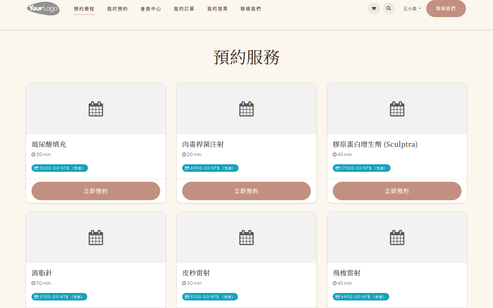

前往預約掛號頁面後，您將看到所有可預約的療程類型列表：

| 功能 | 說明 |
|------|------|
| 療程類型卡片 | 以卡片形式展示每個可預約的療程類型 |
| 療程名稱 | 如「玻尿酸填充」、「皮秒雷射」等 |
| 療程簡介 | 簡短的療程說明文字 |
| 療程時長 | 預約所需時間 |
| 療程圖片 | 療程代表性圖片 |
| 預約按鈕 | 點擊開始進入該療程的預約流程 |

1. 點擊導覽列中的「預約掛號」或前往 `/appointment` 頁面。
2. 頁面將顯示所有可預約的療程類型。
3. 瀏覽各療程類型的說明與時間資訊。

### 步驟 2：完整療程類型一覽

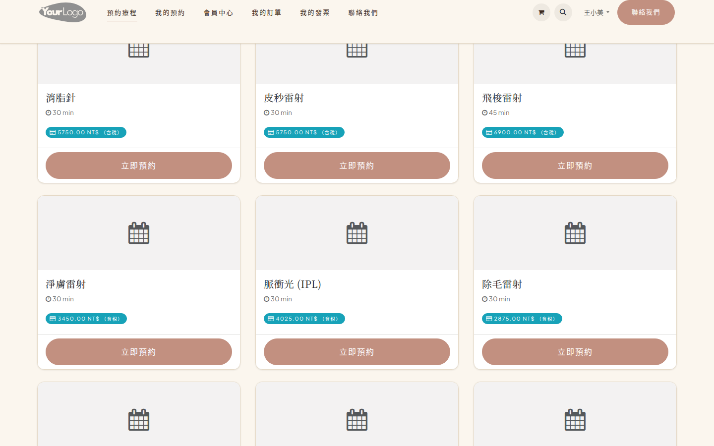

沐淨醫美提供 **20 種可預約療程類型**，與 B2C 療程商城的商品對應：

| 編號 | 療程名稱 | 分類 | 價格（TWD） |
|------|---------|------|-----------|
| 1 | 玻尿酸填充 | 微整形注射 | $8,000 |
| 2 | 肉毒桿菌注射 | 微整形注射 | $6,000 |
| 3 | 膠原蛋白增生劑 | 微整形注射 | $15,000 |
| 4 | 消脂針 | 微整形注射 | $5,000 |
| 5 | 皮秒雷射 | 光電雷射 | $5,000 |
| 6 | 飛梭雷射 | 光電雷射 | $6,000 |
| 7 | 淨膚雷射 | 光電雷射 | $3,000 |
| 8 | 脈衝光 IPL | 光電雷射 | $3,500 |
| 9 | 除毛雷射 | 光電雷射 | $2,500 |
| 10 | 冷凍溶脂 | 體雕療程 | $25,000 |
| 11 | 電波拉皮 Thermage | 體雕療程 | $35,000 |
| 12 | 音波拉提 HIFU | 體雕療程 | $30,000 |
| 13 | 水光注射 | 臉部保養 | $4,500 |
| 14 | 導入保養 | 臉部保養 | $2,000 |
| 15 | 化學煥膚 | 臉部保養 | $2,500 |
| 16 | 杏仁酸煥膚 | 臉部保養 | $1,800 |
| 17 | PRP 自體血小板 | 特殊療程 | $12,000 |
| 18 | 雷射除斑 | 特殊療程 | $6,000 |
| 19 | 痘疤治療 | 特殊療程 | $5,000 |
| 20 | 初次諮詢 | 特殊療程 | $500 |

### 步驟 3：選擇療程與查看詳情

1. 在療程列表中，點擊您想要預約的療程卡片。
2. 進入療程詳情頁面，可查看更完整的資訊：

| 功能 | 說明 |
|------|------|
| 療程詳細說明 | 完整的療程介紹、適應症、注意事項 |
| 所需時間 | 該療程預約所需的時間長度 |
| 價格資訊 | 療程單次價格 |
| 可選醫師/護理師 | 列出可執行該療程的醫護人員 |
| 開始預約按鈕 | 點擊進入日曆選時步驟 |

3. 確認療程資訊無誤後，點擊「開始預約」按鈕。

### 步驟 4：選擇醫師或護理師

預約流程中，系統會依據療程類型列出可選擇的醫護人員：

**微整形注射類療程可選人員：**

| 醫護人員 | 專科 | 說明 |
|---------|------|------|
| 陳志明醫師 | 微整形注射 | 主治醫師，負責注射類療程操作 |
| 張美玲護理師 | 注射助理 | 協助術前準備與術後照護 |

**光電雷射類療程可選人員：**

| 醫護人員 | 專科 | 說明 |
|---------|------|------|
| 林雅婷醫師 | 雷射光電 | 主治醫師，負責雷射光電療程操作 |
| 李佳蓉護理師 | 雷射操作 | 協助雷射儀器操作與術後衛教 |

**體雕抗老類療程可選人員：**

| 醫護人員 | 專科 | 說明 |
|---------|------|------|
| 王建國醫師 | 體雕抗老 | 主治醫師，負責體雕抗老療程操作 |

**臉部保養類療程可選人員：**

| 醫護人員 | 專科 | 說明 |
|---------|------|------|
| 黃心怡護理師 | 保養療程 | 負責臉部保養療程操作 |

1. 在醫護人員選擇畫面中，查看每位醫護人員的專科與簡介。
2. 選擇您偏好的醫師或護理師。
3. 若無特別偏好，可選擇「不指定」，系統將自動分配。
4. 選擇完成後，系統將進入日曆選時步驟。

---

## 9. B2C 預約掛號 — 日曆選時與確認

選擇療程與醫師後，接下來需要在日曆上選擇可用的時段，並填寫預約資訊完成預約。本章說明日曆選時與預約確認的完整流程。

### 步驟 1：日曆選擇預約時段

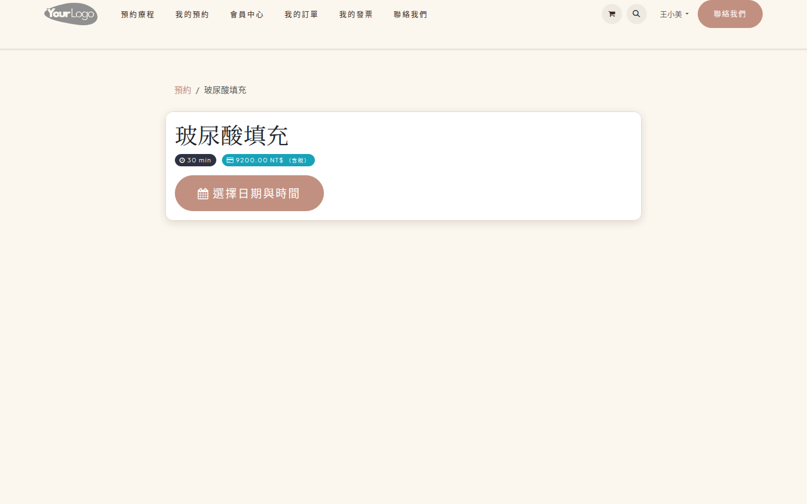

進入日曆選時步驟後，頁面將顯示可用的預約時段：

| 功能 | 說明 |
|------|------|
| 月曆視圖 | 以月曆形式顯示可預約的日期 |
| 可用日期標示 | 有可用時段的日期會以特殊色彩標示 |
| 不可用日期 | 已額滿或休診日期將被灰色標示或不可點選 |
| 時段列表 | 點選日期後，顯示該日期的可用時段 |
| 時段按鈕 | 每個可用時段以按鈕形式顯示，點擊即可選擇 |
| 已選時段 | 選擇後以醒目色彩標示已選擇的時段 |

1. 在月曆上瀏覽可用的預約日期。
2. 點擊您希望預約的日期。
3. 系統將顯示該日期的所有可用時段。
4. 點擊您偏好的時段按鈕。
5. 確認日期與時間無誤後，系統將進入預約表單填寫步驟。

### 步驟 2：填寫預約資訊

選擇時段後，需填寫預約相關資訊：

| 功能 | 說明 |
|------|------|
| 姓名 | 預約者姓名（已登入會自動帶入） |
| 電子郵件 | 聯絡用電子郵件（已登入會自動帶入） |
| 電話號碼 | 聯絡用電話號碼 |
| 備註說明 | 可填寫特殊需求或補充說明 |
| 預約摘要 | 顯示已選擇的療程、醫師、日期、時段 |
| 確認預約按鈕 | 點擊送出預約 |

1. 確認或填寫個人聯絡資訊。
2. 如有特殊需求，可在備註欄位中說明。
3. 仔細核對預約摘要中的療程、醫師、日期與時段是否正確。
4. 確認無誤後，點擊「確認預約」按鈕。

### 步驟 3：預約確認通知

預約送出成功後，系統將顯示確認訊息：

| 功能 | 說明 |
|------|------|
| 確認訊息 | 顯示「預約成功」提示訊息 |
| 預約編號 | 系統自動產生的預約編號 |
| 預約詳情 | 療程名稱、醫師、日期、時段的完整摘要 |
| 加入行事曆 | 可下載 ICS 檔案加入個人行事曆 |
| 查看預約連結 | 前往「我的預約」查看完整預約記錄 |
| Email 通知 | 系統可能發送預約確認 Email |

1. 記下預約編號以便日後查詢。
2. 建議下載 ICS 檔案加入行事曆，以免忘記預約時間。
3. 您可以在 Portal「我的預約」中隨時查看所有預約記錄。

### 步驟 4：王小美的預約範例資料

以示範帳號王小美（`portal`）為例，系統已預建 5 筆預約記錄：

| 預約療程 | 狀態 | 說明 |
|---------|------|------|
| 初次諮詢 | 已完成（done） | 首次到診諮詢，由醫師評估膚況 |
| 玻尿酸填充 | 已完成（done） | 已完成玻尿酸填充療程 |
| 皮秒雷射 | 已完成（done） | 已完成皮秒雷射療程 |
| 杏仁酸煥膚 | 已確認（confirmed） | 已確認預約，等待療程執行 |
| 電波拉皮 | 已確認（confirmed） | 已確認預約，等待療程執行 |

> **提示**：已完成（done）的預約無法取消或修改；已確認（confirmed）的預約可能允許取消或改期，視系統設定而定。

---

## 10. B2C 我的訂單

「我的訂單」頁面列出會員所有的銷售訂單記錄，包含訂單狀態、金額、日期等資訊。本章說明訂單列表的瀏覽與訂單詳情的查看方式。

### 步驟 1：訂單列表

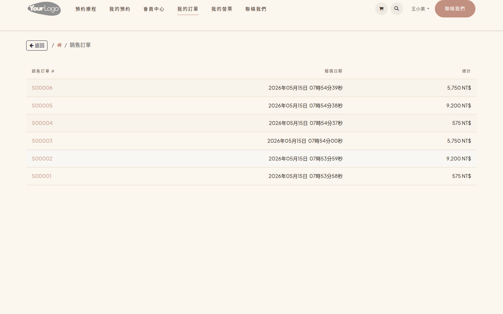

前往「我的訂單」頁面，可查看所有訂單記錄：

| 功能 | 說明 |
|------|------|
| 訂單編號 | 每筆訂單的唯一識別編號 |
| 訂單日期 | 訂單建立的日期 |
| 訂單金額 | 訂單的總金額 |
| 訂單狀態 | 如報價中、已確認、已完成等 |
| 查看詳情連結 | 點擊可前往訂單詳情頁面 |
| 分頁導覽 | 若訂單較多，可透過分頁切換 |

1. 從 Portal 儀表板點擊「我的訂單」功能卡片，或前往 `/my/orders`。
2. 頁面將以列表形式顯示所有訂單。
3. 可依日期排序檢視訂單。

**王小美的訂單範例：**

| 訂單項目 | 金額（TWD） |
|---------|-----------|
| 初次諮詢 | $500 |
| 玻尿酸填充 | $8,000 |
| 皮秒雷射 | $5,000 |

### 步驟 2：訂單詳情

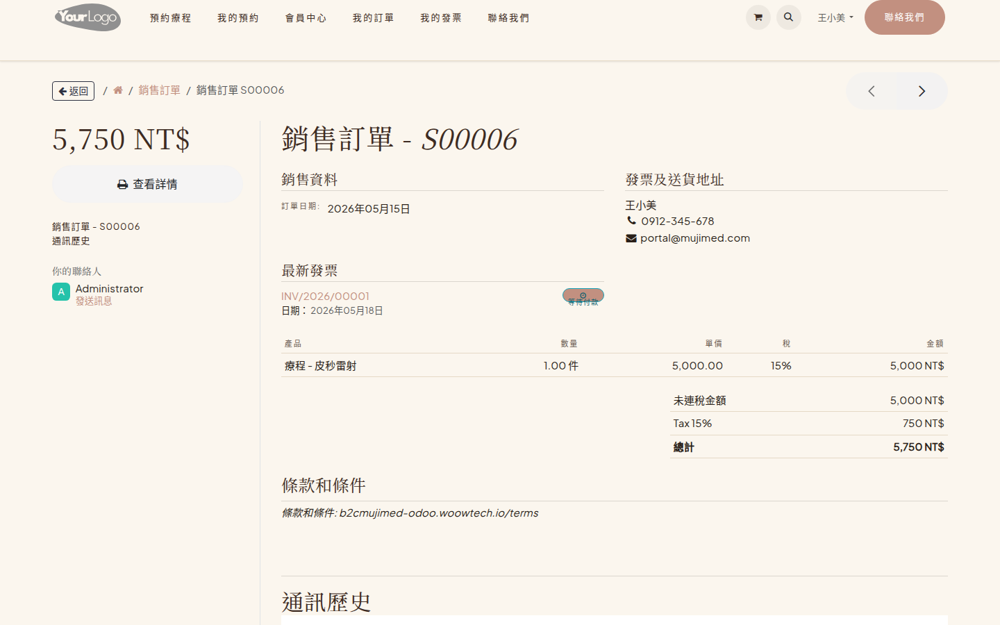

點擊訂單編號或「查看詳情」連結，進入訂單詳情頁面：

| 功能 | 說明 |
|------|------|
| 訂單編號 | 訂單的完整編號 |
| 訂單日期 | 訂單建立日期與時間 |
| 訂單明細 | 購買的療程項目、數量、單價、小計 |
| 稅額 | 各項目的稅額計算 |
| 合計金額 | 訂單的總計金額（含稅） |
| 訂單狀態 | 目前的訂單處理狀態 |
| 發票連結 | 若已開立發票，提供發票查看連結 |
| 列印/下載 | 可列印或下載訂單 PDF |

1. 在訂單列表中，點擊您要查看的訂單。
2. 訂單詳情頁面將顯示完整的訂單資訊。
3. 可確認療程項目、數量與金額是否正確。
4. 若有對應的發票，可直接點擊連結前往發票頁面。

---

## 11. B2C 我的發票

「我的發票」頁面顯示會員所有的發票記錄，可查看發票詳情與下載 PDF。本章說明發票列表與詳情頁面的操作方式。

### 步驟 1：發票列表

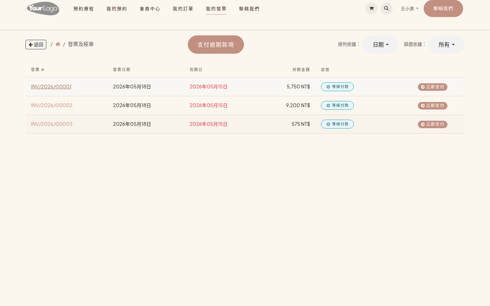

前往「我的發票」頁面，可查看所有發票記錄：

| 功能 | 說明 |
|------|------|
| 發票編號 | 每張發票的唯一識別編號 |
| 發票日期 | 發票開立的日期 |
| 到期日 | 付款到期日 |
| 發票金額 | 發票的總金額 |
| 發票狀態 | 如草稿、已開立、已付款等 |
| 查看詳情連結 | 點擊可前往發票詳情頁面 |

1. 從 Portal 儀表板點擊「我的發票」功能卡片，或前往 `/my/invoices`。
2. 頁面將以列表形式顯示所有發票。
3. 王小美帳號預設有 3 張發票，分別對應 3 筆訂單。

### 步驟 2：發票詳情與 PDF 下載

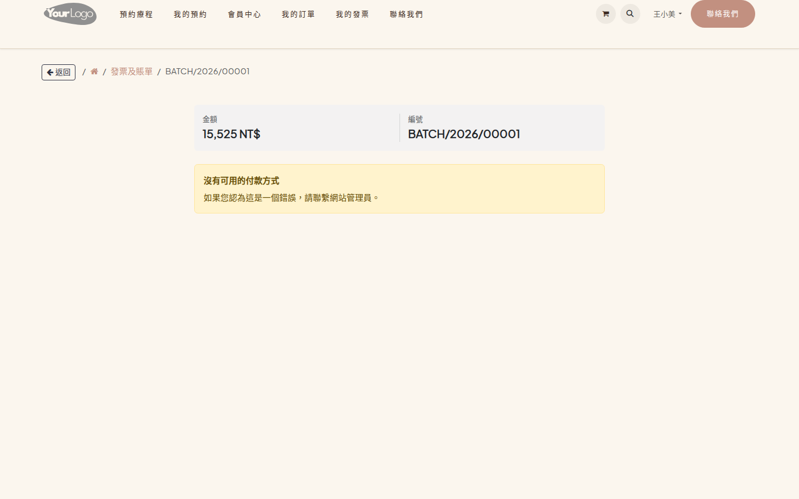

點擊發票編號或查看連結，進入發票詳情頁面：

| 功能 | 說明 |
|------|------|
| 發票編號 | 發票的完整編號 |
| 發票日期 | 開立日期 |
| 到期日 | 付款到期日期 |
| 發票明細 | 項目名稱、數量、單價、小計 |
| 稅額明細 | 各項稅額計算與加總 |
| 合計金額 | 發票的應付總金額 |
| 付款狀態 | 已付款 / 未付款 / 部分付款 |
| 下載 PDF | 點擊可下載發票的 PDF 檔案 |
| 線上付款按鈕 | 若未付款，可透過線上方式付款 |

1. 在發票列表中，點擊您要查看的發票。
2. 發票詳情頁面將顯示完整的發票資訊。
3. 點擊「下載 PDF」按鈕，可下載發票 PDF 檔案以供列印或存檔。
4. 若發票尚未付款，可點擊「線上付款」按鈕進行付款。

---

## 12. B2C 我的預約

「我的預約」頁面列出會員所有的預約掛號記錄，可查看預約狀態、預約詳情與管理預約。

### 步驟 1：預約列表

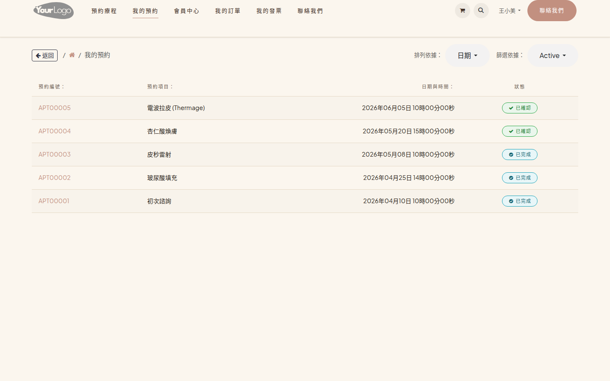

前往「我的預約」頁面，可查看所有預約記錄：

| 功能 | 說明 |
|------|------|
| 預約編號 | 每筆預約的唯一識別編號 |
| 療程名稱 | 預約的療程類型名稱 |
| 預約日期與時段 | 預約的日期與時間 |
| 醫師/護理師 | 預約的醫護人員 |
| 預約狀態 | 如已確認、已完成、已取消等 |
| 查看詳情連結 | 點擊可前往預約詳情頁面 |

1. 從 Portal 儀表板點擊「我的預約」功能卡片，或前往 `/my/appointments`。
2. 頁面將以列表形式顯示所有預約記錄。
3. 王小美帳號預設有 5 筆預約記錄。

### 步驟 2：預約狀態說明

| 狀態 | 英文 | 說明 |
|------|------|------|
| 已確認 | confirmed | 預約已確認，等待到診 |
| 已完成 | done | 療程已完成 |
| 已取消 | cancelled | 預約已被取消 |
| 待確認 | pending | 預約已送出，等待診所確認 |

1. 在預約列表中，透過狀態欄位即可快速了解每筆預約的處理進度。
2. 「已確認」狀態表示您可以按時到診。
3. 「已完成」狀態表示療程已順利執行完畢。

### 步驟 3：預約詳情

點擊預約編號或查看連結，進入預約詳情頁面：

| 功能 | 說明 |
|------|------|
| 預約編號 | 預約的完整編號 |
| 療程名稱 | 預約的療程類型 |
| 預約日期 | 預約的具體日期 |
| 預約時段 | 預約的具體時間 |
| 醫師/護理師 | 負責執行的醫護人員 |
| 預約狀態 | 目前的預約處理狀態 |
| 備註 | 預約時填寫的備註說明 |
| 取消預約按鈕 | 若預約尚未執行，可點擊取消（視設定） |

1. 在預約詳情頁面中，確認所有預約資訊是否正確。
2. 如需取消預約，點擊「取消預約」按鈕（僅限尚未執行的預約）。
3. 取消後，預約狀態將變更為「已取消」。

---

## 13. B2C 會員卡與忠誠計畫

沐淨醫美為會員提供多元的忠誠計畫，包含電子錢包、忠誠點數、禮品卡、優惠券、醫美寄品卡等。本章說明如何查看與管理您的會員卡及忠誠計畫。

### 步驟 1：會員中心概覽

前往會員中心頁面，可查看所有持有的會員卡與忠誠計畫：

| 功能 | 說明 |
|------|------|
| 忠誠計畫列表 | 顯示您已加入的所有忠誠計畫 |
| 卡片餘額 | 各會員卡的目前餘額或點數 |
| 計畫類型 | 如電子錢包、忠誠點數、禮品卡等 |
| 使用說明 | 各計畫的使用規則與兌換方式 |

1. 從 Portal 儀表板點擊「會員卡」功能卡片，或前往 `/my/loyalty_card`。
2. 頁面將顯示您持有的所有忠誠計畫與會員卡。

### 步驟 2：七大忠誠計畫詳細說明

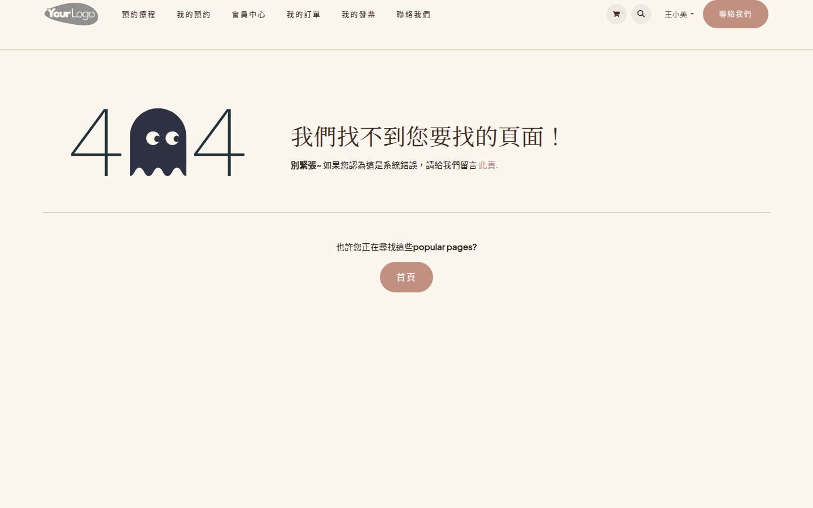

沐淨醫美提供 **7 大忠誠計畫**：

| 編號 | 計畫名稱 | 類型 | 王小美餘額 | 說明 |
|------|---------|------|-----------|------|
| 1 | Mujimed 電子錢包 | 電子錢包（ewallet） | 5,000 點 | 可直接於結帳時折抵消費金額，1 點 = 1 元 |
| 2 | Mujimed 忠誠點數 | 忠誠點數（loyalty） | 1,200 點 | 消費累積點數，可兌換療程折扣或贈品 |
| 3 | Mujimed 禮品卡 | 禮品卡（gift_card） | 3,000 點 | 預儲值卡片，可購買贈送或自用 |
| 4 | Mujimed 新客優惠券 | 優惠券（coupon） | 1 張 | 新會員專屬優惠券，限用一次 |
| 5 | Mujimed 醫美寄品卡 | 寄品卡（consignment） | — | 預購療程次數，寄存於診所分次使用 |
| 6 | 母親節優惠 | 促銷活動（promotion） | — | 母親節期間限定優惠活動 |
| 7 | 生日禮金 | 生日禮金（birthday） | — | 會員生日月份專屬禮金或折扣 |

**各計畫類型詳細說明：**

| 計畫類型 | 功能 | 說明 |
|---------|------|------|
| 電子錢包 | 儲值與折抵 | 可儲值點數至錢包，結帳時直接折抵消費金額 |
| 忠誠點數 | 累積與兌換 | 消費自動累積點數，達到門檻可兌換優惠 |
| 禮品卡 | 儲值與使用 | 具有固定面額的儲值卡，可購買贈送或自用 |
| 優惠券 | 限定折扣 | 特定條件觸發的折扣券，限用一次或限定期間 |
| 寄品卡 | 預購寄存 | 預購療程次數後寄存於診所，分次使用 |
| 促銷活動 | 期間優惠 | 特定節日或活動期間的限定優惠 |
| 生日禮金 | 生日優惠 | 會員生日月份的專屬禮金或折扣 |

### 步驟 3：查看餘額與使用會員卡

1. 在會員中心頁面中，每張會員卡會顯示目前的餘額或可用點數。
2. 電子錢包、禮品卡等儲值型計畫會顯示具體點數餘額。
3. 優惠券會顯示可使用的張數。
4. 要使用會員卡的折扣，通常在購物車結帳時自動套用或手動輸入代碼。

| 功能 | 說明 |
|------|------|
| 餘額顯示 | 即時顯示各卡片的餘額與點數 |
| 使用紀錄 | 查看歷次使用與異動紀錄 |
| 儲值入口 | 電子錢包可透過此處進行儲值 |
| 代碼複製 | 部分優惠券可複製代碼於結帳時使用 |

---

## 14. B2C 聯絡我們

「聯絡我們」頁面提供消費者與沐淨醫美取得聯繫的管道，包含聯絡表單、診所地址、電話等資訊。

### 步驟 1：聯絡頁面概覽

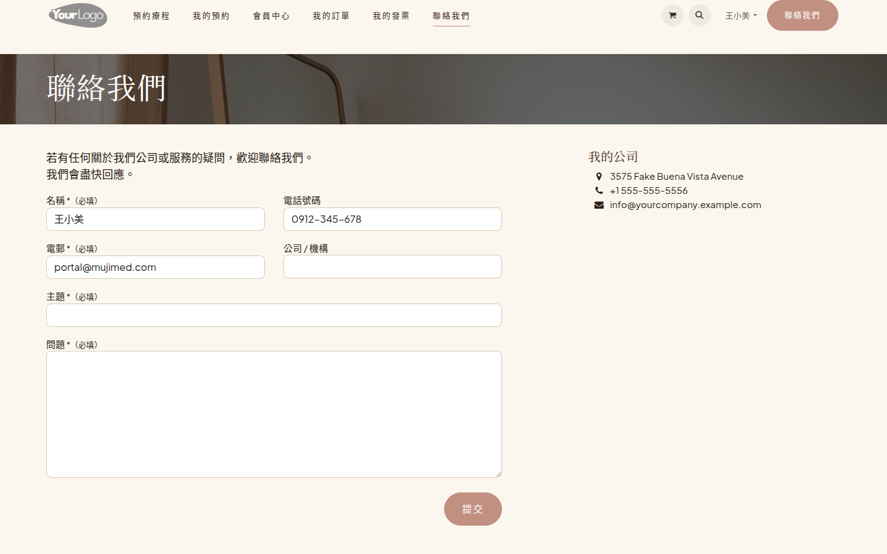

前往「聯絡我們」頁面，您將看到以下內容：

| 功能 | 說明 |
|------|------|
| 聯絡表單 | 填寫姓名、Email、主旨、訊息後送出 |
| 姓名欄位 | 輸入您的姓名 |
| Email 欄位 | 輸入您的電子郵件（方便回覆） |
| 主旨欄位 | 輸入諮詢主旨 |
| 訊息欄位 | 輸入詳細的諮詢內容 |
| 送出按鈕 | 將表單內容送出至沐淨醫美客服 |
| 診所地址 | 沐淨醫美實體診所的地址 |
| 聯絡電話 | 診所聯絡電話 |
| 營業時間 | 診所的營業時間資訊 |
| 地圖 | Google Map 嵌入或地圖圖片 |

1. 點擊導覽列中的「聯絡我們」或前往 `/contactus` 頁面。
2. 填寫聯絡表單中的各欄位資訊。
3. 確認內容無誤後，點擊「送出」按鈕。
4. 系統將顯示送出成功的確認訊息。
5. 沐淨醫美客服團隊將透過您提供的 Email 回覆您的諮詢。

---

## 15. B2B 企業採購 — 商品目錄

B2B 企業批發商城提供醫美診所與醫療機構採購所需的耗材、設備配件與保養品。本章介紹 B2B 商品目錄的瀏覽方式與完整商品列表。

### 步驟 1：B2B 商品目錄列表

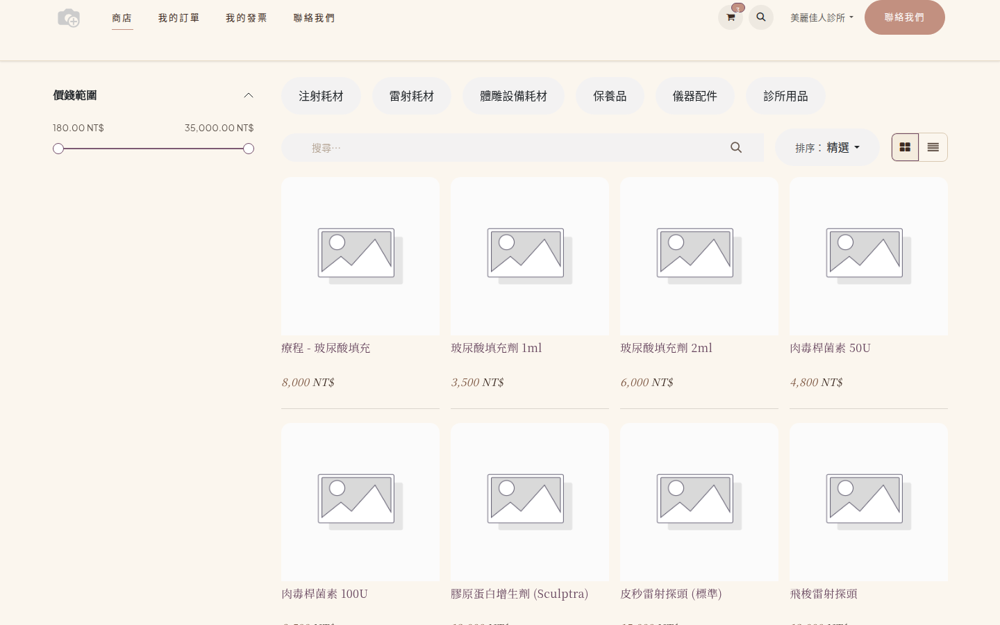

使用企業夥伴帳號（`partner` / `partner`）登入 B2B 網站後，前往商品目錄頁面：

| 功能 | 說明 |
|------|------|
| 商品卡片 | 以網格形式展示所有批發商品 |
| 商品圖片 | 各商品的產品照片 |
| 商品名稱 | 完整的商品名稱 |
| 批發價格 | B2B 專屬批發價格 |
| 分類篩選 | 依商品分類篩選顯示 |
| 搜尋功能 | 以關鍵字搜尋商品 |
| 加入購物車 | 快速加入購物車按鈕 |

1. 登入 B2B 網站（`https://b2bmujimed-odoo.woowtech.io`）。
2. 點擊導覽列中的「商品目錄」或前往 `/shop` 頁面。
3. 瀏覽商品列表，可使用分類篩選或搜尋功能快速找到所需商品。

### 步驟 2：六大商品分類與完整商品列表

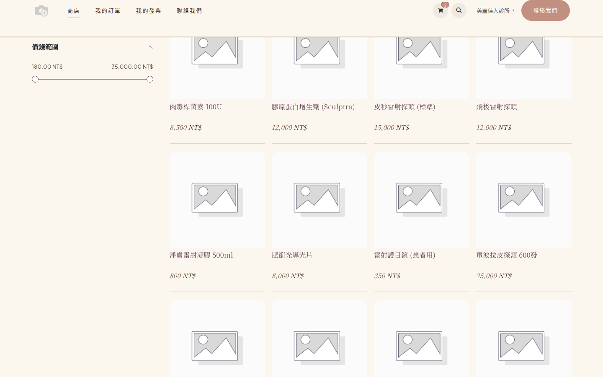

B2B 商城共提供 **31 項商品**，分為 **6 大分類**：

**分類一：注射耗材（5 項）**

| 商品名稱 | 規格 | 說明 |
|---------|------|------|
| 玻尿酸填充劑 1ml | 1ml/支 | 醫療級玻尿酸填充劑，用於臉部填充注射 |
| 肉毒桿菌素 100U | 100U/瓶 | 肉毒桿菌素凍乾粉劑，用於除皺注射 |
| 膠原蛋白增生劑 1ml | 1ml/支 | 膠原蛋白增生劑，刺激自體膠原蛋白再生 |
| 消脂針 PCDC | 每組 | PCDC 消脂成分注射劑，用於局部溶脂 |
| PRP 套組 | 每套 | 自體血小板分離套組，含離心管與相關耗材 |

**分類二：雷射耗材（5 項）**

| 商品名稱 | 規格 | 說明 |
|---------|------|------|
| 皮秒雷射探頭 | 每支 | 皮秒雷射儀器的替換探頭 |
| 飛梭雷射探頭 | 每支 | 飛梭雷射儀器的替換探頭 |
| 淨膚雷射凝膠 | 每瓶 | 淨膚雷射治療使用的導光凝膠 |
| IPL 濾光片 | 每片 | 脈衝光儀器使用的濾光片 |
| 除毛雷射冷凝膠 | 每瓶 | 除毛雷射治療使用的冷卻凝膠 |

**分類三：體雕設備耗材（5 項）**

| 商品名稱 | 規格 | 說明 |
|---------|------|------|
| 電波拉皮探頭 | 每支 | Thermage 電波拉皮的替換探頭 |
| 音波拉提探頭 | 每支 | HIFU 音波拉提的替換探頭 |
| 冷凍溶脂貼片 | 每片 | 冷凍溶脂治療使用的防凍貼片 |
| 電波導電膜 | 每片 | 電波拉皮治療使用的導電膜 |
| 音波耦合劑 | 每瓶 | 音波拉提治療使用的超音波耦合凝膠 |

**分類四：保養品（5 項）**

| 商品名稱 | 規格 | 說明 |
|---------|------|------|
| 術後修護面膜 | 每盒 | 醫美術後使用的修護鎮定面膜 |
| 玻尿酸精華液 | 每瓶 | 高濃度玻尿酸保濕精華液 |
| 維他命 C 精華 | 每瓶 | 左旋 C 抗氧化亮白精華液 |
| 防曬修護乳 | 每瓶 | 醫美術後專用防曬修護乳液 |
| 舒緩凝膠 | 每瓶 | 術後舒緩鎮定凝膠 |

**分類五：儀器配件（5 項）**

| 商品名稱 | 規格 | 說明 |
|---------|------|------|
| 超音波導入儀探頭 | 每支 | 超音波導入儀的替換探頭 |
| LED 光療面罩 | 每組 | LED 紅藍光光療面罩 |
| 微針滾輪 | 每支 | 微針美容滾輪，用於精華液導入 |
| 射頻美容儀手柄 | 每支 | 射頻美容儀的替換手柄 |
| 冷噴儀噴頭 | 每支 | 冷噴鎮定儀的替換噴頭 |

**分類六：診所用品（6 項）**

| 商品名稱 | 規格 | 說明 |
|---------|------|------|
| 無粉乳膠手套 | 每盒 | 醫療級無粉乳膠檢查手套 |
| 醫療紗布 | 每包 | 無菌醫療用紗布 |
| 酒精消毒液 | 每瓶 | 75% 醫用酒精消毒液 |
| 拋棄式治療巾 | 每包 | 一次性無紡布治療巾 |
| 診療床護墊 | 每包 | 一次性診療床護墊紙 |
| 醫用棉花棒 | 每包 | 無菌醫用棉花棒 |

### 步驟 3：商品詳情頁面

1. 在商品列表中，點擊您要採購的商品卡片。
2. 進入商品詳情頁面，可查看完整的商品資訊。

| 功能 | 說明 |
|------|------|
| 商品大圖 | 高解析度的商品照片 |
| 商品名稱 | 完整的商品名稱 |
| 批發價格 | B2B 專屬批發價格 |
| 商品描述 | 詳細的商品說明、規格、用途 |
| 數量選擇 | 可設定採購數量 |
| 加入購物車 | 將商品加入 B2B 購物車 |
| 商品分類 | 顯示該商品所屬的分類 |

3. 設定採購數量後，點擊「加入購物車」按鈕。
4. 商品將加入 B2B 購物車，可繼續瀏覽或前往結帳。

---

## 16. B2B 企業採購 — 購物車與結帳

B2B 企業採購的購物車與結帳流程與 B2C 類似，但針對企業客戶提供了批發價格與企業帳務功能。本章說明 B2B 購物車的操作與結帳流程。

### 步驟 1：B2B 購物車

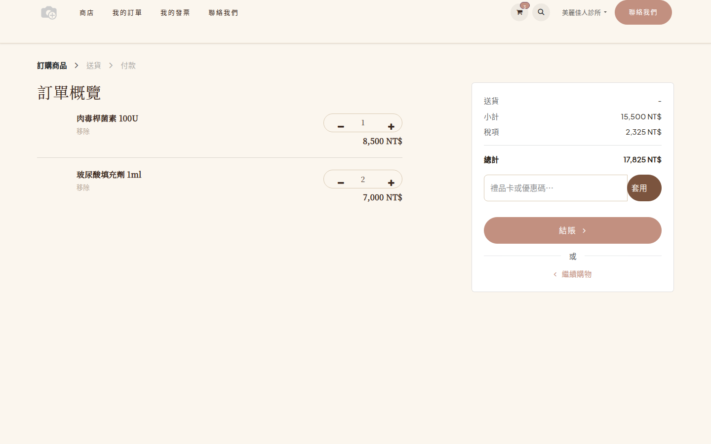

B2B 購物車頁面顯示已加入的所有商品：

| 功能 | 說明 |
|------|------|
| 商品列表 | 已加入購物車的所有批發商品 |
| 商品圖片 | 各商品的縮圖 |
| 商品名稱 | 商品完整名稱 |
| 批發單價 | B2B 專屬批發價格 |
| 數量 | 可增減採購數量 |
| 小計 | 該項目的小計金額 |
| 優惠碼欄位 | 可輸入企業專屬優惠碼 |
| 合計金額 | 所有商品的總計金額 |
| 繼續購物按鈕 | 返回商品目錄繼續瀏覽 |
| 結帳按鈕 | 前往結帳流程 |

1. 點擊導覽列右上角的購物車圖示，或前往 `/shop/cart`。
2. 確認購物車中的商品項目與數量。
3. 如需修改數量，直接在數量欄位中調整。
4. 如需移除商品，點擊刪除按鈕。
5. 確認無誤後，點擊「結帳」按鈕。

### 步驟 2：B2B 結帳流程

1. 點擊「結帳」按鈕後，進入結帳頁面。
2. 確認或填寫企業帳單資訊：

| 功能 | 說明 |
|------|------|
| 公司名稱 | 企業名稱（如「美麗佳人診所」） |
| 統一編號 | 企業統一編號 |
| 帳單地址 | 企業帳單地址 |
| 出貨地址 | 商品配送地址（可與帳單地址不同） |
| 聯絡人 | 企業聯絡人姓名 |
| 聯絡電話 | 企業聯絡電話 |
| Email | 企業聯絡電子郵件 |
| 付款方式 | 選擇付款方式（如月結、銀行轉帳等） |
| 訂單摘要 | 採購項目、數量、金額摘要 |
| 確認下單按鈕 | 確認採購訂單 |

3. 企業客戶可能享有月結付款等企業專屬付款方式。
4. 確認所有資訊無誤後，點擊「確認下單」按鈕。
5. 訂單送出成功後，系統顯示訂單確認頁面。
6. 企業夥伴可在 B2B Portal 中追蹤訂單狀態。

---

## 17. B2B 企業入口 — 訂單與發票管理

B2B 企業夥伴登入後，可透過 Portal 入口管理採購訂單與發票。本章說明 B2B Portal 的操作方式。

### 步驟 1：B2B Portal 儀表板

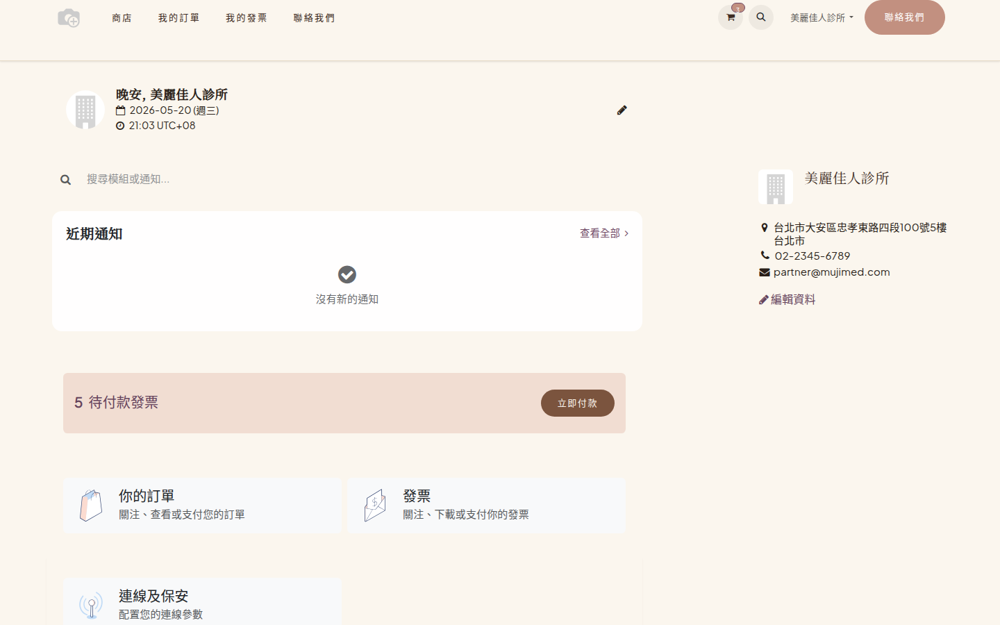

B2B 企業夥伴登入後的 Portal 儀表板：

| 功能 | 說明 |
|------|------|
| 歡迎訊息 | 顯示企業名稱（如「歡迎，美麗佳人診所」） |
| 採購訂單 | 顯示目前的採購訂單數量 |
| 發票 | 顯示目前的發票數量 |
| 功能卡片 | 採購訂單、發票等功能入口 |

1. 使用企業夥伴帳號（`partner` / `partner`）登入 B2B 網站。
2. 登入後自動進入 B2B Portal 儀表板。
3. 儀表板顯示企業相關的統計數據與功能入口。

### 步驟 2：B2B 訂單管理

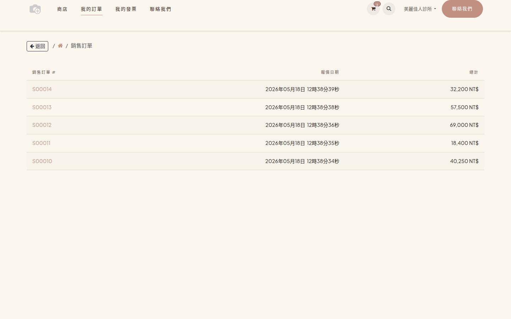

B2B 訂單列表頁面：

| 功能 | 說明 |
|------|------|
| 訂單編號 | 採購訂單的唯一編號 |
| 訂單日期 | 訂單建立日期 |
| 訂單金額 | 訂單的總金額 |
| 訂單狀態 | 如報價中、已確認、出貨中、已完成等 |
| 查看詳情 | 點擊進入訂單詳情頁面 |
| 訂單明細 | 採購商品項目、數量、單價、小計 |
| 出貨資訊 | 配送進度與物流追蹤（如適用） |

1. 從 Portal 儀表板點擊「採購訂單」卡片。
2. 訂單列表將顯示所有採購訂單。
3. 點擊訂單編號可查看完整訂單詳情。
4. 訂單詳情包含採購的商品明細、金額與狀態。

### 步驟 3：B2B 發票管理

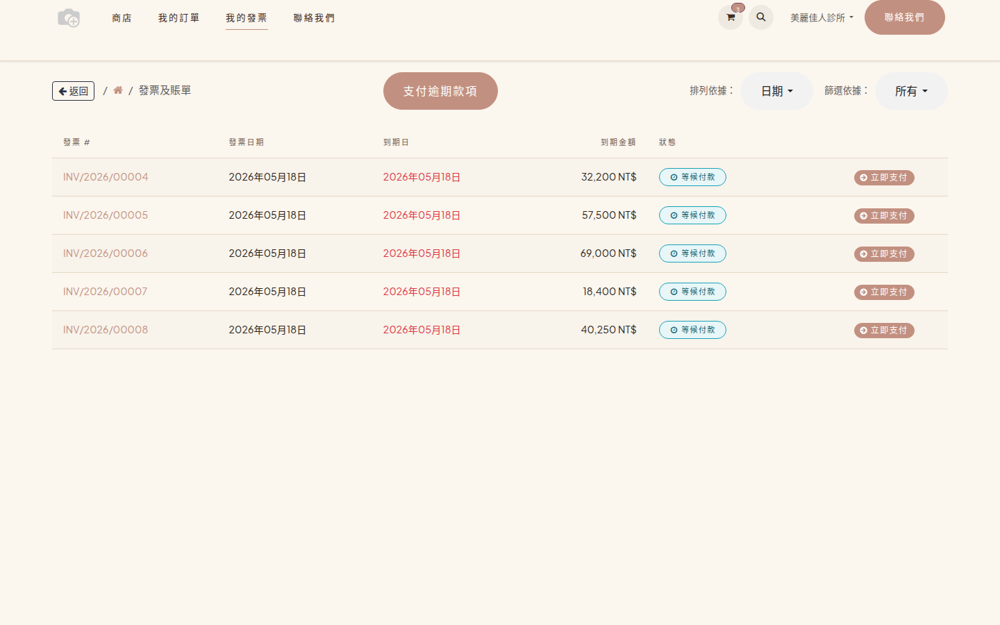

B2B 發票列表頁面：

| 功能 | 說明 |
|------|------|
| 發票編號 | 發票的唯一編號 |
| 發票日期 | 開立日期 |
| 到期日 | 付款到期日 |
| 發票金額 | 應付總金額 |
| 付款狀態 | 已付款 / 未付款 / 部分付款 |
| 下載 PDF | 下載發票 PDF 檔案 |
| 線上付款 | 線上付款功能（如適用） |

1. 從 Portal 儀表板點擊「發票」卡片。
2. 發票列表將顯示所有發票記錄。
3. 點擊發票編號可查看完整發票詳情。
4. 可下載 PDF 或進行線上付款。

---

## 18. 後台管理 — 登入與儀表板

本章開始介紹沐淨醫美 Odoo 18 後台管理系統。後台管理介面供管理員使用，可管理網站內容、商品、訂單、預約、忠誠計畫、使用者等所有系統功能。

### 步驟 1：管理員登入

1. 開啟瀏覽器，前往 `https://b2cmujimed-odoo.woowtech.io/odoo`。
2. 在登入頁面輸入管理員帳號：
   - **帳號**：`admin`
   - **密碼**：`admin`
3. 點擊「登入」按鈕。
4. 系統驗證成功後，將進入 Odoo 後台管理介面。

| 功能 | 說明 |
|------|------|
| 後台登入網址 | `https://b2cmujimed-odoo.woowtech.io/odoo` |
| 管理員帳號 | `admin` |
| 管理員密碼 | `admin` |
| 登入後跳轉 | 進入 Odoo 後台儀表板頁面 |

> **安全提醒**：預設的 `admin` / `admin` 帳號密碼僅供展示與測試使用，正式上線前務必修改為強密碼。

### 步驟 2：後台儀表板概覽

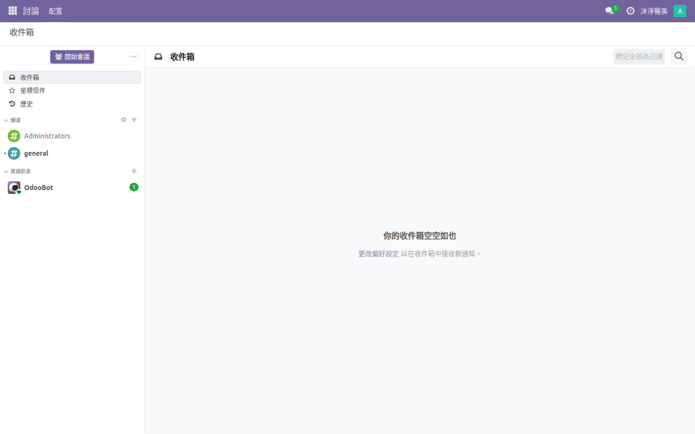

登入後台後，您將看到 Odoo 18 的管理儀表板：

| 功能 | 說明 |
|------|------|
| 應用程式選單 | 左上角或側邊欄顯示已安裝的 Odoo 應用程式 |
| 快速搜尋 | 頂部搜尋欄，可搜尋功能、設定或資料 |
| 通知中心 | 右上角通知鈴鐺，顯示系統通知 |
| 使用者選單 | 右上角使用者頭像，可修改偏好設定或登出 |
| 儀表板小工具 | 顯示關鍵數據摘要（如今日訂單數、待處理事項等） |

**後台主要功能模組一覽：**

| 模組 | 功能 | 說明 |
|------|------|------|
| 網站 | 多網站管理 | 管理 B2C 與 B2B 網站內容 |
| 銷售 | 銷售訂單管理 | 管理所有銷售訂單 |
| 發票 | 帳務管理 | 管理發票、收款 |
| 產品 | 產品目錄管理 | 管理療程商品與批發商品 |
| 聯絡人 | 客戶管理 | 管理客戶與企業夥伴資料 |
| 預約 | 預約排班管理 | 管理預約類型、預約記錄 |
| 忠誠計畫 | 會員卡管理 | 管理忠誠計畫、電子錢包等 |
| 設定 | 系統設定 | 系統參數、使用者權限管理 |

1. 透過左側選單或頂部應用程式列表，點擊對應模組進入管理頁面。
2. 各模組均提供列表視圖、表單視圖、搜尋與篩選功能。
3. 可透過麵包屑導覽快速切換頁面。

---

## 19. 後台管理 — 多網站管理

沐淨醫美採用 Odoo 18 多網站架構，同時營運 B2C 消費者網站與 B2B 企業網站。本章說明如何在後台管理多個網站。

### 步驟 1：網站管理概覽

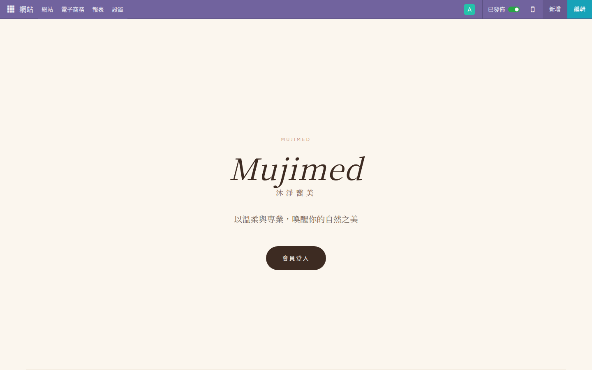

在後台進入「網站」模組後，可管理所有網站：

| 功能 | 說明 |
|------|------|
| 網站列表 | 顯示系統中所有已建立的網站 |
| B2C 網站 | 沐淨醫美消費者網站（b2cmujimed-odoo.woowtech.io） |
| B2B 網站 | 沐淨醫美企業批發網站（b2bmujimed-odoo.woowtech.io） |
| 網站切換器 | 快速切換管理的目標網站 |
| 網站編輯器 | 進入視覺化網站編輯器（Website Builder） |
| 網站設定 | 管理網站的基本設定 |

1. 從後台左側選單點擊「網站」模組。
2. 系統將進入網站管理介面。
3. 使用網站切換器選擇要管理的網站（B2C 或 B2B）。

### 步驟 2：網站設定

| 設定項目 | 說明 |
|---------|------|
| 網站名稱 | 設定網站顯示名稱 |
| 網域 | 設定網站的網域名稱 |
| 預設語言 | 設定網站的預設語言 |
| 公司資訊 | 設定公司名稱、地址、電話等 |
| 社群媒體 | 設定社群媒體連結 |
| SEO 設定 | 設定網站的 SEO 元資料 |
| 分析追蹤 | 設定 Google Analytics 等追蹤代碼 |

1. 在網站管理介面中，點擊「設定」或齒輪圖示。
2. 在設定頁面中調整各項網站參數。
3. 修改完成後點擊「儲存」按鈕。

### 步驟 3：網站內容編輯

| 功能 | 說明 |
|------|------|
| 視覺化編輯器 | 拖放式頁面編輯器，所見即所得 |
| 頁面管理 | 新增、編輯、刪除網站頁面 |
| 選單管理 | 管理網站的導覽選單結構 |
| 主題設定 | 調整網站的視覺主題與色彩 |
| 區塊庫 | 選擇預設的內容區塊加入頁面 |

1. 在網站管理介面中，點擊「編輯」按鈕進入視覺化編輯器。
2. 在編輯模式下，可直接點擊頁面上的文字進行修改。
3. 拖放左側的區塊庫中的元件至頁面中。
4. 編輯完成後，點擊「儲存」按鈕發佈變更。

---

## 20. 後台管理 — 產品目錄管理

後台產品管理模組負責管理所有療程商品（B2C）與批發商品（B2B）。本章說明如何在後台新增、編輯與發佈產品。

### 步驟 1：產品列表

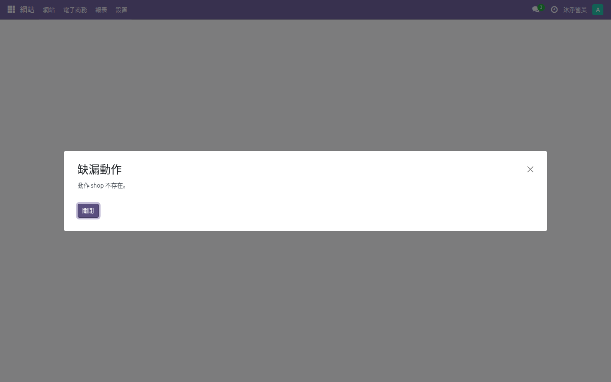

進入產品管理模組後的列表頁面：

| 功能 | 說明 |
|------|------|
| 產品列表 | 以列表或卡片形式顯示所有產品 |
| 產品名稱 | 產品的完整名稱 |
| 產品類型 | 服務型 / 實體商品 / 消耗品 |
| 銷售價格 | 產品的定價 |
| 產品分類 | 產品所屬的分類 |
| 發佈狀態 | 已發佈 / 未發佈 |
| 新增產品按鈕 | 新增一個新的產品 |
| 匯入/匯出 | 批次匯入或匯出產品資料 |
| 篩選與搜尋 | 依名稱、分類、狀態等條件篩選 |

1. 從後台左側選單進入「產品」或「銷售 > 產品」模組。
2. 產品列表將顯示系統中的所有產品。
3. B2C 療程商品（20 項）與 B2B 批發商品（31 項）均會在此列出。

### 步驟 2：新增或編輯產品

1. 點擊「新增」按鈕建立新產品，或點擊現有產品進入編輯。
2. 在產品表單中填寫以下資訊：

| 欄位 | 說明 |
|------|------|
| 產品名稱 | 輸入產品的完整名稱 |
| 產品類型 | 選擇「服務」（療程）或「可儲存產品」（實體商品） |
| 銷售價格 | 設定產品的銷售價格 |
| 成本價格 | 設定產品的成本價格（內部使用） |
| 產品分類 | 選擇或建立產品分類 |
| 內部參考 | 設定內部管理用的產品編號 |
| 產品描述 | 輸入詳細的產品描述 |
| 產品圖片 | 上傳產品照片 |
| 網站發佈 | 設定是否在網站上公開顯示 |
| 適用網站 | 選擇此產品要顯示在哪個網站（B2C / B2B / 全部） |

3. 填寫完成後，點擊「儲存」按鈕。

### 步驟 3：發佈產品至網站

| 功能 | 說明 |
|------|------|
| 發佈狀態切換 | 在產品表單中切換「已發佈」/「未發佈」狀態 |
| 網站選擇 | 指定產品發佈至 B2C 網站、B2B 網站或兩者 |
| 網站分類 | 設定產品在網站商城中的顯示分類 |
| SEO 設定 | 設定產品頁面的 SEO 標題與描述 |
| 預覽功能 | 可在發佈前預覽產品在前台的顯示效果 |

1. 在產品表單中，找到「發佈」或「網站」相關欄位。
2. 將發佈狀態設定為「已發佈」。
3. 選擇要發佈至的目標網站。
4. 設定完成後儲存，產品即會顯示在前台網站上。

---

## 21. 後台管理 — 銷售訂單管理

銷售模組是後台管理的核心功能之一，管理所有來自 B2C 與 B2B 的銷售訂單。本章說明銷售訂單的查看、確認與發票開立流程。

### 步驟 1：銷售訂單列表

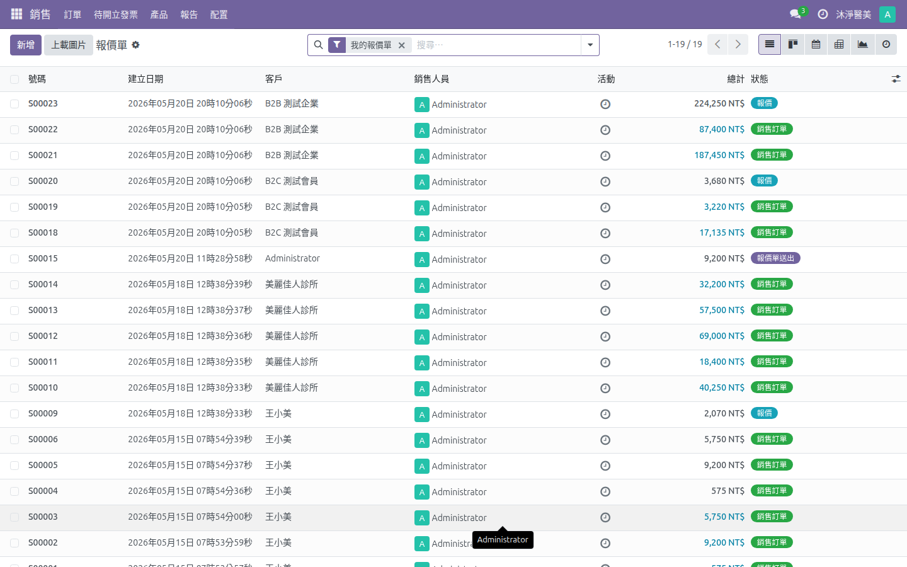

進入銷售模組後的訂單列表頁面：

| 功能 | 說明 |
|------|------|
| 訂單列表 | 以列表形式顯示所有銷售訂單 |
| 訂單編號 | 每筆訂單的唯一編號 |
| 客戶名稱 | 下單客戶名稱 |
| 訂單日期 | 訂單建立日期 |
| 訂單金額 | 訂單總金額 |
| 訂單狀態 | 報價單 / 銷售訂單 / 已鎖定 / 已取消 |
| 發票狀態 | 未開立 / 已開立 / 已付款 |
| 篩選功能 | 依客戶、日期、狀態、網站等條件篩選 |
| 群組功能 | 依客戶、月份、狀態等條件群組 |
| 新增訂單 | 手動建立新的銷售訂單 |

1. 從後台左側選單進入「銷售 > 訂單」。
2. 訂單列表將顯示所有銷售訂單，包含 B2C 與 B2B 來源。
3. 可使用篩選功能快速找到特定訂單。

### 步驟 2：確認訂單

1. 在訂單列表中，點擊要處理的訂單編號。
2. 進入訂單表單頁面，查看訂單詳情。

| 功能 | 說明 |
|------|------|
| 客戶資訊 | 客戶名稱、地址、聯絡方式 |
| 訂單明細 | 產品項目、數量、單價、小計 |
| 稅額計算 | 各項稅額的明細與加總 |
| 合計金額 | 訂單的總金額 |
| 確認按鈕 | 將報價單確認為銷售訂單 |
| 取消按鈕 | 取消此筆訂單 |
| 備註 | 訂單的內部備註或客戶備註 |

3. 確認訂單內容無誤後，點擊「確認」按鈕。
4. 報價單狀態將變更為「銷售訂單」。

### 步驟 3：開立發票

| 功能 | 說明 |
|------|------|
| 建立發票按鈕 | 在已確認的銷售訂單中點擊此按鈕 |
| 發票類型 | 選擇一般發票或預付款發票 |
| 發票明細 | 系統自動帶入訂單明細 |
| 確認發票 | 確認並開立發票 |
| 發送發票 | 透過 Email 發送發票給客戶 |
| 登記付款 | 記錄客戶的付款資訊 |

1. 在已確認的銷售訂單頁面中，點擊「建立發票」按鈕。
2. 選擇發票類型（通常選擇「一般發票」）。
3. 系統自動產生發票草稿，確認明細後點擊「確認」。
4. 發票開立後，可點擊「發送」按鈕以 Email 通知客戶。
5. 客戶付款後，在發票頁面點擊「登記付款」記錄收款。

---

## 22. 後台管理 — 客戶與合作夥伴管理

聯絡人模組管理所有客戶資料，包含 B2C 會員與 B2B 企業夥伴。本章說明客戶管理與 Portal 存取權限設定。

### 步驟 1：聯絡人列表

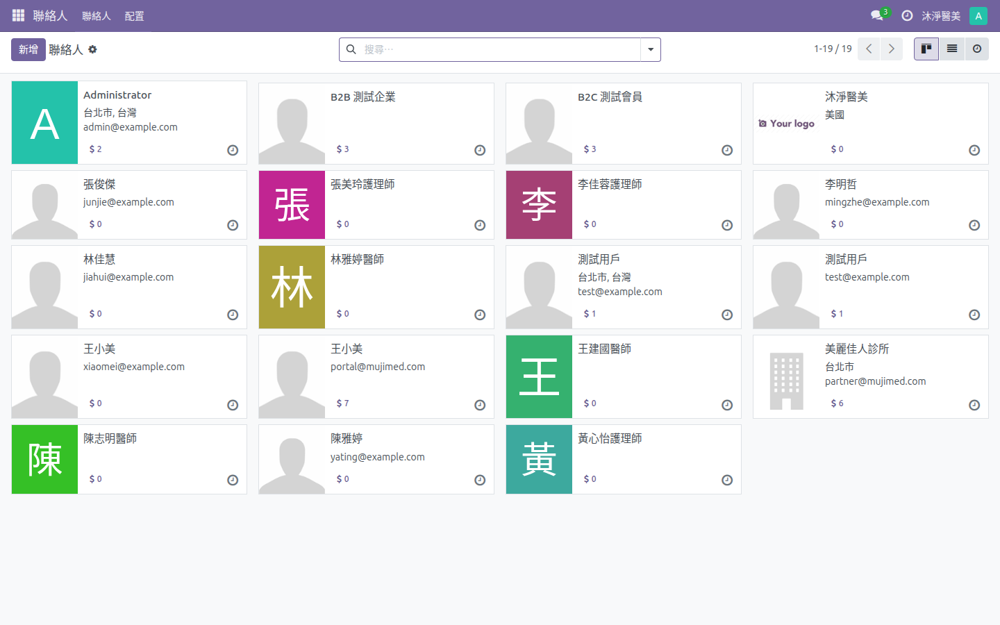

進入聯絡人模組後的列表頁面：

| 功能 | 說明 |
|------|------|
| 聯絡人列表 | 以列表或卡片形式顯示所有聯絡人 |
| 聯絡人類型 | 個人（B2C 會員）/ 公司（B2B 企業夥伴） |
| 姓名 | 聯絡人姓名或公司名稱 |
| Email | 電子郵件地址 |
| 電話 | 聯絡電話號碼 |
| 標籤 | 自訂標籤分類 |
| 篩選與搜尋 | 依類型、標籤、城市等條件篩選 |
| 新增聯絡人 | 建立新的聯絡人記錄 |

1. 從後台左側選單進入「聯絡人」模組。
2. 聯絡人列表將顯示所有客戶與合作夥伴資料。
3. 可使用篩選功能快速找到特定客戶。

**系統預設聯絡人範例：**

| 姓名 | 類型 | 帳號 | 說明 |
|------|------|------|------|
| 王小美 | 個人（B2C） | `portal` | B2C 消費者會員 |
| 美麗佳人診所 | 公司（B2B） | `partner` | B2B 企業夥伴 |
| 陳志明醫師 | 個人（員工） | `dr.chen` | 微整形注射醫師 |
| 林雅婷醫師 | 個人（員工） | `dr.lin` | 雷射光電醫師 |
| 王建國醫師 | 個人（員工） | `dr.wang` | 體雕抗老醫師 |
| 張美玲護理師 | 個人（員工） | `nurse.zhang` | 注射助理護理師 |
| 李佳蓉護理師 | 個人（員工） | `nurse.li` | 雷射操作護理師 |
| 黃心怡護理師 | 個人（員工） | `nurse.huang` | 保養療程護理師 |

### 步驟 2：管理 Portal 存取權限

| 功能 | 說明 |
|------|------|
| Portal 存取 | 授予聯絡人 Portal 登入權限 |
| 邀請 Email | 系統發送 Portal 邀請郵件 |
| 權限設定 | 設定 Portal 使用者的存取範圍 |
| 停用帳號 | 可停用特定使用者的 Portal 存取 |

1. 在聯絡人列表中，選擇要授予 Portal 權限的聯絡人。
2. 點擊「動作」（Action）選單，選擇「授予 Portal 存取」。
3. 系統將發送邀請郵件至該聯絡人的 Email。
4. 聯絡人收到郵件後，可設定密碼並登入 Portal。

---

## 23. 後台管理 — 預約與排班管理

預約管理模組負責管理所有的預約類型（療程）與預約記錄。本章說明如何在後台管理預約系統。

### 步驟 1：預約管理概覽

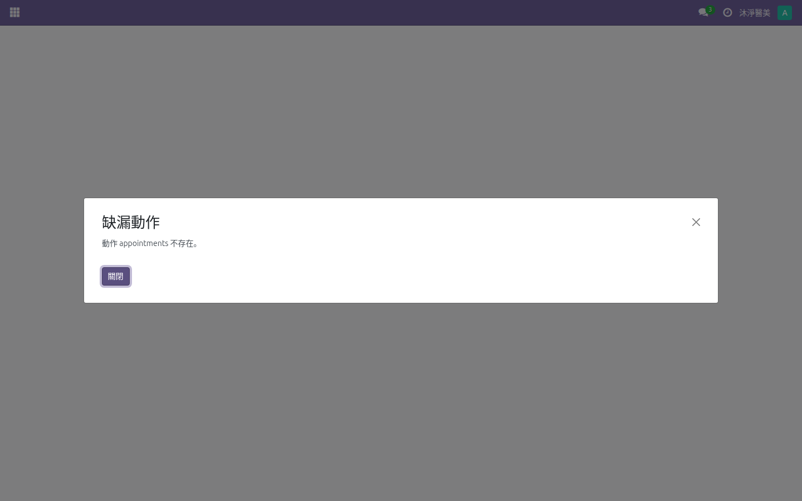

進入預約管理模組後的頁面：

| 功能 | 說明 |
|------|------|
| 預約類型列表 | 管理可預約的療程類型 |
| 預約記錄列表 | 查看所有預約記錄 |
| 行事曆視圖 | 以日曆形式查看所有預約 |
| 新增預約類型 | 建立新的可預約療程 |
| 預約設定 | 管理預約相關的系統設定 |

1. 從後台左側選單進入「預約」或「網站 > 線上預約」模組。
2. 可在此管理 20 種預約療程類型。
3. 可查看並管理所有預約記錄。

### 步驟 2：管理預約類型

| 欄位 | 說明 |
|------|------|
| 預約類型名稱 | 療程名稱（如「玻尿酸填充」） |
| 時長 | 預約所需時間長度 |
| 可用人員 | 指定可執行此療程的醫師/護理師 |
| 排班規則 | 設定可預約的時段規則 |
| 提前預約天數 | 設定最少需提前幾天預約 |
| 最大預約數 | 設定單一時段的最大預約數量 |
| 確認方式 | 自動確認或需管理員手動確認 |
| 網站發佈 | 是否顯示在前台預約頁面 |
| 描述 | 療程的詳細描述文字 |

1. 在預約類型列表中，點擊要管理的療程類型。
2. 在表單中調整各項設定。
3. 修改完成後點擊「儲存」。

### 步驟 3：管理預約記錄

| 功能 | 說明 |
|------|------|
| 預約列表 | 所有預約記錄的列表視圖 |
| 行事曆視圖 | 以日曆形式顯示預約排程 |
| 預約狀態管理 | 可變更預約狀態（確認 / 完成 / 取消） |
| 預約詳情 | 查看預約的完整資訊 |
| 篩選功能 | 依日期、醫師、療程、狀態等篩選 |

1. 切換至預約記錄列表，可查看所有預約。
2. 可以行事曆視圖查看每日、每週的預約排程。
3. 點擊預約記錄可查看詳情或變更狀態。
4. 管理員可將預約標記為「已完成」或「已取消」。

---

## 24. 後台管理 — 忠誠計畫與會員卡管理

忠誠計畫模組管理所有的會員忠誠計畫，包含電子錢包、點數、禮品卡、優惠券等。本章說明如何在後台設定與管理忠誠計畫。

### 步驟 1：忠誠計畫列表

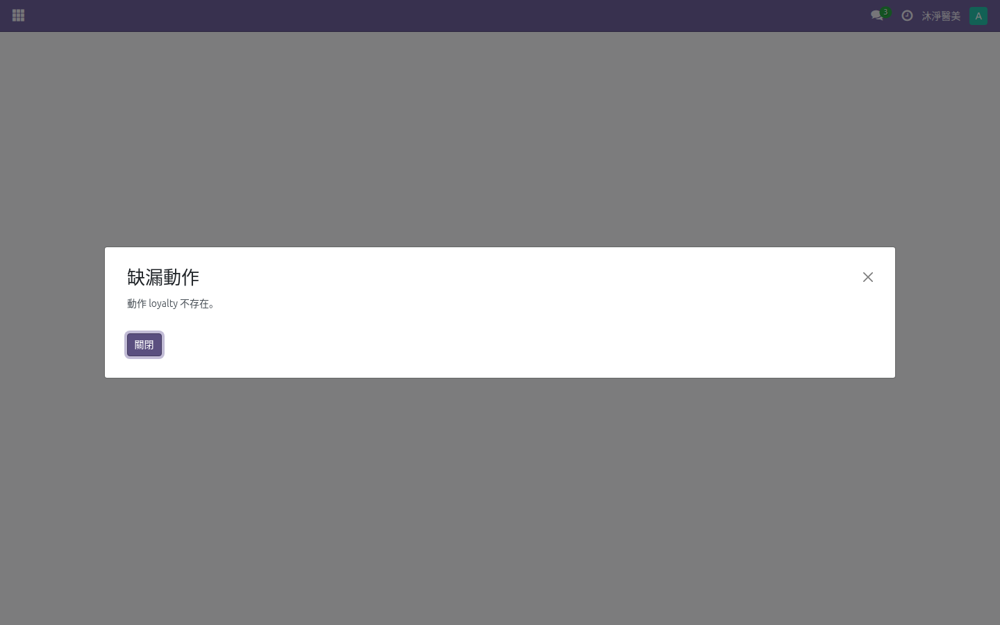

進入忠誠計畫模組後的列表頁面：

| 功能 | 說明 |
|------|------|
| 計畫列表 | 顯示所有已建立的忠誠計畫 |
| 計畫名稱 | 忠誠計畫的名稱 |
| 計畫類型 | 電子錢包 / 忠誠點數 / 禮品卡 / 優惠券 / 促銷 |
| 啟用狀態 | 已啟用 / 已停用 |
| 會員卡數量 | 已發出的會員卡數量 |
| 新增計畫 | 建立新的忠誠計畫 |

**系統內建的 7 大忠誠計畫：**

| 計畫名稱 | 類型 | 說明 |
|---------|------|------|
| Mujimed 電子錢包 | 電子錢包（ewallet） | 可儲值的電子錢包，1 點 = 1 元 |
| Mujimed 忠誠點數 | 忠誠點數（loyalty） | 消費累積點數，可兌換優惠 |
| Mujimed 禮品卡 | 禮品卡（gift_card） | 預儲值禮品卡 |
| Mujimed 新客優惠券 | 優惠券（coupon） | 新會員專屬優惠券 |
| Mujimed 醫美寄品卡 | 寄品卡（consignment） | 預購療程寄存卡 |
| 母親節優惠 | 促銷活動（promotion） | 母親節限定優惠 |
| 生日禮金 | 生日禮金（birthday） | 會員生日月份禮金 |

1. 從後台左側選單進入「忠誠計畫」或「銷售 > 忠誠計畫」。
2. 列表將顯示所有 7 個忠誠計畫。
3. 點擊計畫名稱可進入設定頁面。

### 步驟 2：設定忠誠計畫規則

| 設定項目 | 說明 |
|---------|------|
| 計畫名稱 | 設定忠誠計畫的顯示名稱 |
| 計畫類型 | 選擇計畫類型 |
| 累積規則 | 設定點數累積條件（如每消費 $100 獲得 1 點） |
| 兌換規則 | 設定點數兌換條件（如 100 點兌換 $100 折扣） |
| 有效期限 | 設定點數或卡片的有效期限 |
| 適用產品 | 設定此計畫適用的產品範圍 |
| 適用網站 | 設定此計畫顯示在哪個網站 |
| 觸發條件 | 設定自動觸發的條件（如新會員自動發放） |

1. 在忠誠計畫表單中，設定各項規則。
2. 累積規則決定會員如何獲得點數。
3. 兌換規則決定會員如何使用點數。
4. 設定完成後儲存即生效。

### 步驟 3：管理會員卡

| 功能 | 說明 |
|------|------|
| 會員卡列表 | 查看已發出的所有會員卡 |
| 持有人 | 會員卡持有人的客戶資訊 |
| 餘額 | 該會員卡的目前餘額或點數 |
| 使用紀錄 | 查看歷次異動紀錄 |
| 手動調整 | 管理員可手動調整點數餘額 |
| 發放新卡 | 為特定客戶發放新的會員卡 |

1. 在忠誠計畫表單中，切換至「會員卡」頁籤。
2. 可查看所有持有此計畫卡片的會員。
3. 管理員可手動調整餘額或發放新卡。

---

## 25. 後台管理 — 發票與帳務管理

發票模組管理所有的發票開立、收款與帳務作業。本章說明後台的發票管理功能。

### 步驟 1：發票管理概覽

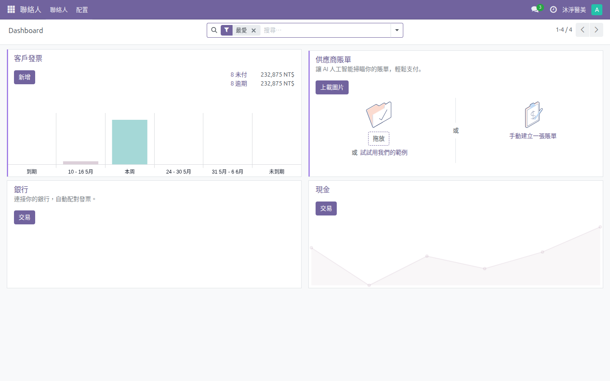

進入發票模組後的管理頁面：

| 功能 | 說明 |
|------|------|
| 發票列表 | 以列表形式顯示所有發票 |
| 發票編號 | 發票的唯一編號 |
| 客戶名稱 | 發票對應的客戶 |
| 發票日期 | 開立日期 |
| 到期日 | 付款到期日 |
| 金額 | 發票總金額 |
| 付款狀態 | 草稿 / 已開立 / 已付款 / 已逾期 |
| 篩選功能 | 依客戶、日期、狀態等篩選 |
| 新增發票 | 手動建立新的發票 |

1. 從後台左側選單進入「發票」或「會計 > 發票」模組。
2. 發票列表將顯示所有發票記錄。
3. 可使用篩選功能找到特定發票。

### 步驟 2：處理付款

| 功能 | 說明 |
|------|------|
| 登記付款按鈕 | 在已開立的發票中記錄收款 |
| 付款方式 | 選擇現金、銀行轉帳、信用卡等 |
| 付款金額 | 輸入收款金額（可全額或部分） |
| 付款日期 | 記錄付款日期 |
| 付款備註 | 輸入付款相關備註 |
| 確認付款 | 確認並記錄付款 |

1. 在發票列表中，點擊要處理的發票。
2. 確認發票內容無誤後，點擊「登記付款」按鈕。
3. 選擇付款方式，輸入付款金額與日期。
4. 點擊「確認」按鈕完成收款記錄。
5. 發票狀態將變更為「已付款」。

### 步驟 3：發票報表

| 功能 | 說明 |
|------|------|
| 發票分析 | 以圖表形式分析發票數據 |
| 營收統計 | 按月份、客戶、產品統計營收 |
| 應收帳款 | 查看未付款的應收帳款 |
| 帳齡分析 | 分析應收帳款的帳齡分佈 |
| 匯出報表 | 匯出報表資料為 Excel 或 PDF |

1. 在發票模組中，點擊「報表」或「分析」選項。
2. 可依不同維度查看發票相關的統計數據。
3. 報表可匯出為 Excel 或 PDF 格式。

---

## 26. 後台管理 — 網站存取權限與使用者管理

使用者管理模組負責管理系統中所有使用者帳號與權限設定。本章說明如何管理使用者帳號、設定權限群組、以及控制網站存取規則。

### 步驟 1：使用者列表

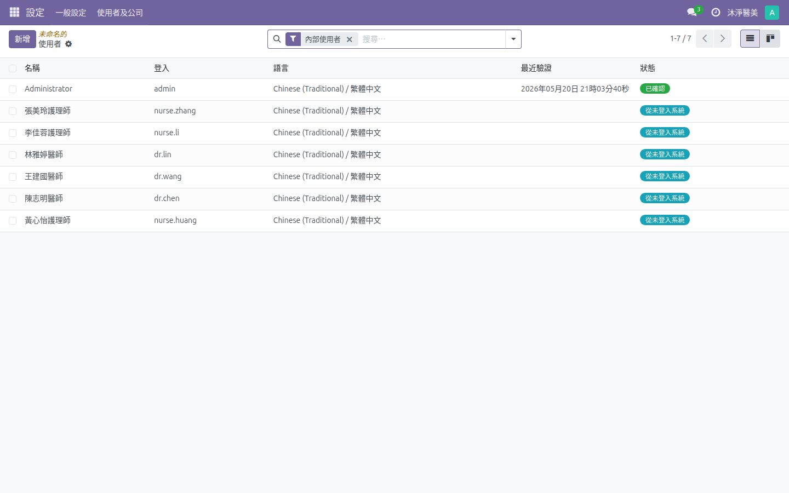

進入使用者管理模組後的列表頁面：

| 功能 | 說明 |
|------|------|
| 使用者列表 | 以列表形式顯示所有系統使用者 |
| 使用者名稱 | 使用者的顯示名稱 |
| 帳號（Login） | 使用者的登入帳號 |
| 使用者類型 | 內部使用者 / Portal 使用者 / 公開使用者 |
| 狀態 | 已啟用 / 已停用 |
| 權限群組 | 使用者所屬的權限群組 |
| 最後登入時間 | 使用者最後一次登入的時間 |
| 新增使用者 | 建立新的使用者帳號 |
| 篩選功能 | 依類型、狀態等條件篩選 |

1. 從後台左側選單進入「設定 > 使用者與公司 > 使用者」。
2. 使用者列表將顯示所有帳號。

**系統預設使用者：**

| 使用者名稱 | 帳號 | 類型 | 說明 |
|-----------|------|------|------|
| 管理員 | `admin` | 內部使用者 | 系統最高權限管理員 |
| 王小美 | `portal` | Portal 使用者 | B2C 消費者會員 |
| 美麗佳人診所 | `partner` | Portal 使用者 | B2B 企業夥伴 |
| 陳志明醫師 | `dr.chen` | 內部使用者 | 微整形注射醫師 |
| 林雅婷醫師 | `dr.lin` | 內部使用者 | 雷射光電醫師 |
| 王建國醫師 | `dr.wang` | 內部使用者 | 體雕抗老醫師 |
| 張美玲護理師 | `nurse.zhang` | 內部使用者 | 注射助理護理師 |
| 李佳蓉護理師 | `nurse.li` | 內部使用者 | 雷射操作護理師 |
| 黃心怡護理師 | `nurse.huang` | 內部使用者 | 保養療程護理師 |

### 步驟 2：新增與編輯使用者

1. 點擊「新增」按鈕建立新使用者，或點擊現有使用者進入編輯。
2. 在使用者表單中填寫以下資訊：

| 欄位 | 說明 |
|------|------|
| 姓名 | 使用者的顯示名稱 |
| Email（Login） | 登入帳號，須為有效的電子郵件格式 |
| 使用者類型 | 選擇「內部使用者」、「Portal」或「公開」 |
| 權限群組 | 設定使用者在各模組中的權限層級 |
| 密碼 | 設定使用者的登入密碼 |
| 語言 | 設定使用者介面的預設語言 |
| 時區 | 設定使用者的時區 |

3. 填寫完成後，點擊「儲存」按鈕。
4. 若選擇 Portal 類型，系統將自動建立對應的 Portal 存取權限。

### 步驟 3：權限群組設定

| 使用者類型 | 權限範圍 | 說明 |
|-----------|---------|------|
| 內部使用者 | 後台管理 | 可存取 Odoo 後台管理介面，權限依群組設定 |
| Portal 使用者 | Portal 前台 | 僅可存取前台 Portal（訂單、發票、預約等） |
| 公開使用者 | 公開頁面 | 僅可存取網站公開頁面，無需登入 |

**內部使用者權限群組範例：**

| 權限群組 | 說明 |
|---------|------|
| 銷售 / 使用者 | 可查看與管理自己的銷售訂單 |
| 銷售 / 管理員 | 可查看與管理所有銷售訂單 |
| 網站 / 受限編輯 | 可編輯網站內容但有限制 |
| 網站 / 設計師 | 可完整編輯網站內容與設計 |
| 發票 / 帳務人員 | 可管理發票與收款 |
| 管理 / 存取權限 | 可管理使用者與權限設定 |

1. 在使用者表單中，根據使用者的職責設定適當的權限群組。
2. 每個模組可獨立設定權限層級。
3. 權限設定採最小權限原則，僅授予使用者所需的最低權限。

### 步驟 4：網站存取規則

| 功能 | 說明 |
|------|------|
| 網站可見性 | 設定網站頁面的公開 / 登入可見 / 限定群組可見 |
| 頁面權限 | 針對個別頁面設定存取權限 |
| 選單可見性 | 設定導覽選單項目的可見條件 |
| 產品可見性 | 設定產品在不同網站上的可見性 |
| IP 限制 | 可設定 IP 白名單限制存取（進階設定） |

1. 網站存取規則可在網站模組或個別頁面中設定。
2. 建議 B2B 網站設定為需登入才可瀏覽商品目錄。
3. B2C 網站可設定為公開瀏覽，但結帳需登入。

---

## 27. 行動裝置操作指南

沐淨醫美平台採用響應式設計（Responsive Design），完整支援手機與平板等行動裝置。本章展示各主要頁面在行動裝置上的呈現方式與操作要點。

### 步驟 1：行動版首頁

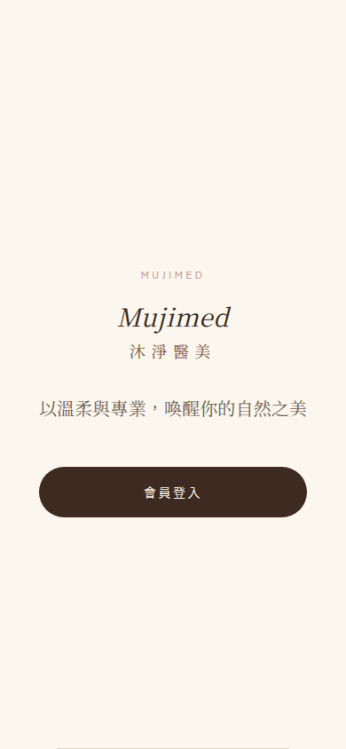

行動裝置上的首頁呈現方式：

| 功能 | 說明 |
|------|------|
| 漢堡選單 | 導覽列收合為漢堡選單圖示（三橫線） |
| 品牌主視覺 | 自動調整為行動版排版，單欄式顯示 |
| 療程卡片 | 療程服務卡片自動轉為單欄堆疊排列 |
| 行動呼籲按鈕 | 按鈕尺寸放大，方便觸控操作 |
| 聯絡資訊 | 電話號碼可直接點擊撥打 |
| 頁尾 | 頁尾資訊堆疊式排列 |

1. 在手機瀏覽器中開啟 `https://b2cmujimed-odoo.woowtech.io`。
2. 頁面將自動以行動版排版呈現。
3. 點擊左上角漢堡選單圖示展開導覽選單。
4. 導覽選單以全螢幕滑出面板（Offcanvas）呈現。

### 步驟 2：行動版登入

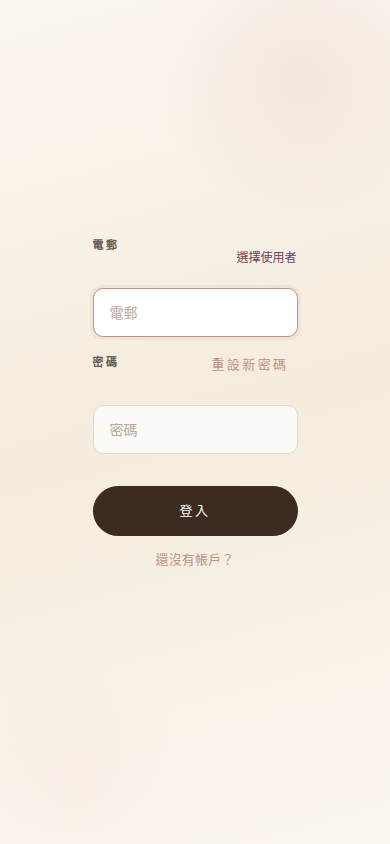

行動裝置上的登入頁面：

| 功能 | 說明 |
|------|------|
| 單欄式版面 | 桌面版的分割式版面在手機上改為單欄式 |
| 帳號欄位 | 全寬輸入欄位，方便手機輸入 |
| 密碼欄位 | 全寬輸入欄位 |
| 登入按鈕 | 全寬按鈕，方便觸控點擊 |
| 鍵盤適配 | 輸入時自動彈出適當的軟體鍵盤 |

1. 在行動版導覽選單中點擊「登入」。
2. 登入頁面自動適配為行動版排版。
3. 輸入帳號密碼後點擊登入按鈕。

### 步驟 3：行動版 Portal 儀表板

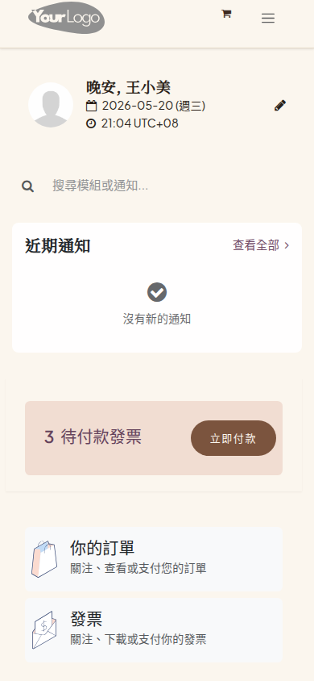

行動裝置上的 Portal 儀表板：

| 功能 | 說明 |
|------|------|
| 功能卡片堆疊 | 功能卡片由多欄改為單欄堆疊排列 |
| 觸控友善 | 所有按鈕與連結均放大以適配觸控操作 |
| 統計數據 | 訂單、發票、預約數量等統計數據清楚顯示 |
| 快速導覽 | 點擊卡片即可前往對應功能頁面 |

1. 登入後自動進入 Portal 儀表板。
2. 功能卡片以單欄堆疊方式排列，上下滑動瀏覽。
3. 點擊任一功能卡片前往對應頁面。

### 步驟 4：行動版療程商城

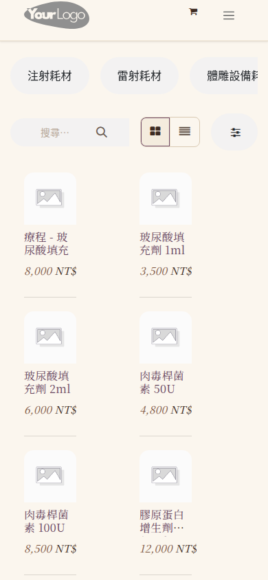

行動裝置上的療程商城頁面：

| 功能 | 說明 |
|------|------|
| 單欄商品卡片 | 療程卡片改為單欄排列，每張卡片佔滿螢幕寬度 |
| 分類篩選 | 分類篩選可能收合為下拉選單 |
| 搜尋欄 | 搜尋欄位適配行動版排版 |
| 加入購物車 | 按鈕放大並適配觸控 |
| 無限滾動 | 向下滾動自動載入更多商品（如有啟用） |

1. 瀏覽療程商城時，商品卡片以單欄形式排列。
2. 上下滑動瀏覽所有療程項目。
3. 點擊商品卡片查看詳情或直接加入購物車。

### 步驟 5：行動版預約掛號

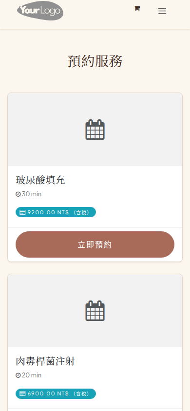

行動裝置上的預約掛號頁面：

| 功能 | 說明 |
|------|------|
| 療程類型列表 | 以單欄堆疊顯示所有可預約療程 |
| 醫師選擇 | 醫師選擇界面適配行動版 |
| 日曆選時 | 日曆以緊湊格式顯示，可左右滑動切換月份 |
| 時段按鈕 | 時段按鈕放大，適合觸控選擇 |
| 表單填寫 | 預約表單欄位全寬顯示 |

1. 在行動裝置上開啟預約掛號頁面。
2. 選擇療程類型與醫師。
3. 在行動版日曆上選擇日期與時段。
4. 填寫預約表單並確認送出。

### 步驟 6：行動版購物車

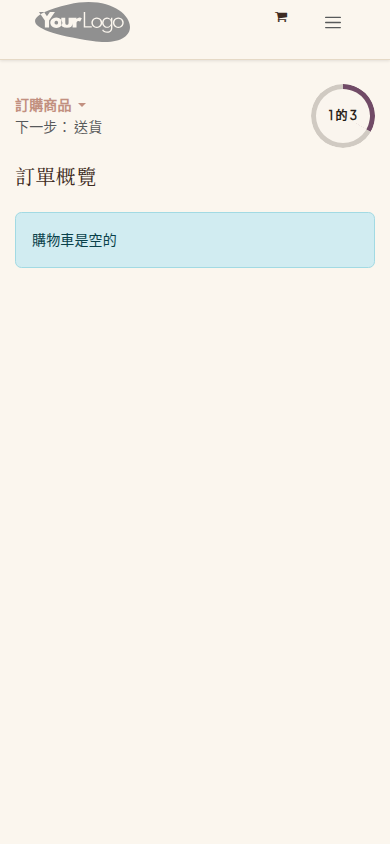

行動裝置上的購物車頁面：

| 功能 | 說明 |
|------|------|
| 商品列表 | 購物車商品以行動版排版顯示 |
| 數量調整 | 數量增減按鈕放大以適配觸控 |
| 優惠碼輸入 | 優惠碼輸入欄位全寬顯示 |
| 合計金額 | 合計金額醒目顯示 |
| 結帳按鈕 | 全寬結帳按鈕，方便觸控點擊 |

1. 點擊導覽列的購物車圖示查看購物車。
2. 確認商品項目與數量。
3. 如需套用優惠碼，在輸入欄位中輸入並點擊套用。
4. 點擊「結帳」按鈕進入結帳流程。
5. 行動版結帳流程與桌面版相同，但版面自動適配手機螢幕。

> **行動裝置操作提示：**
> - 建議使用 Chrome、Safari 或 Firefox 等主流瀏覽器。
> - 確保瀏覽器已更新至最新版本以獲得最佳體驗。
> - 橫向（Landscape）模式可能提供更寬廣的瀏覽空間。
> - 若頁面顯示異常，可嘗試清除瀏覽器快取後重新載入。

---

## 28. 常見問題（FAQ）

本章彙整使用沐淨醫美 Odoo 18 醫美平台時常見的問題與解答。

### Q1：如何登入 B2C 消費者網站？

**A**：前往 `https://b2cmujimed-odoo.woowtech.io`，點擊右上角的「登入」按鈕，輸入您的帳號與密碼即可登入。示範帳號為 `portal` / `portal`（王小美）。

### Q2：如何登入 B2B 企業網站？

**A**：前往 `https://b2bmujimed-odoo.woowtech.io`，點擊「登入」按鈕，使用企業夥伴帳號登入。示範帳號為 `partner` / `partner`（美麗佳人診所）。

### Q3：如何進入後台管理介面？

**A**：前往 `https://b2cmujimed-odoo.woowtech.io/odoo`，使用管理員帳號 `admin` / `admin` 登入即可進入 Odoo 18 後台管理系統。

### Q4：忘記密碼怎麼辦？

**A**：在登入頁面點擊「忘記密碼？」連結，輸入您的註冊信箱，系統將發送密碼重設郵件。請依郵件中的指示設定新密碼。

### Q5：如何註冊新帳號？

**A**：在登入頁面點擊「立即註冊」連結，填寫姓名、Email 與密碼等資訊，完成註冊後即可使用新帳號登入。

### Q6：B2C 網站提供哪些療程？

**A**：B2C 網站共提供 20 種療程，分為五大分類：
- **微整形注射**（4 項）：玻尿酸填充、肉毒桿菌注射、膠原蛋白增生劑、消脂針
- **光電雷射**（5 項）：皮秒雷射、飛梭雷射、淨膚雷射、脈衝光 IPL、除毛雷射
- **體雕療程**（3 項）：冷凍溶脂、電波拉皮 Thermage、音波拉提 HIFU
- **臉部保養**（4 項）：水光注射、導入保養、化學煥膚、杏仁酸煥膚
- **特殊療程**（4 項）：PRP 自體血小板、雷射除斑、痘疤治療、初次諮詢

### Q7：如何預約療程？

**A**：登入 B2C 網站後，點擊導覽列的「預約掛號」，選擇療程類型，選擇醫師（或不指定），在日曆上選擇日期與時段，填寫預約資訊後送出即完成預約。

### Q8：如何查看我的預約記錄？

**A**：登入後前往 Portal 儀表板（`/my`），點擊「我的預約」功能卡片，即可查看所有預約記錄。

### Q9：可以取消預約嗎？

**A**：若預約狀態為「已確認」且尚未執行，您可以在預約詳情頁面中點擊「取消預約」按鈕進行取消。已完成的預約無法取消。實際取消政策依診所規定。

### Q10：如何使用購物車購買療程？

**A**：在療程商城中將想要的療程加入購物車，點擊購物車圖示查看購物車內容，確認無誤後點擊「結帳」，填寫結帳資訊並完成付款。

### Q11：如何使用優惠券或優惠碼？

**A**：在購物車頁面中找到「優惠碼」輸入欄位，輸入您的優惠碼後點擊「套用」，系統將自動計算折扣並更新合計金額。

### Q12：如何查看我的會員卡餘額？

**A**：登入後前往 Portal 儀表板，點擊「會員卡」功能卡片，即可查看所有會員卡的餘額與點數。

### Q13：什麼是電子錢包？

**A**：電子錢包是沐淨醫美提供的儲值型忠誠計畫。您的錢包中的點數可在結帳時直接折抵消費金額，1 點 = 1 元。王小美帳號預設有 5,000 點餘額。

### Q14：什麼是忠誠點數？

**A**：忠誠點數是消費自動累積的點數。每次消費可依規則累積點數，累積到一定數量可兌換療程折扣或贈品。王小美帳號預設有 1,200 點。

### Q15：什麼是醫美寄品卡？

**A**：醫美寄品卡允許您預購特定療程的次數，寄存於診所後可分次使用。例如購買 10 次導入保養，每次到診使用 1 次，直到用完為止。

### Q16：B2B 網站有哪些商品？

**A**：B2B 企業批發網站提供 31 項商品，分為 6 大分類：注射耗材（5 項）、雷射耗材（5 項）、體雕設備耗材（5 項）、保養品（5 項）、儀器配件（5 項）、診所用品（6 項）。

### Q17：如何成為 B2B 企業夥伴？

**A**：請透過 B2B 網站的「聯絡我們」頁面提交企業合作申請，或直接聯繫沐淨醫美業務團隊。經審核通過後，將為您建立企業夥伴帳號。

### Q18：B2B 企業採購有什麼優勢？

**A**：B2B 企業夥伴享有批發優惠價格、原廠正品認證、快速出貨服務、專屬客服支援，以及完善的企業帳務與發票管理功能。

### Q19：手機可以正常使用網站嗎？

**A**：是的，沐淨醫美平台採用響應式設計，完整支援手機與平板裝置。所有功能（瀏覽、預約、購物、Portal 管理）均可在行動裝置上正常操作。

### Q20：後台管理有哪些主要功能？

**A**：後台管理（Odoo 18 管理介面）提供以下主要功能：
- 多網站管理（B2C + B2B）
- 產品目錄管理（療程 + 批發商品）
- 銷售訂單管理
- 發票與帳務管理
- 預約與排班管理
- 忠誠計畫與會員卡管理
- 客戶與合作夥伴管理
- 使用者帳號與權限管理

### Q21：如何在後台新增產品？

**A**：登入後台後，進入「產品」模組，點擊「新增」按鈕，填寫產品名稱、類型、價格、描述等資訊，設定適用網站後儲存。將發佈狀態設為「已發佈」即可在前台網站上顯示。

### Q22：如何在後台管理預約？

**A**：登入後台後，進入「預約」模組，可查看所有預約記錄。可使用行事曆視圖查看排程，點擊個別預約可變更狀態（確認、完成、取消）。

### Q23：如何為客戶發放會員卡？

**A**：登入後台後，進入「忠誠計畫」模組，選擇對應的忠誠計畫，在「會員卡」頁籤中點擊「新增」，選擇客戶並設定初始餘額或點數，儲存後即完成發放。

### Q24：系統支援哪些付款方式？

**A**：系統支援的付款方式依後台設定而定，可能包含線上信用卡付款、銀行轉帳、現場付款等。B2B 企業客戶可能享有月結付款等企業專屬方式。具體付款方式請參閱結帳頁面的選項。

### Q25：網站出現錯誤或無法載入怎麼辦？

**A**：請嘗試以下步驟：
1. 清除瀏覽器快取，重新整理頁面。
2. 嘗試使用其他瀏覽器或無痕模式開啟。
3. 確認網路連線是否正常。
4. 若問題持續，請透過「聯絡我們」頁面回報問題，或聯繫沐淨醫美客服團隊。

### Q26：如何修改個人資料？

**A**：登入後前往 Portal 儀表板，點擊「個人資料」功能卡片（或前往 `/my/account`），即可修改姓名、電話、地址等個人資訊。修改完成後點擊「儲存」。

### Q27：如何修改密碼？

**A**：登入後前往 Portal 儀表板，點擊「安全性」功能卡片（或前往 `/my/security`），輸入目前密碼與新密碼，點擊「確認」即可完成密碼修改。

### Q28：發票可以下載 PDF 嗎？

**A**：可以。前往「我的發票」頁面，點擊要下載的發票，在發票詳情頁面中點擊「下載 PDF」按鈕即可下載發票 PDF 檔案。

### Q29：預約的療程和商城購買的療程有什麼不同？

**A**：預約功能用於預約到診時間，確保您到院時有醫師為您服務。商城購買功能用於線上付款購買療程。建議先透過商城購買療程取得訂單，再透過預約功能預約到診時間。

### Q30：如何聯絡沐淨醫美？

**A**：您可以透過以下方式聯繫沐淨醫美：
1. 前往 B2C 網站的「聯絡我們」頁面，填寫聯絡表單。
2. 撥打網站上公佈的診所聯絡電話。
3. 親臨沐淨醫美診所。

---

## 附錄 A：系統快速參考卡

### 系統網址

| 系統 | 網址 |
|------|------|
| B2C 消費者網站 | https://b2cmujimed-odoo.woowtech.io |
| B2B 企業網站 | https://b2bmujimed-odoo.woowtech.io |
| 後台管理 | https://b2cmujimed-odoo.woowtech.io/odoo |

### 帳號速查

| 帳號 | 密碼 | 角色 |
|------|------|------|
| `admin` | `admin` | 管理員 |
| `portal` | `portal` | B2C 會員（王小美） |
| `partner` | `partner` | B2B 企業夥伴（美麗佳人診所） |

### 常用路徑

| 功能 | 路徑 |
|------|------|
| B2C 首頁 | `/` |
| 療程商城 | `/shop` |
| 購物車 | `/shop/cart` |
| 預約掛號 | `/appointment` |
| 會員登入 | `/web/login` |
| Portal 儀表板 | `/my` |
| 我的訂單 | `/my/orders` |
| 我的發票 | `/my/invoices` |
| 我的預約 | `/my/appointments` |
| 會員卡 | `/my/loyalty_card` |
| 個人資料 | `/my/account` |
| 安全性 | `/my/security` |
| 聯絡我們 | `/contactus` |
| 後台管理 | `/odoo` |

### B2C 療程價格速查

| 療程 | 價格 |
|------|------|
| 初次諮詢 | $500 |
| 杏仁酸煥膚 | $1,800 |
| 導入保養 | $2,000 |
| 除毛雷射 | $2,500 |
| 化學煥膚 | $2,500 |
| 淨膚雷射 | $3,000 |
| 脈衝光 IPL | $3,500 |
| 水光注射 | $4,500 |
| 消脂針 | $5,000 |
| 皮秒雷射 | $5,000 |
| 痘疤治療 | $5,000 |
| 肉毒桿菌注射 | $6,000 |
| 飛梭雷射 | $6,000 |
| 雷射除斑 | $6,000 |
| 玻尿酸填充 | $8,000 |
| PRP 自體血小板 | $12,000 |
| 膠原蛋白增生劑 | $15,000 |
| 冷凍溶脂 | $25,000 |
| 音波拉提 HIFU | $30,000 |
| 電波拉皮 Thermage | $35,000 |

### 王小美帳號資料摘要

| 項目 | 數量/內容 |
|------|----------|
| 預約記錄 | 5 筆（3 已完成 + 2 已確認） |
| 銷售訂單 | 3 筆（$500 + $8,000 + $5,000） |
| 發票 | 3 張 |
| 電子錢包 | 5,000 點 |
| 忠誠點數 | 1,200 點 |
| 禮品卡 | 3,000 點 |
| 新客優惠券 | 1 張 |

---

> **本手冊由 WOOW Tech 沃科技維護**  
> 如有任何問題或建議，請聯繫技術支援團隊。  
> 版權所有 &copy; 2026 WOOW Tech 沃科技。保留所有權利。
